# [通过“分裂至合并”策略，我们旨在将分离的模态融合以实现无监督领域适应的统一。这一方法旨在解决不同模态在无标签数据上进行领域适应时的问题，从而提升模型性能和泛化能力。]

发布时间：2024年03月11日

`Agent`

> Split to Merge: Unifying Separated Modalities for Unsupervised Domain Adaptation

> 类似CLIP这样的大型视觉-语言模型在无监督领域适应任务上展现出了出色的零样本学习能力，但多数针对这类模型的迁移策略仅关注单个模态分支，而忽略了两者间微妙的交互效应。为此，我们创新性地提出了一个名为“UniMoS”的统一模态分离框架，专用于无监督领域适应场景。该框架基于模态间隙研究的新颖洞察，精心构建了一种敏捷的模态分离网络，能巧妙地将CLIP的特征拆分为与语言紧密关联的部分和与视觉紧密关联的部分。此外，我们设计了一种模态集成训练（MET）方法，在保留各模态独特特点的同时，促进模态间通用信息的有效传递。借助模态鉴别器，我们实现不同领域特征的精准对齐。在三项权威基准测试中的综合评估显示，我们的方法凭借较低的计算成本刷新了当前最优性能记录，相关代码已开源，地址为：https://github.com/TL-UESTC/UniMoS。

> Large vision-language models (VLMs) like CLIP have demonstrated good zero-shot learning performance in the unsupervised domain adaptation task. Yet, most transfer approaches for VLMs focus on either the language or visual branches, overlooking the nuanced interplay between both modalities. In this work, we introduce a Unified Modality Separation (UniMoS) framework for unsupervised domain adaptation. Leveraging insights from modality gap studies, we craft a nimble modality separation network that distinctly disentangles CLIP's features into language-associated and vision-associated components. Our proposed Modality-Ensemble Training (MET) method fosters the exchange of modality-agnostic information while maintaining modality-specific nuances. We align features across domains using a modality discriminator. Comprehensive evaluations on three benchmarks reveal our approach sets a new state-of-the-art with minimal computational costs. Code: https://github.com/TL-UESTC/UniMoS

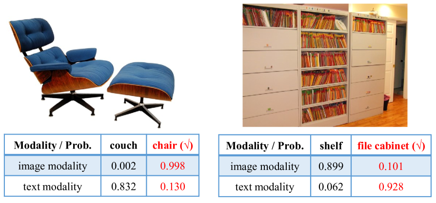

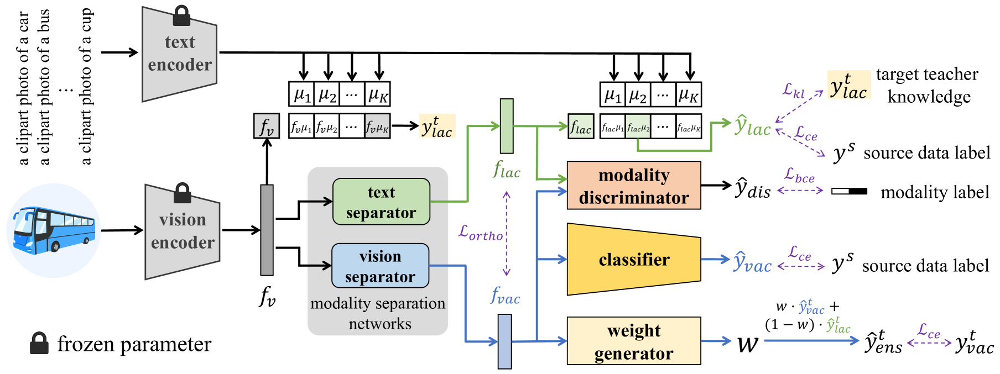

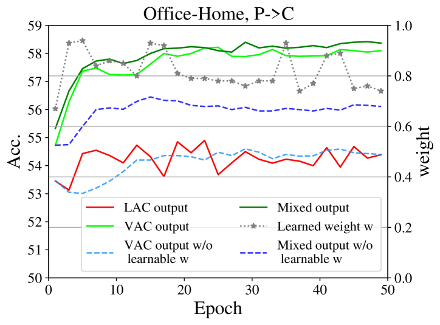

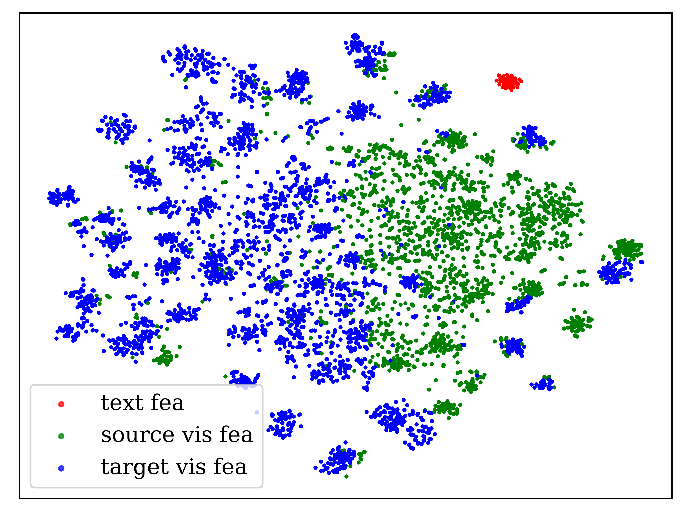

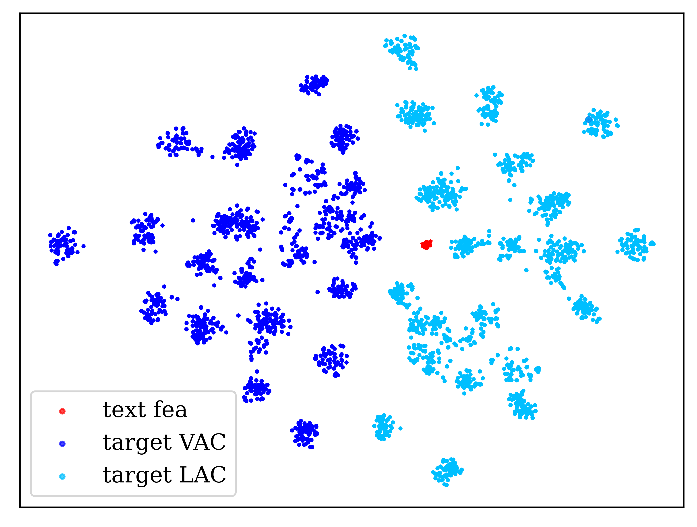

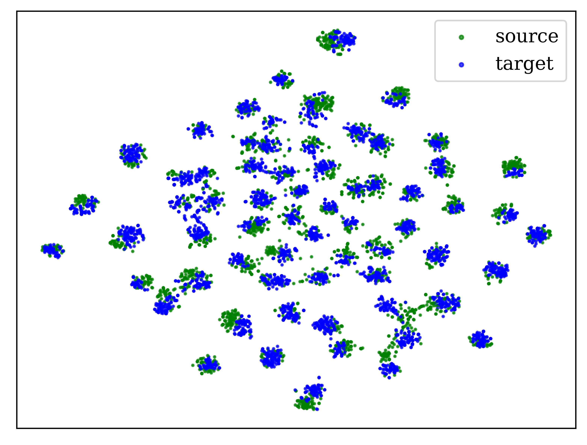

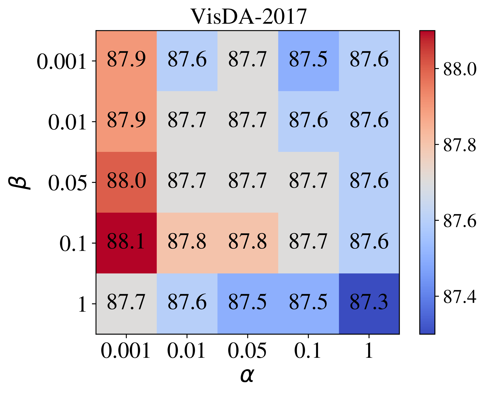

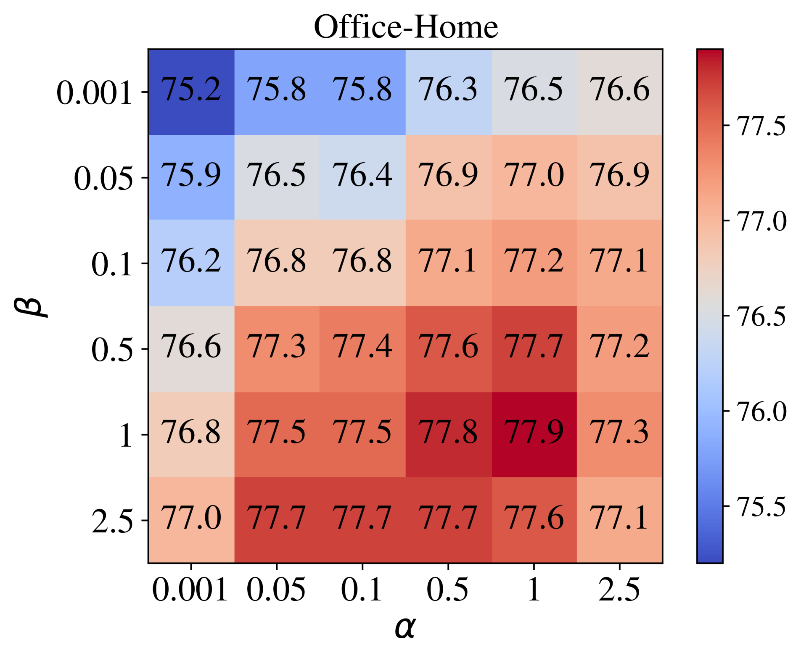

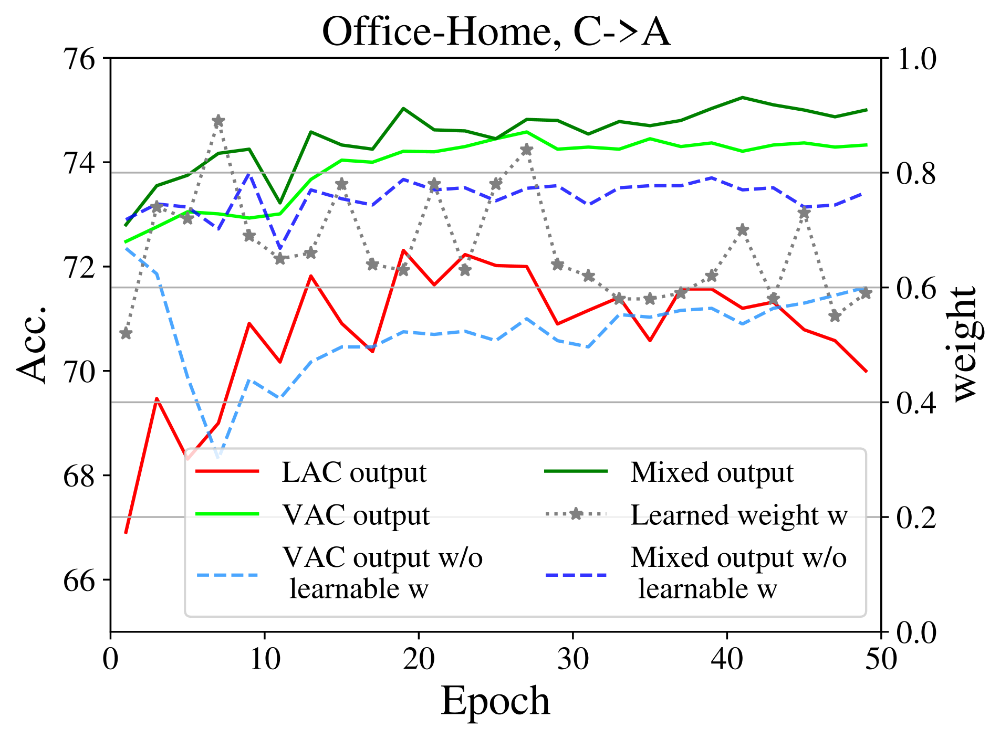

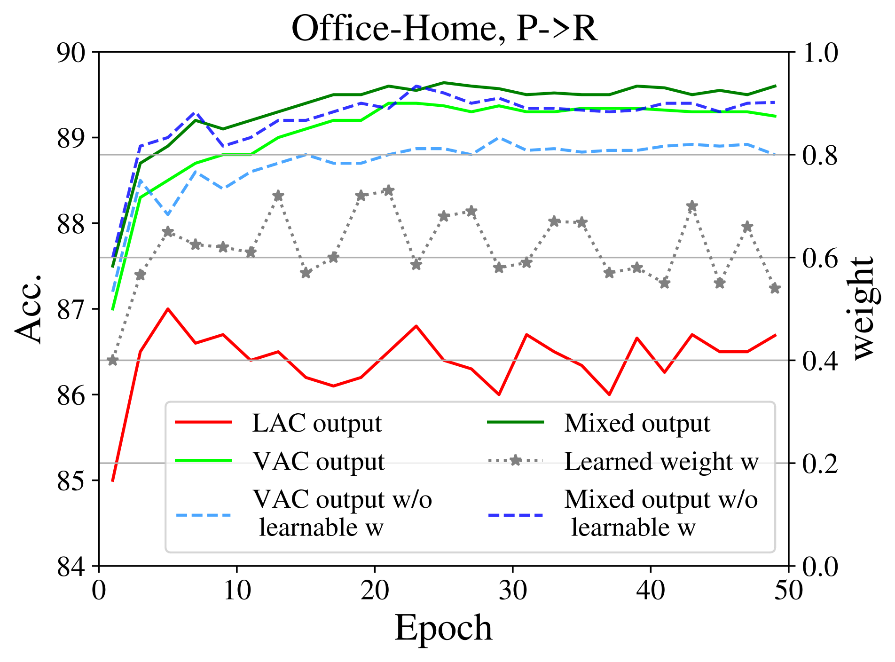

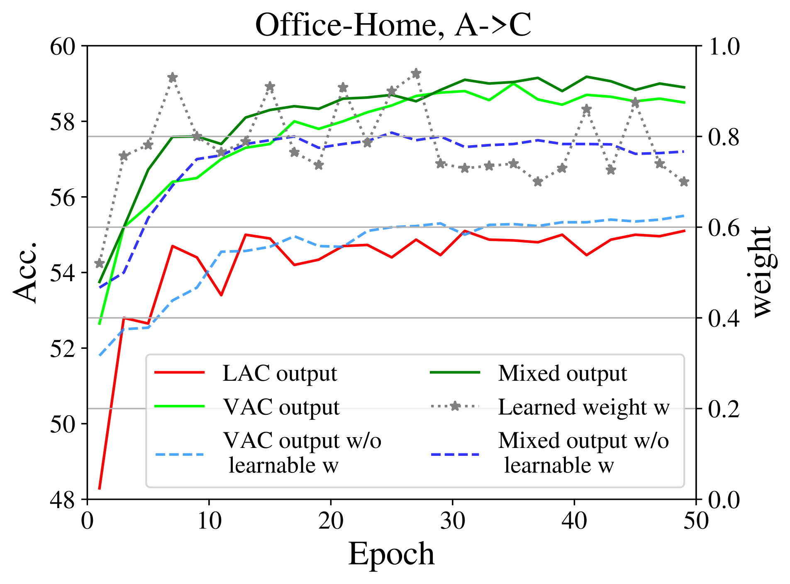

[Arxiv](https://arxiv.org/abs/2403.06946)