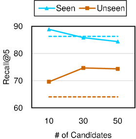
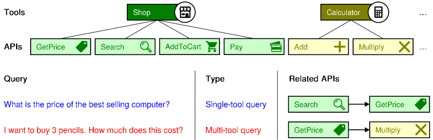
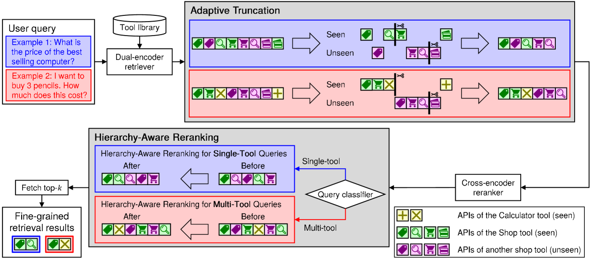
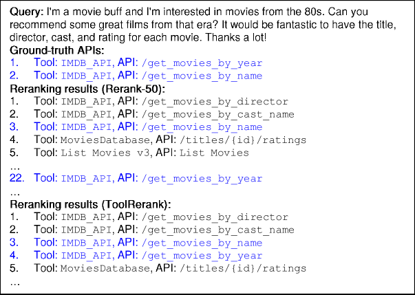
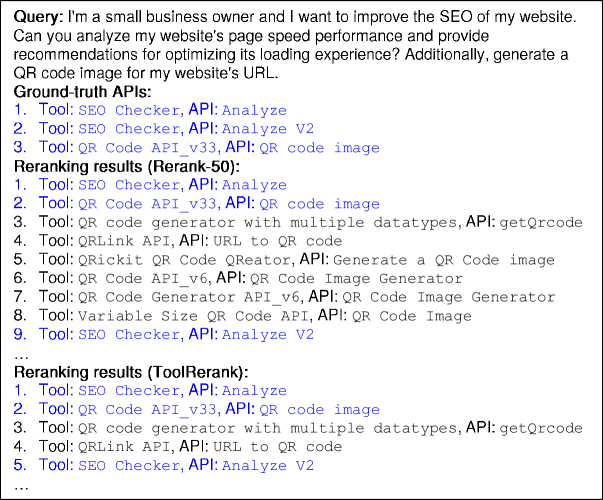

# [ToolRerank：针对工具检索问题，提出了一种能够自适应调整并具备层次感知能力的重新排序方法，旨在提升检索效果。](https://arxiv.org/abs/2403.06551)

发布时间：2024年03月11日

`Agent`

> ToolRerank: Adaptive and Hierarchy-Aware Reranking for Tool Retrieval

> 工具学习致力于借助外部工具增强LLMs的能力，但如何有效支持大量工具尤其是未知工具是个重大挑战。对此，过往研究提出依据用户查询从LLM中检索匹配工具，不过这些方法忽略了已知工具与未知工具的区别，也未充分考虑工具库的层级特性，可能造成工具检索效果不佳。为此，我们创新性地提出了ToolRerank——一种适应性强且具备层级意识的工具检索重排序策略，以精细化检索结果。ToolRerank的具体亮点在于其自适应截断机制，针对已知和未知工具在不同位置智能截取检索结果，并采用层级感知重排序，确保单一工具查询时结果更为聚焦，而在多工具查询情境下呈现更多元化的选择。实验证明，ToolRerank能够显著提升检索质量，从而助力LLM生成更出色的执行表现。

> Tool learning aims to extend the capabilities of large language models (LLMs) with external tools. A major challenge in tool learning is how to support a large number of tools, including unseen tools. To address this challenge, previous studies have proposed retrieving suitable tools for the LLM based on the user query. However, previously proposed methods do not consider the differences between seen and unseen tools, nor do they take the hierarchy of the tool library into account, which may lead to suboptimal performance for tool retrieval. Therefore, to address the aforementioned issues, we propose ToolRerank, an adaptive and hierarchy-aware reranking method for tool retrieval to further refine the retrieval results. Specifically, our proposed ToolRerank includes Adaptive Truncation, which truncates the retrieval results related to seen and unseen tools at different positions, and Hierarchy-Aware Reranking, which makes retrieval results more concentrated for single-tool queries and more diverse for multi-tool queries. Experimental results show that ToolRerank can improve the quality of the retrieval results, leading to better execution results generated by the LLM.

