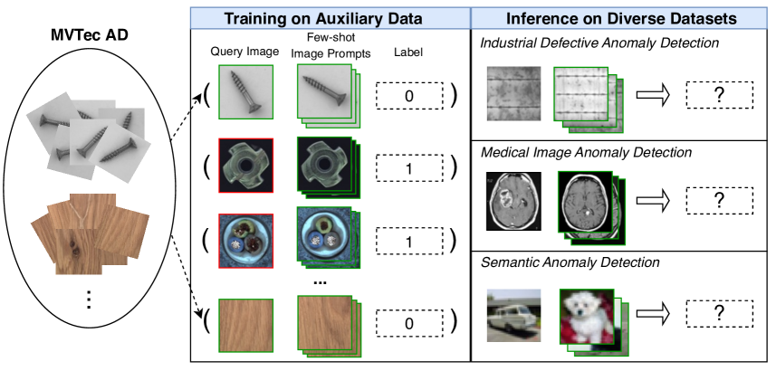
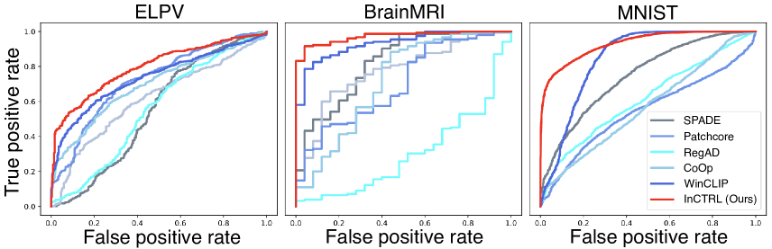
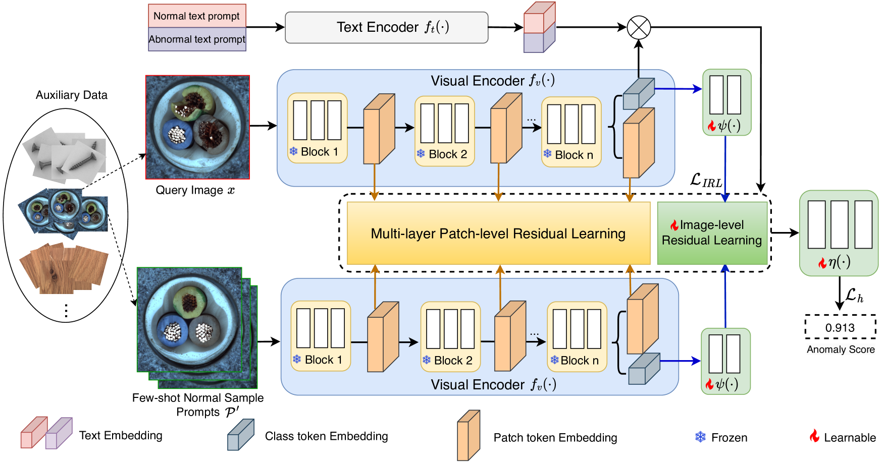
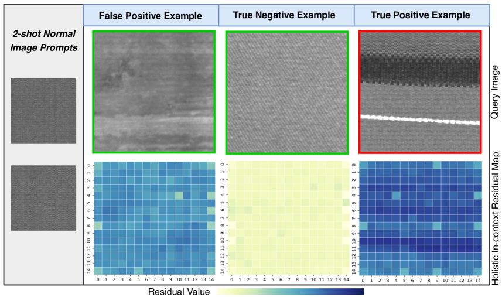
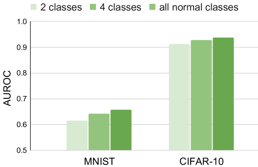

# 借助少量样例提示的上下文残差学习方法，我们正逐步迈向实现能应对各类异常检测任务的通才模型。

发布时间：2024年03月11日

`Agent`

> Toward Generalist Anomaly Detection via In-context Residual Learning with Few-shot Sample Prompts

> 本研究聚焦于打造能跨域识别各类异常的通用异常检测（GAD）模型，力求实现仅需一次训练便能应用于不同领域、多样数据集中的异常检测，而无需针对目标数据做额外训练。近期研究显示，像CLIP这样的大规模预训练视觉-语言模型在识别不同数据集中的工业缺陷时表现出强大泛化能力，然而其方法过于依赖人工设计的缺陷文本提示，限制了其在如医疗图像异常或自然图像语义异常等其他应用场景中的推广。因此，我们创新性地提出了利用少量正常图像作为实时示例提示，训练能在多种数据集上执行AD任务的GAD模型，并引入名为InCTRL的新型上下文残差学习方法。InCTRL通过辅助数据集训练，依据查询图像与少量正常示例提示间的整体残差差异来区分异常与正常样本，理论上讲，不论数据来源如何，异常样本相较于正常样本应产生更大的残差，由此，InCTRL得以无需额外训练便能有效跨越不同领域进行泛化。

> This paper explores the problem of Generalist Anomaly Detection (GAD), aiming to train one single detection model that can generalize to detect anomalies in diverse datasets from different application domains without any further training on the target data. Some recent studies have shown that large pre-trained Visual-Language Models (VLMs) like CLIP have strong generalization capabilities on detecting industrial defects from various datasets, but their methods rely heavily on handcrafted text prompts about defects, making them difficult to generalize to anomalies in other applications, e.g., medical image anomalies or semantic anomalies in natural images. In this work, we propose to train a GAD model with few-shot normal images as sample prompts for AD on diverse datasets on the fly. To this end, we introduce a novel approach that learns an in-context residual learning model for GAD, termed InCTRL. It is trained on an auxiliary dataset to discriminate anomalies from normal samples based on a holistic evaluation of the residuals between query images and few-shot normal sample prompts. Regardless of the datasets, per definition of anomaly, larger residuals are expected for anomalies than normal samples, thereby enabling InCTRL to generalize across different domains without further training.

[Arxiv](https://arxiv.org/abs/2403.06495)