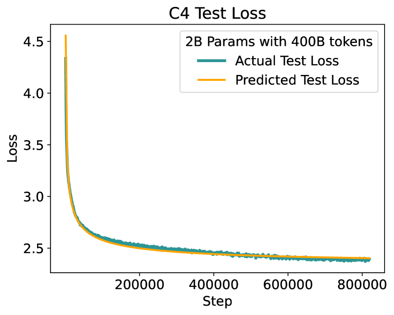
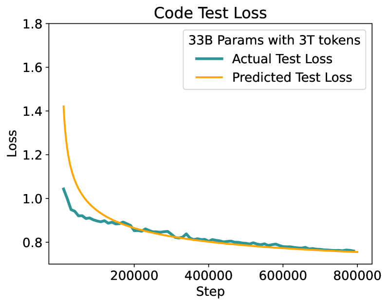
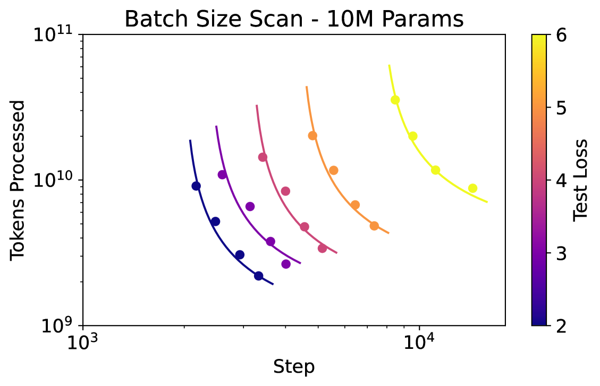
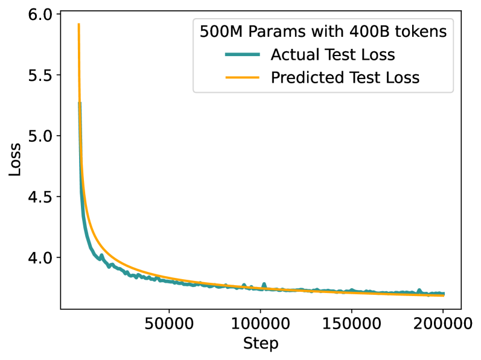
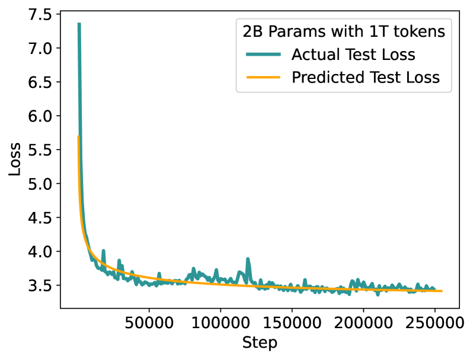
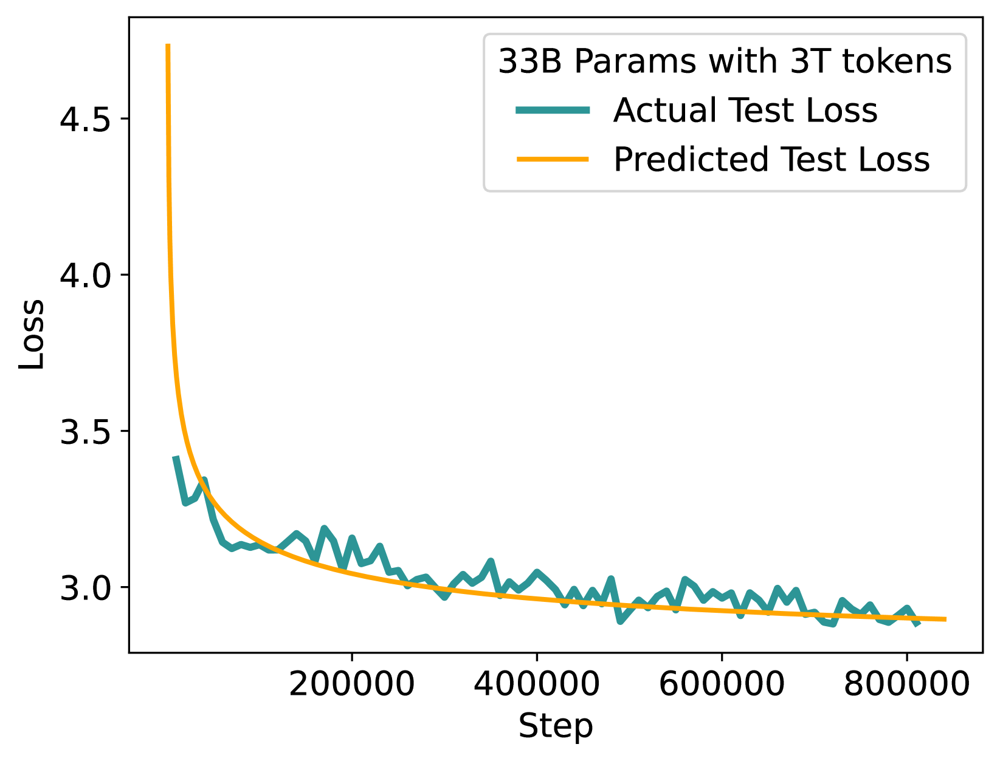

# [揭秘规模定律的奥秘：第一篇章](https://arxiv.org/abs/2403.06563)

发布时间：2024年03月11日

`LLM理论`

> Unraveling the Mystery of Scaling Laws: Part I

> 研究表明，缩放定律揭示了模型性能与其规模、训练数据量及所用计算资源间的强关联性，这一发现对诸如GPT-4、Llama和Gemini等大模型的成功至关重要。然而，OpenAI首篇关于缩放定律的论文并未详尽阐述推导精确公式所需的所有细节，其结论仅基于含15亿参数以下的模型。后续研究虽努力揭示更多细节并尝试拓展至更大模型，却常常忽略了学习率、上下文长度和批量大小等关键因素在训练过程中的依赖性，从而未能得出可靠的测试损失预测公式。本技术报告证实，在模型规模扩大至330亿参数时，原始OpenAI论文中提出的缩放定律公式依然适用，但其中的常数系数会随实验配置大幅波动。我们精细梳理了影响因子，并通过训练仅含100万至6000万参数的模型，提供了清晰易懂的步骤指导，以估算缩放定律公式中的全部常数项。运用这些估算出的公式，我们能够精准预见拥有高达330亿参数模型在训练前的各项性能指标，具体包括：最低可达的测试损失值；为实现某一特定损失所需的最少训练步数和处理的令牌数量；针对任何损失值下的最佳时间和计算资源平衡点——关键批量大小；以及任意批量大小下的完整测试损失曲线。

> Scaling law principles indicate a power-law correlation between loss and variables such as model size, dataset size, and computational resources utilized during training. These principles play a vital role in optimizing various aspects of model pre-training, ultimately contributing to the success of large language models such as GPT-4, Llama and Gemini. However, the original scaling law paper by OpenAI did not disclose the complete details necessary to derive the precise scaling law formulas, and their conclusions are only based on models containing up to 1.5 billion parameters. Though some subsequent works attempt to unveil these details and scale to larger models, they often neglect the training dependency of important factors such as the learning rate, context length and batch size, leading to their failure to establish a reliable formula for predicting the test loss trajectory. In this technical report, we confirm that the scaling law formulations proposed in the original OpenAI paper remain valid when scaling the model size up to 33 billion, but the constant coefficients in these formulas vary significantly with the experiment setup. We meticulously identify influential factors and provide transparent, step-by-step instructions to estimate all constant terms in scaling-law formulas by training on models with only 1M~60M parameters. Using these estimated formulas, we showcase the capability to accurately predict various attributes for models with up to 33B parameters before their training, including (1) the minimum possible test loss; (2) the minimum required training steps and processed tokens to achieve a specific loss; (3) the critical batch size with an optimal time/computation trade-off at any loss value; and (4) the complete test loss trajectory with arbitrary batch size.

[Arxiv](https://arxiv.org/abs/2403.06563)