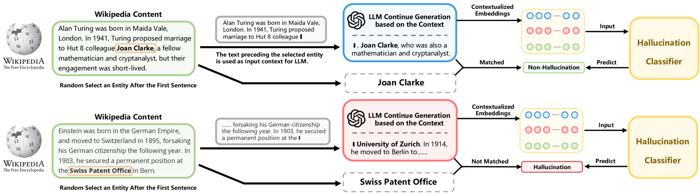
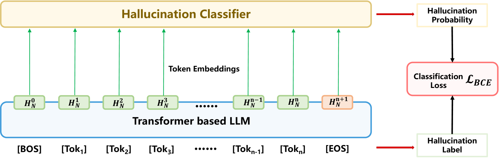

# 本研究提出了一种新颖的方法，利用大型语言模型（LLM）的内部状态进行无监督实时幻觉检测。这项技术无需人工标注，在运行过程中直接根据LLM的状态识别出可能的“幻觉”输出，特别适用于对自然语言处理系统的实时监控与优化。

发布时间：2024年03月11日

`LLM应用`

> Unsupervised Real-Time Hallucination Detection based on the Internal States of Large Language Models

# 摘要

> LLMs中出现的“幻觉”问题，即生成内容虽逻辑连贯却与事实不符，降低了它们在实际场景下的表现力，迫切需要研究如何识别并减轻这种现象。以往研究大多依赖于计算密集型且因与LLMs推理过程脱节而效力受限的后处理检测技术。为此，我们创新提出了MIND这一无监督训练框架，它能实时利用LLMs的内部状态进行幻觉检测，无需人工标注辅助。同时，我们构建了全新的评估基准HELK，包含多种LLMs的输出样例及其推理过程中的内部状态信息，用于全面检验幻觉检测性能。实验证明，MIND在幻觉检测任务上已超越当前最先进的方法。

> Hallucinations in large language models (LLMs) refer to the phenomenon of LLMs producing responses that are coherent yet factually inaccurate. This issue undermines the effectiveness of LLMs in practical applications, necessitating research into detecting and mitigating hallucinations of LLMs. Previous studies have mainly concentrated on post-processing techniques for hallucination detection, which tend to be computationally intensive and limited in effectiveness due to their separation from the LLM's inference process. To overcome these limitations, we introduce MIND, an unsupervised training framework that leverages the internal states of LLMs for real-time hallucination detection without requiring manual annotations. Additionally, we present HELM, a new benchmark for evaluating hallucination detection across multiple LLMs, featuring diverse LLM outputs and the internal states of LLMs during their inference process. Our experiments demonstrate that MIND outperforms existing state-of-the-art methods in hallucination detection.

[Arxiv](https://arxiv.org/abs/2403.06448)