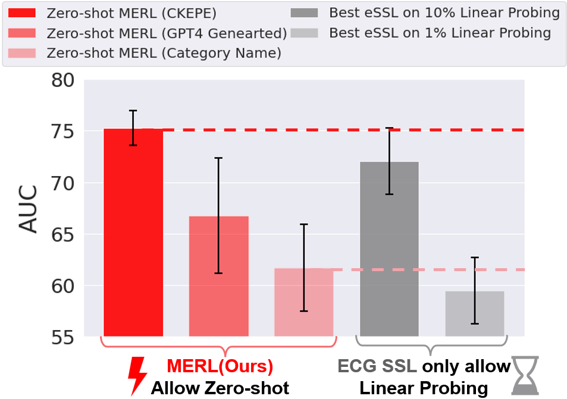
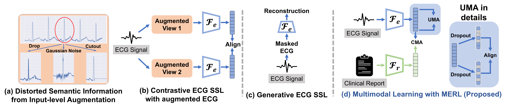
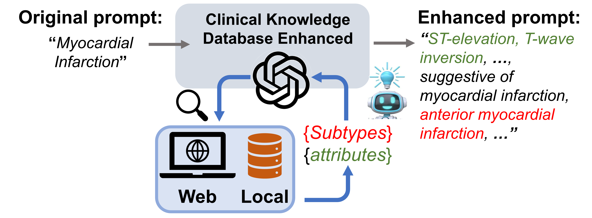

# 运用多模态学习与测试阶段临床知识升级技术，我们实现了无需预先训练的心电图分类。这一研究聚焦于在零样本场景下，通过融合多种模态信息并实时提升临床相关知识，以实现对心电图的有效分类。

发布时间：2024年03月11日

`LLM应用`

> Zero-Shot ECG Classification with Multimodal Learning and Test-time Clinical Knowledge Enhancement

> ECG作为临床诊断心脏异常的关键非侵入式工具，在自我监督学习(eSSL)技术的帮助下，能从无标注数据中提取有价值的信息。然而，现有eSSL方法大多忽略了蕴含于报告中的丰富临床知识，并且对下游任务所需的标注样本过于依赖，这制约了其应用灵活性。为此，我们创新提出了一种多模态心电图表示学习框架——MERL，它结合心电图记录和相关报告进行多模态学习，无需任何训练数据，即可通过文本提示完成零样本ECG分类。为进一步提高零样本分类效果，我们设计了一种临床知识增强型提示工程技术CKEPE，运用大型语言模型(LLMs)对接权威临床知识库，生成更精确详尽的提示，有效抑制LLMs生成内容的臆断性。基于MERL，我们在六大公开ECG数据集上设立首个基准测试，并揭示MERL相比eSSL方法取得了显著的性能提升，尤其在零样本分类场景下，MERL平均AUC得分高达75.2%，较之仅使用10\%标注训练数据的传统线性探查eSSL方法高出3.2个百分点。

> Electrocardiograms (ECGs) are non-invasive diagnostic tools crucial for detecting cardiac arrhythmic diseases in clinical practice. While ECG Self-supervised Learning (eSSL) methods show promise in representation learning from unannotated ECG data, they often overlook the clinical knowledge that can be found in reports. This oversight and the requirement for annotated samples for downstream tasks limit eSSL's versatility. In this work, we address these issues with the Multimodal ECG Representation Learning (MERL}) framework. Through multimodal learning on ECG records and associated reports, MERL is capable of performing zero-shot ECG classification with text prompts, eliminating the need for training data in downstream tasks. At test time, we propose the Clinical Knowledge Enhanced Prompt Engineering (CKEPE) approach, which uses Large Language Models (LLMs) to exploit external expert-verified clinical knowledge databases, generating more descriptive prompts and reducing hallucinations in LLM-generated content to boost zero-shot classification. Based on MERL, we perform the first benchmark across six public ECG datasets, showing the superior performance of MERL compared against eSSL methods. Notably, MERL achieves an average AUC score of 75.2% in zero-shot classification (without training data), 3.2% higher than linear probed eSSL methods with 10\% annotated training data, averaged across all six datasets.

[Arxiv](https://arxiv.org/abs/2403.06659)