# [进一步探索，我们发现大型语言模型（LLM）在解析视觉信号方面也展现出潜力。本文探讨了“Frozen Large Language Models”在非文本领域——视觉信号理解上的应用，揭示其在图像、视频等多模态信息处理中的新可能。](https://arxiv.org/abs/2403.07874)

发布时间：2024年03月12日

`LLM应用`

> Beyond Text: Frozen Large Language Models in Visual Signal Comprehension

> 本工作中，我们探索了一种让大型语言模型（LLM）不依赖于多模态数据集微调，也能直接理解视觉信号的新可能。我们创新地将图像视为一种可以用语言表达的实体，并通过V2T Tokenizer将其转化为由LLM词汇生成的一系列离散词语。这一过程巧妙融合了编码器-解码器、LLM词库及CLIP模型的力量，将图像转化成了一种“另类语言”。如此一来，LLM不仅能理解视觉信息，还能以自回归的方式完成图像去噪与复原，且无需经历任何微调步骤。我们严谨地开展了大量实验，验证了这种方法在图像识别、图像标题生成、视觉问答等多种理解任务上的有效性，同时也适用于诸如填充缺失像素、扩增图像边界、去除模糊、还原位移等各类图像去噪任务。相关代码和模型已开放在GitHub上供查阅和使用，地址为：https://github.com/zh460045050/V2L-Tokenizer。

> In this work, we investigate the potential of a large language model (LLM) to directly comprehend visual signals without the necessity of fine-tuning on multi-modal datasets. The foundational concept of our method views an image as a linguistic entity, and translates it to a set of discrete words derived from the LLM's vocabulary. To achieve this, we present the Vision-to-Language Tokenizer, abbreviated as V2T Tokenizer, which transforms an image into a ``foreign language'' with the combined aid of an encoder-decoder, the LLM vocabulary, and a CLIP model. With this innovative image encoding, the LLM gains the ability not only for visual comprehension but also for image denoising and restoration in an auto-regressive fashion-crucially, without any fine-tuning. We undertake rigorous experiments to validate our method, encompassing understanding tasks like image recognition, image captioning, and visual question answering, as well as image denoising tasks like inpainting, outpainting, deblurring, and shift restoration. Code and models are available at https://github.com/zh460045050/V2L-Tokenizer.

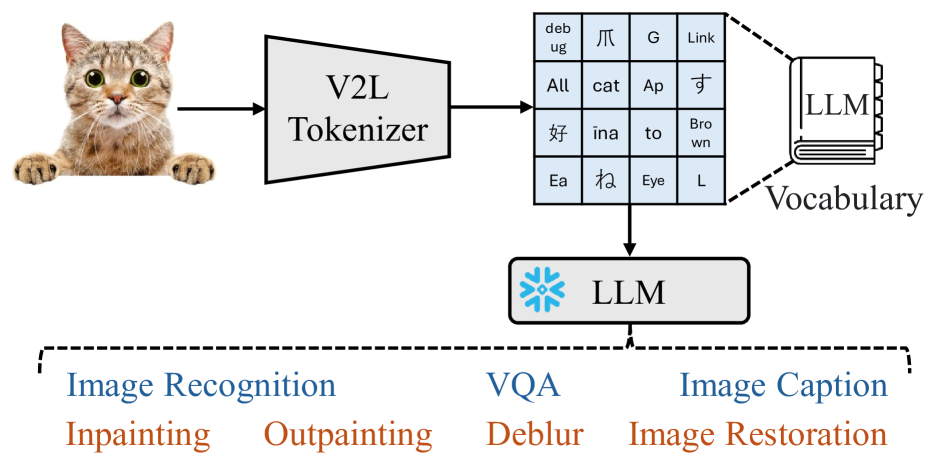

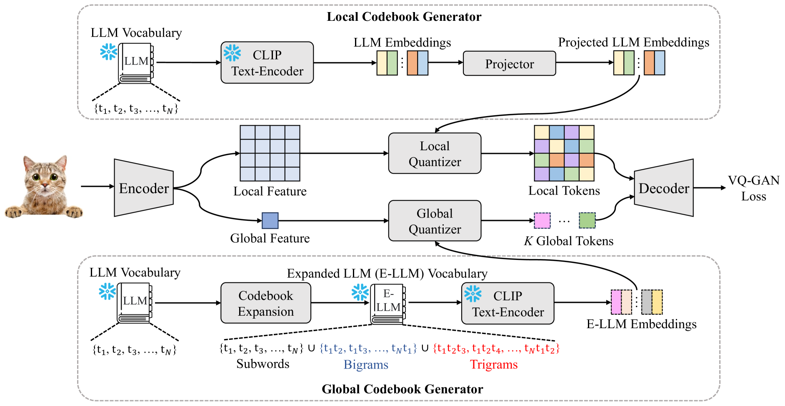

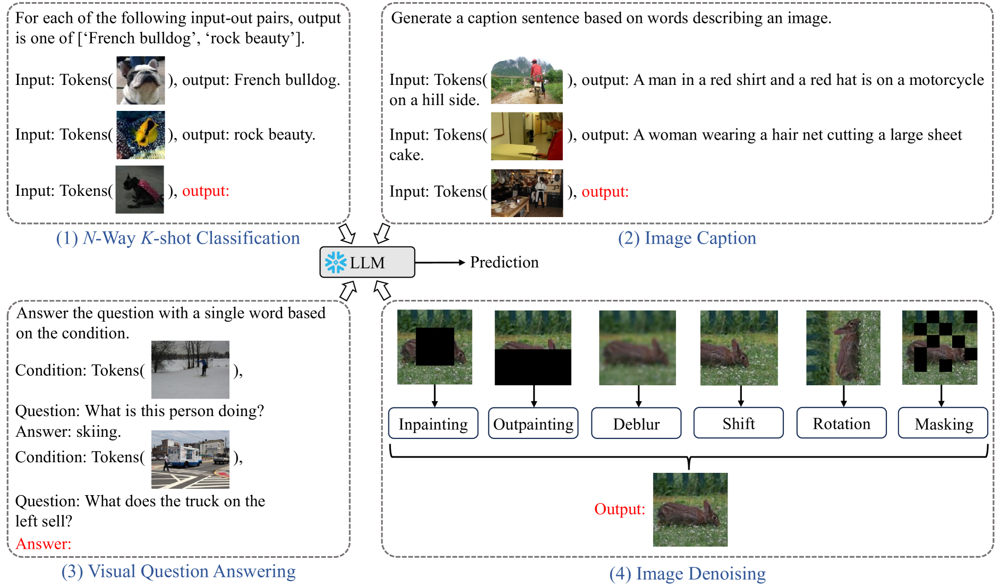

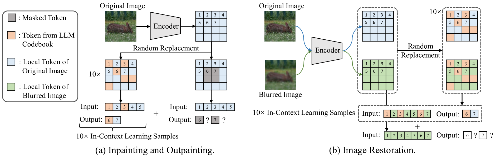

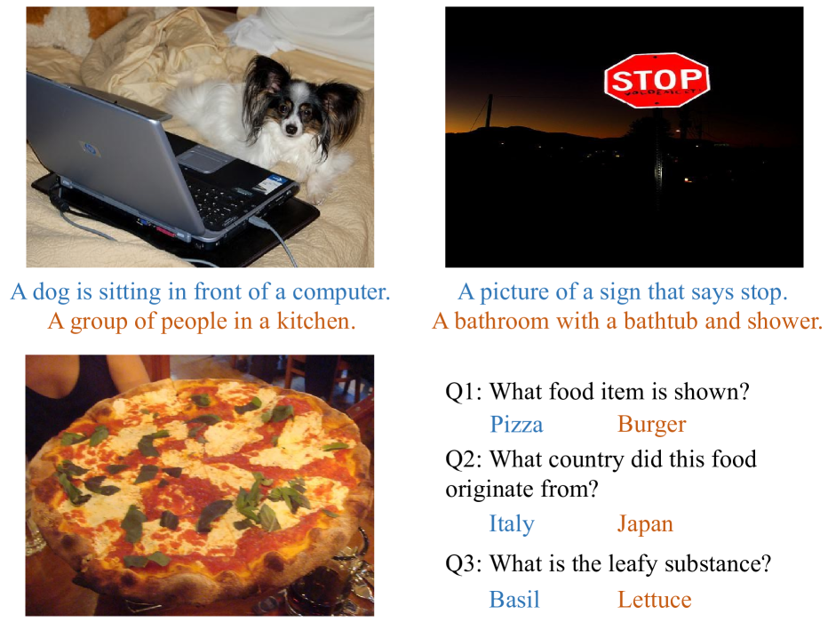

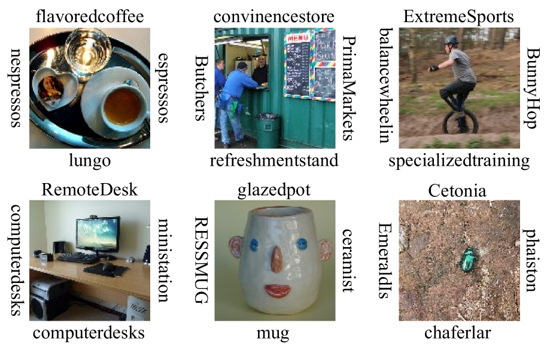

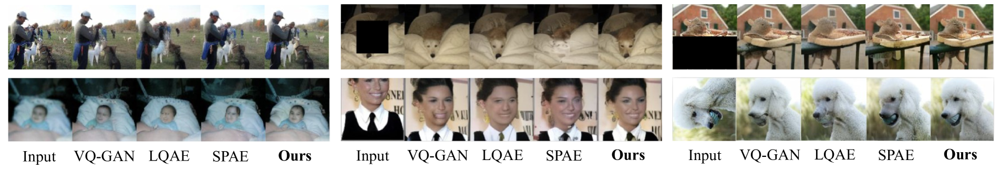

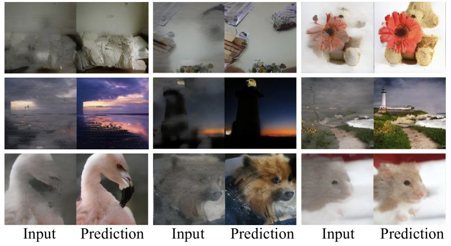

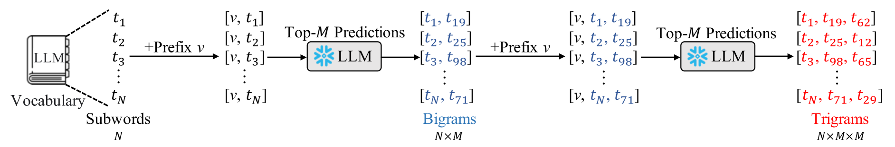

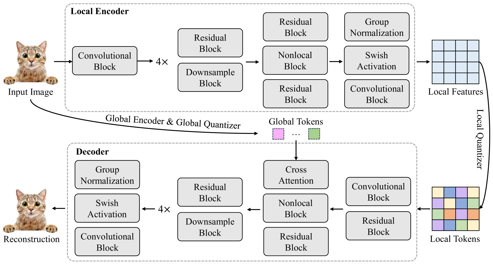

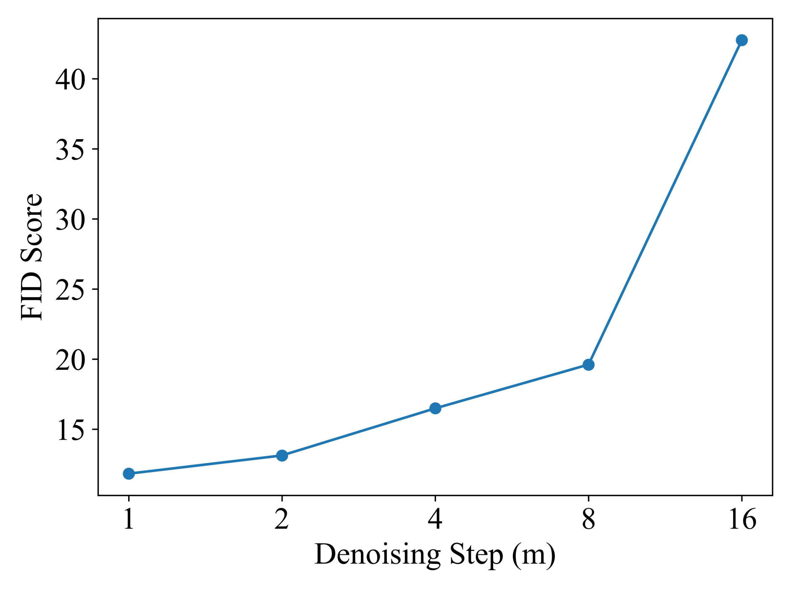

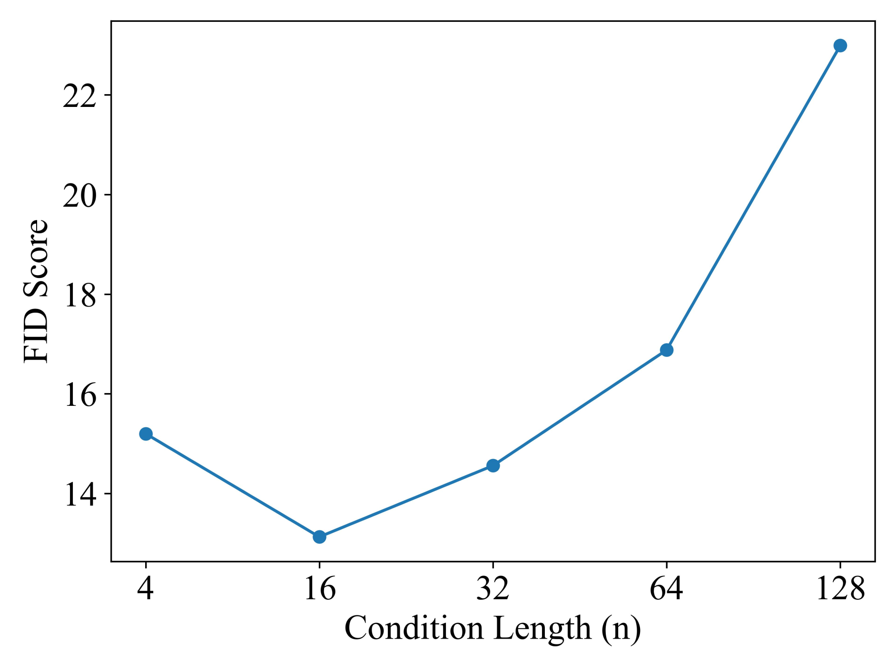

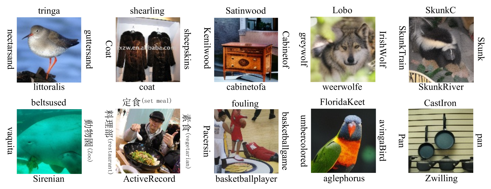

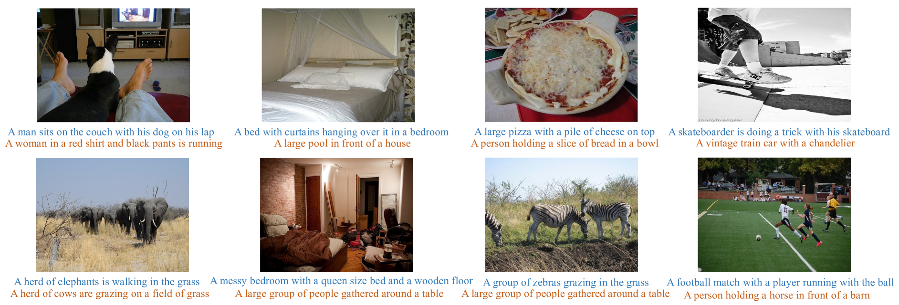

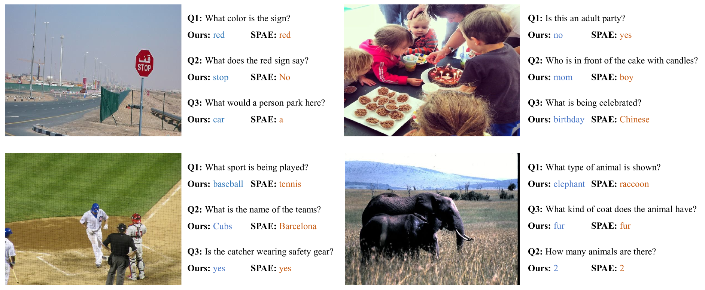

