# [Branch-Train-MiX 技术，旨在将多个专家级大型语言模型融合为一个混合型专家 LLM，通过该方法，各专家模型的优势得以有机结合，共同提升整体性能。](https://arxiv.org/abs/2403.07816)

发布时间：2024年03月12日

`LLM理论`

> Branch-Train-MiX: Mixing Expert LLMs into a Mixture-of-Experts LLM

> 本研究探索了一种高效训练LLMs的方法——BTX，旨在让模型同时具备编程、数学推理及世界知识等多领域的专业技能。BTX从基础模型出发，通过高效并行方式分化训练各个领域专家，减少通讯开销且提高处理速度。在各专家完成异步训练后，BTX巧妙地将他们的前馈参数融入MoE层作为专家集合，并对剩余参数做平均化处理，随后进行MoE精细化调整以学习令牌级别的路径选择。BTX包括两个特例：不涉及路由学习的Branch-Train-Merge方法，以及跳过异步训练专家步骤的稀疏升级方法。相比其他方法，BTX在准确度与效率之间找到了最优平衡点。

> We investigate efficient methods for training Large Language Models (LLMs) to possess capabilities in multiple specialized domains, such as coding, math reasoning and world knowledge. Our method, named Branch-Train-MiX (BTX), starts from a seed model, which is branched to train experts in embarrassingly parallel fashion with high throughput and reduced communication cost. After individual experts are asynchronously trained, BTX brings together their feedforward parameters as experts in Mixture-of-Expert (MoE) layers and averages the remaining parameters, followed by an MoE-finetuning stage to learn token-level routing. BTX generalizes two special cases, the Branch-Train-Merge method, which does not have the MoE finetuning stage to learn routing, and sparse upcycling, which omits the stage of training experts asynchronously. Compared to alternative approaches, BTX achieves the best accuracy-efficiency tradeoff.

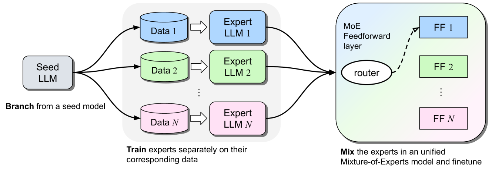

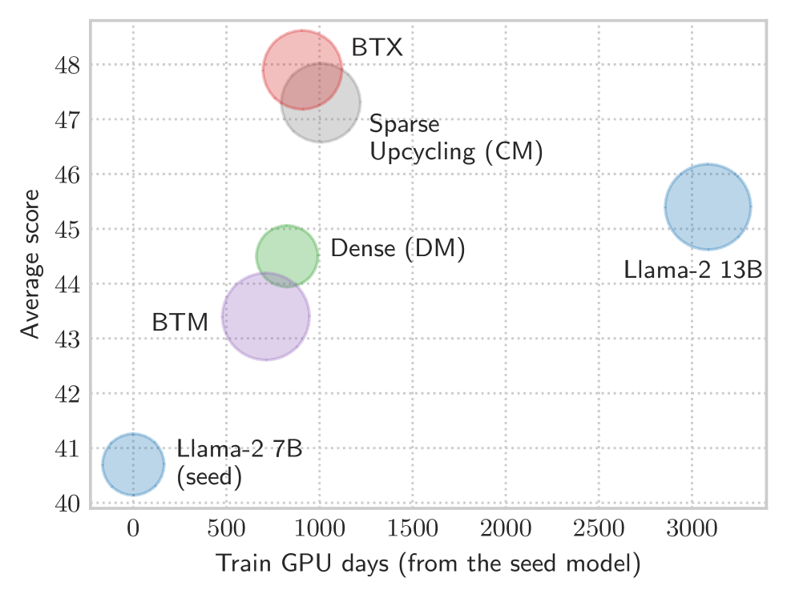

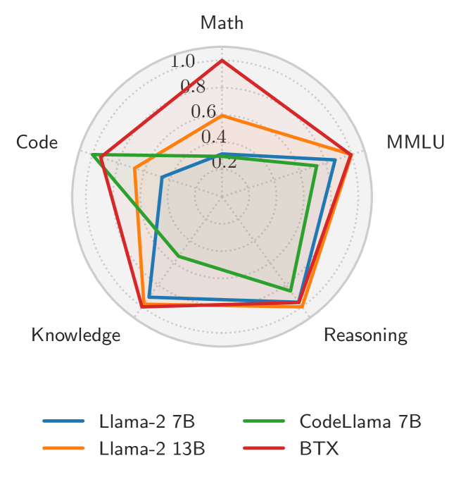

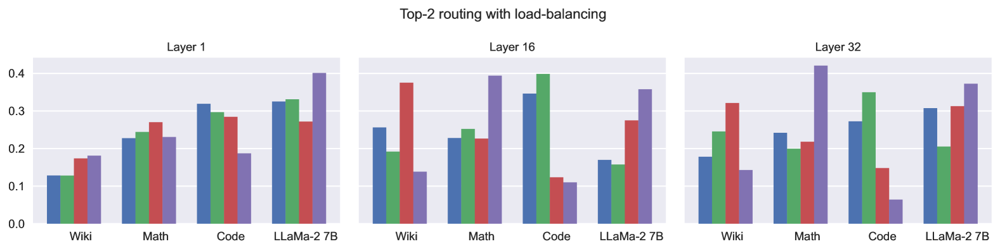

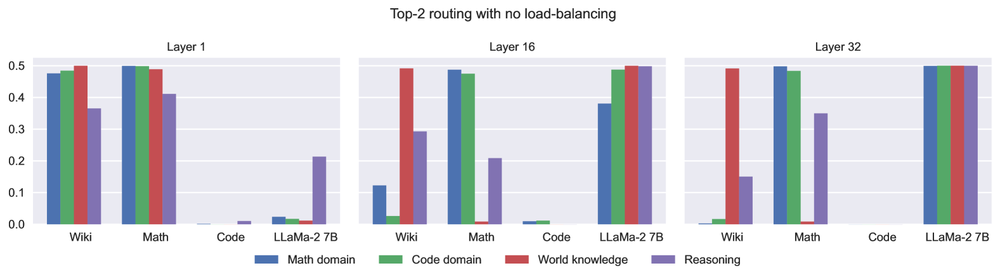

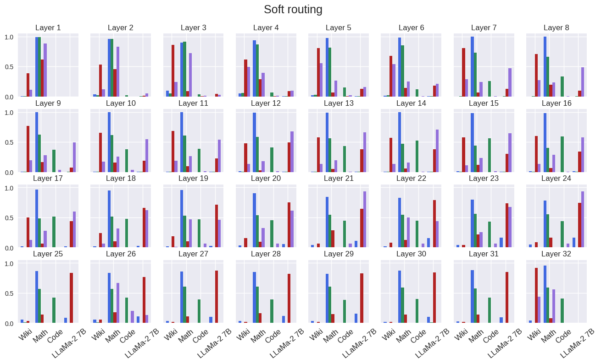

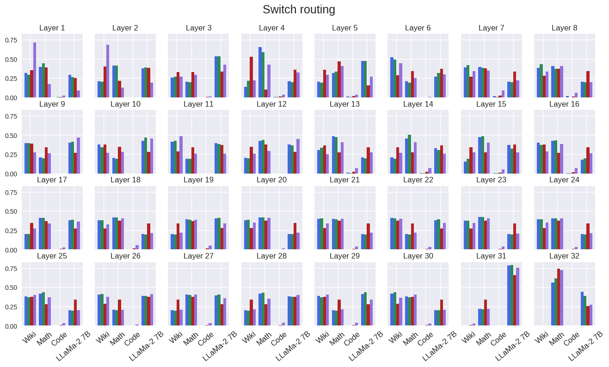

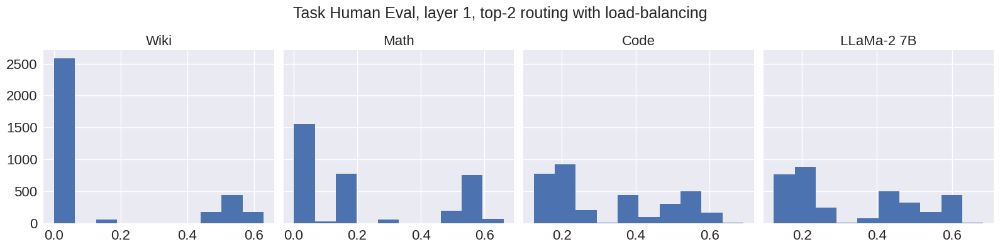

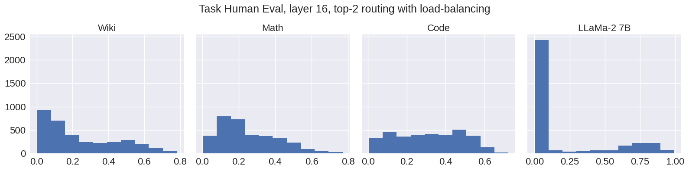

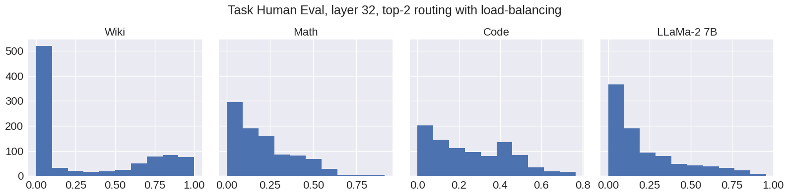

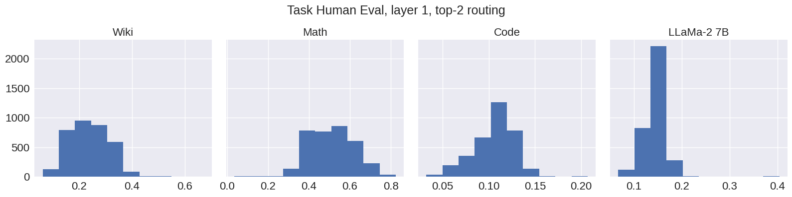

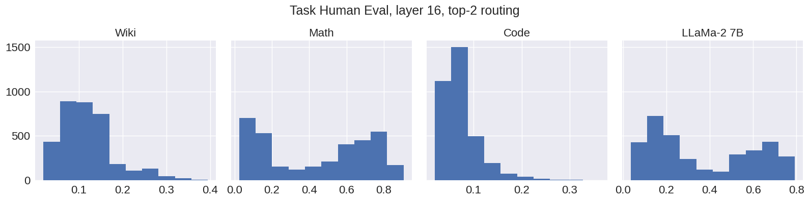

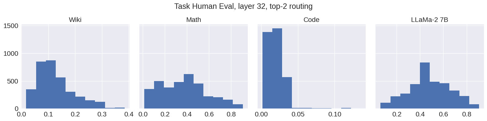

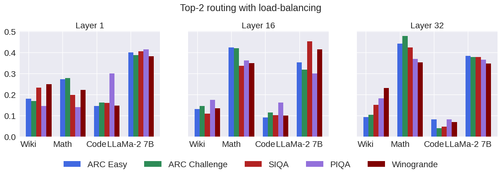

[Arxiv](https://arxiv.org/abs/2403.07816)