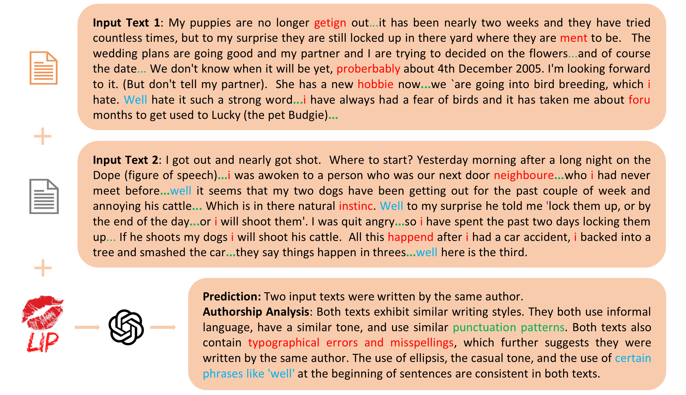
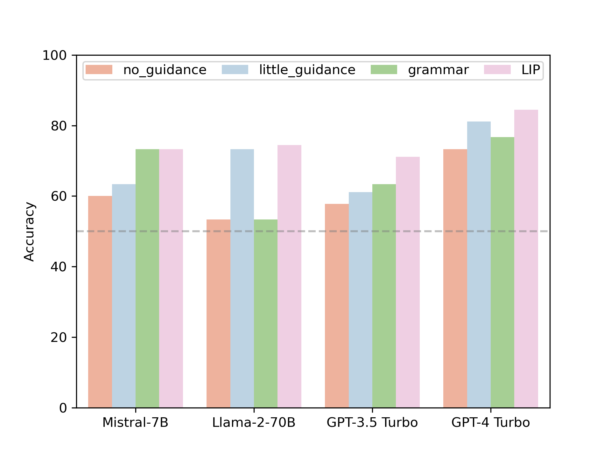
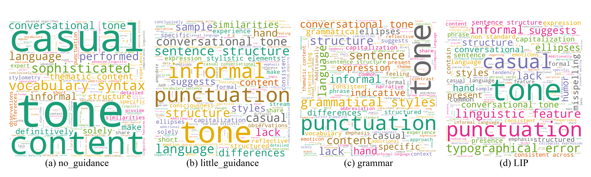
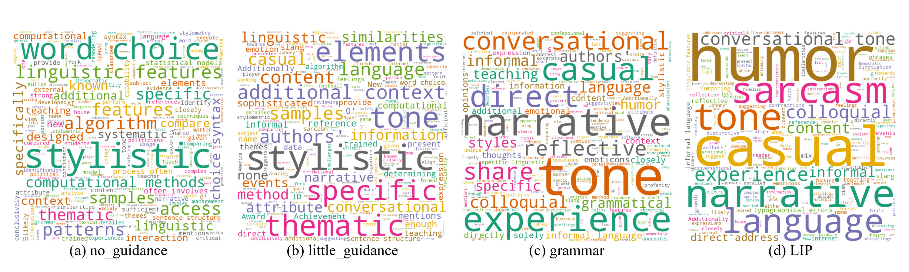

# 大型语言模型是否具备鉴别文本作者的能力？

发布时间：2024年03月12日

`LLM应用` `文本分析` `作者身份验证`

> Can Large Language Models Identify Authorship?

# 摘要

> 精准识别作者身份是确保内容真实性和打击虚假信息的关键，LLMs虽拥有强大的推理与解题能力，但其在作者分析（包括作者验证和归属）领域的潜力尚待挖掘。本论文系统评估了LLMs在这两类核心任务上的表现力，突破了以往依赖手工精选文体特征的研究局限，转而采用预训练语言模型生成的文本嵌入技术。然而，此类方法常需借助标注数据进行微调，且在跨领域应用时性能易下滑，同时解释性较弱。本研究围绕三个核心问题展开：(1) LLMs能否实现从零开始、全流程的高效作者身份验证？(2) LLMs在面对多个候选作者（如10位或20位）时，是否能精确判断作品归属？(3) 在作者分析过程中，尤其是针对语言特征的影响，LLMs如何提供具有说服力的解释？不仅如此，我们还尝试将明确的语言学特征融入LLMs的推理机制中。经过广泛而深入的评估，我们证实了LLMs在上述任务中无需特定领域微调也能展现卓越效能，并通过对语言学特征详尽解析，揭示了其决策背后的逻辑，从而为后续基于LLM的作者分析研究建立了新的标杆。相关的代码和数据资源已开放在https://github.com/baixianghuang/authorship-llm平台上。

> The ability to accurately identify authorship is crucial for verifying content authenticity and mitigating misinformation. Large Language Models (LLMs) have demonstrated exceptional capacity for reasoning and problem-solving. However, their potential in authorship analysis, encompassing authorship verification and attribution, remains underexplored. This paper conducts a comprehensive evaluation of LLMs in these critical tasks. Traditional studies have depended on hand-crafted stylistic features, whereas state-of-the-art approaches leverage text embeddings from pre-trained language models. These methods, which typically require fine-tuning on labeled data, often suffer from performance degradation in cross-domain applications and provide limited explainability. This work seeks to address three research questions: (1) Can LLMs perform zero-shot, end-to-end authorship verification effectively? (2) Are LLMs capable of accurately attributing authorship among multiple candidates authors (e.g., 10 and 20)? (3) How can LLMs provide explainability in authorship analysis, particularly through the role of linguistic features? Moreover, we investigate the integration of explicit linguistic features to guide LLMs in their reasoning processes. Our extensive assessment demonstrates LLMs' proficiency in both tasks without the need for domain-specific fine-tuning, providing insights into their decision-making via a detailed analysis of linguistic features. This establishes a new benchmark for future research on LLM-based authorship analysis. The code and data are available at https://github.com/baixianghuang/authorship-llm.

[Arxiv](https://arxiv.org/abs/2403.08213)