# 探究数据中心中大型语言模型开发过程的特点与特征分析

发布时间：2024年03月12日

`Agent`

> Characterization of Large Language Model Development in the Datacenter

# 摘要

> LLMs在众多变革性任务中的表现令人瞩目，但如何高效利用大规模集群资源进行开发则充满挑战，比如硬件故障频发、并行化策略复杂、资源分配不均等问题。在这篇论文中，我们深入剖析了从自家GPU数据中心Acme采集的长达半年的LLM开发工作负载追踪数据。我们特别关注LLMs与之前任务特定DL工作负载之间的差异，探究资源利用规律，并识别各类任务失败带来的影响。通过对这些难点的总结，我们找出了为LLMs定制优化系统的可能方向。同时，我们还推出了两项创新系统举措：(1) 容错型预训练技术，借助LLM参与故障诊断和自动化恢复手段提升系统容错能力；(2) 分离式评估调度机制，采用试验分解与调度优化相结合的方式确保快速获得性能反馈。

> Large Language Models (LLMs) have presented impressive performance across several transformative tasks. However, it is non-trivial to efficiently utilize large-scale cluster resources to develop LLMs, often riddled with numerous challenges such as frequent hardware failures, intricate parallelization strategies, and imbalanced resource utilization. In this paper, we present an in-depth characterization study of a six-month LLM development workload trace collected from our GPU datacenter Acme. Specifically, we investigate discrepancies between LLMs and prior task-specific Deep Learning (DL) workloads, explore resource utilization patterns, and identify the impact of various job failures. Our analysis summarizes hurdles we encountered and uncovers potential opportunities to optimize systems tailored for LLMs. Furthermore, we introduce our system efforts: (1) fault-tolerant pretraining, which enhances fault tolerance through LLM-involved failure diagnosis and automatic recovery. (2) decoupled scheduling for evaluation, which achieves timely performance feedback via trial decomposition and scheduling optimization.

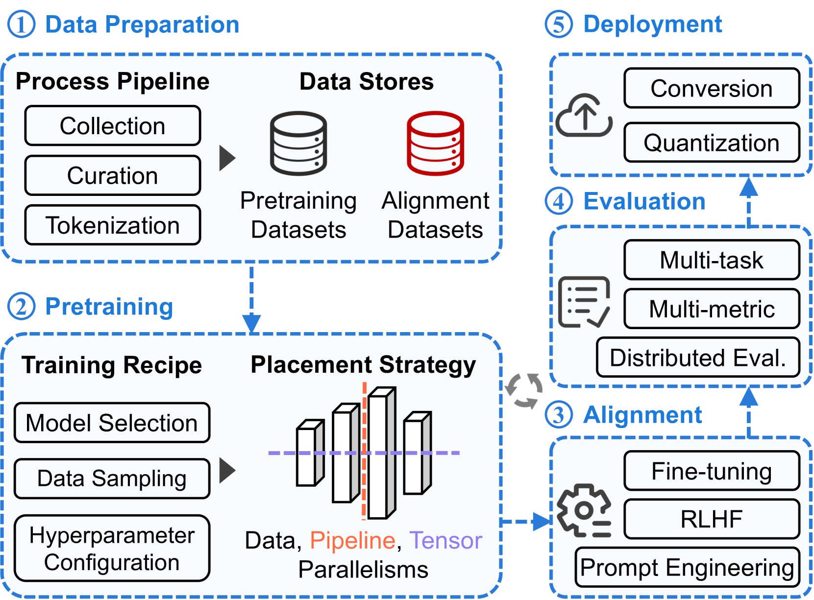

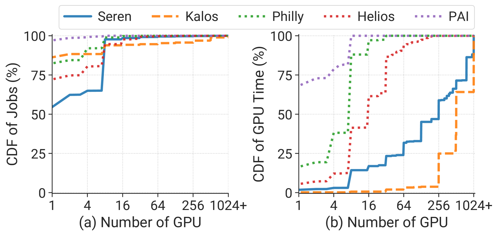

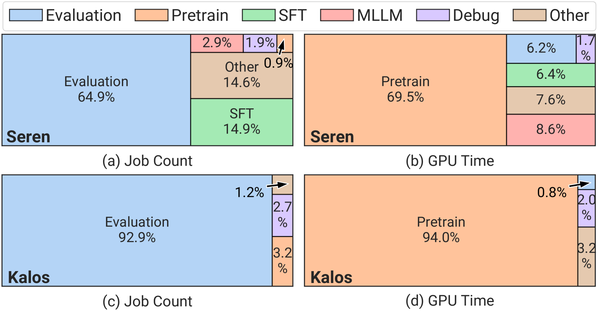

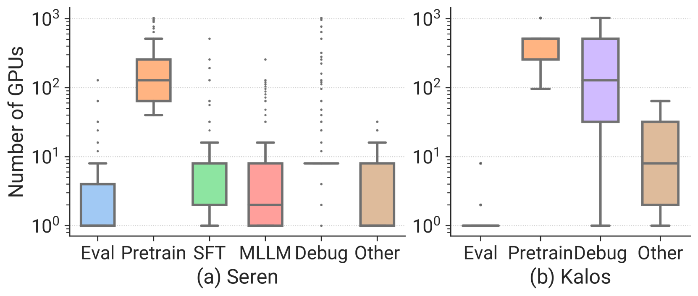

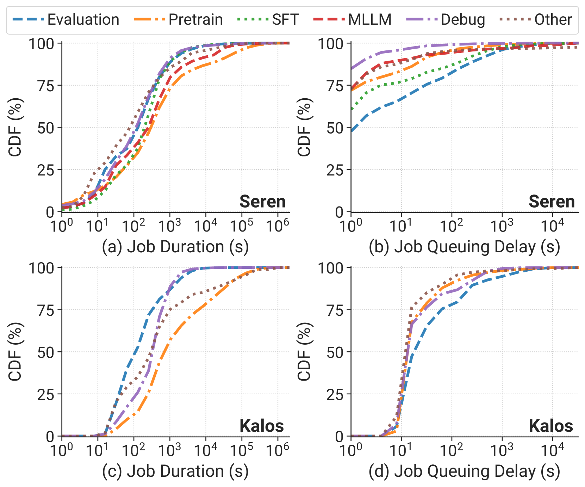

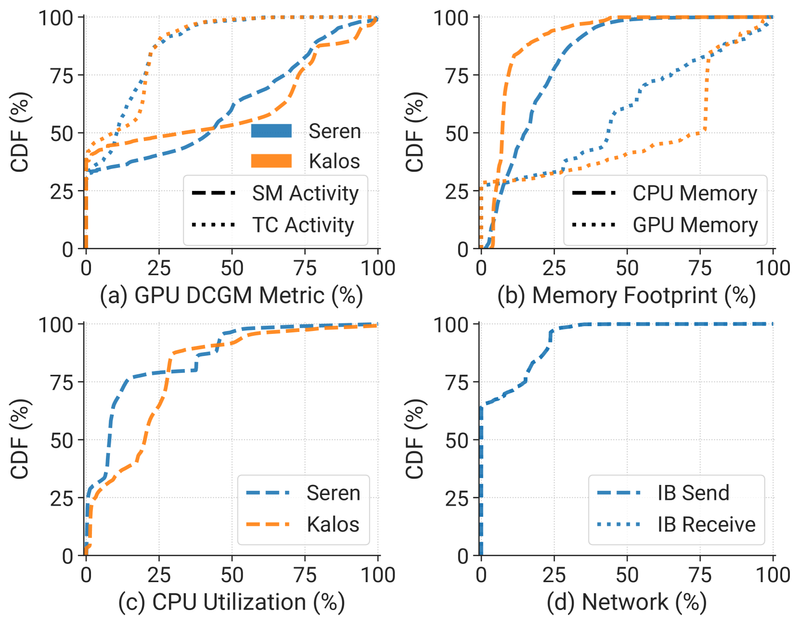

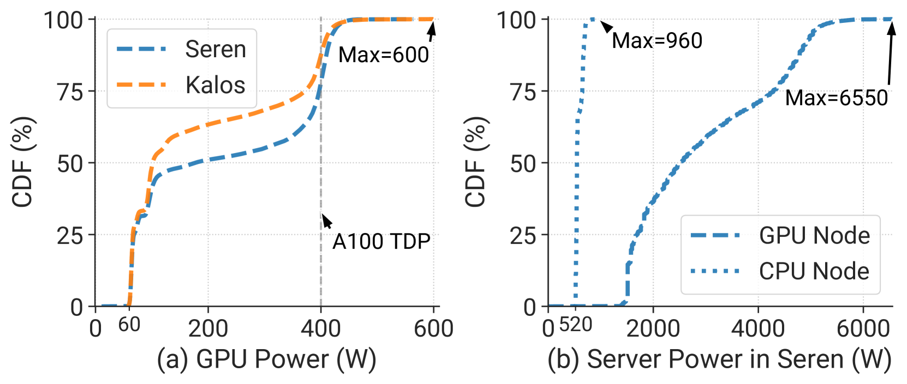

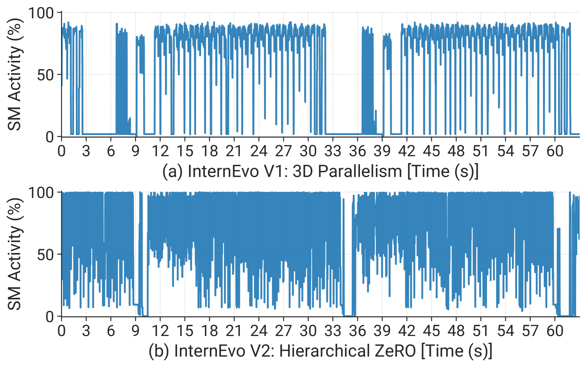

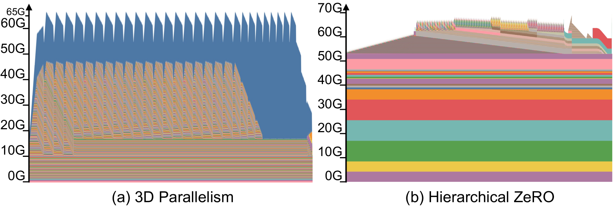

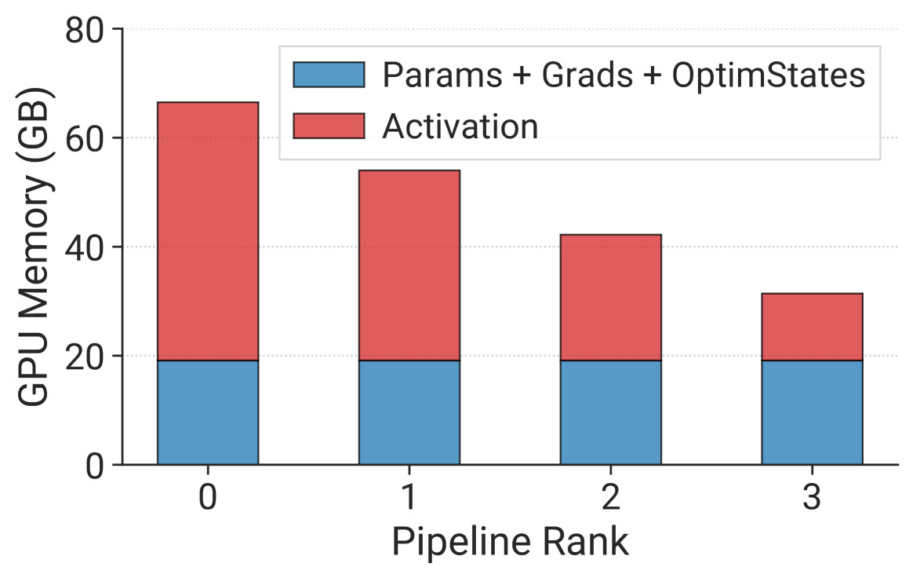

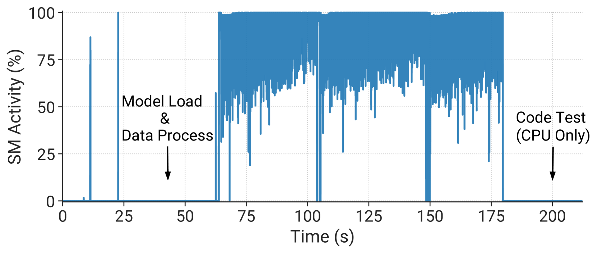

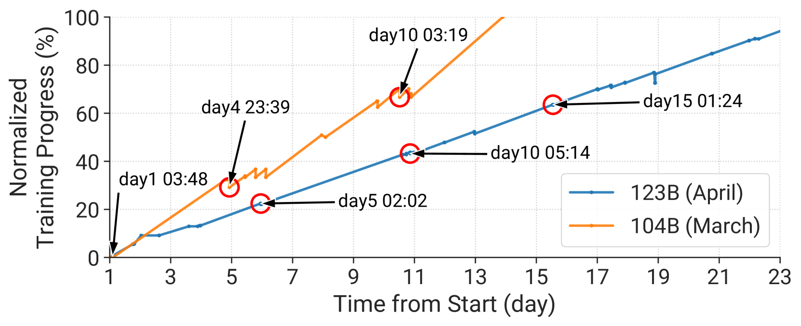

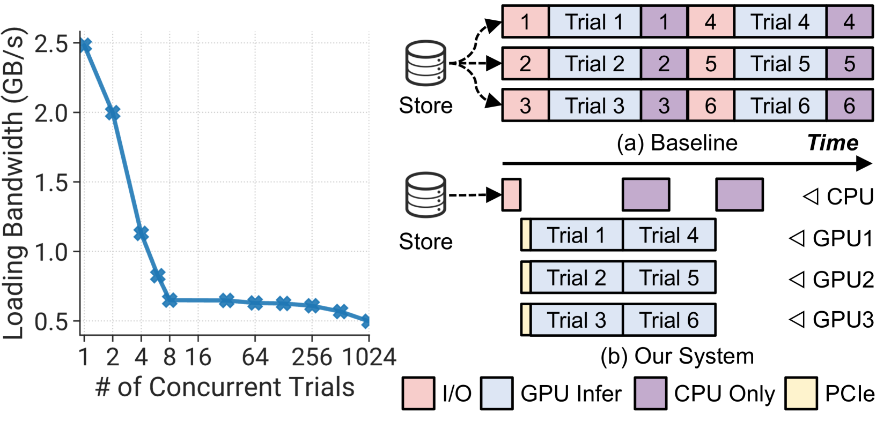

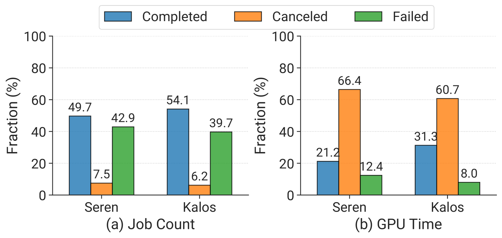

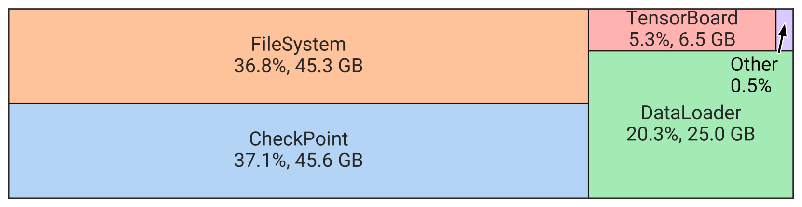

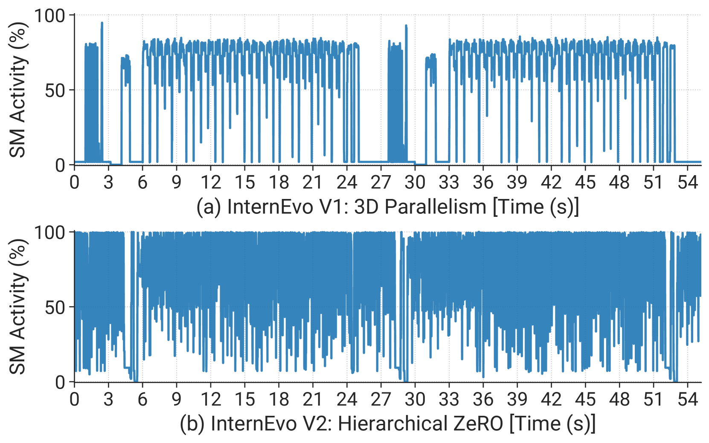

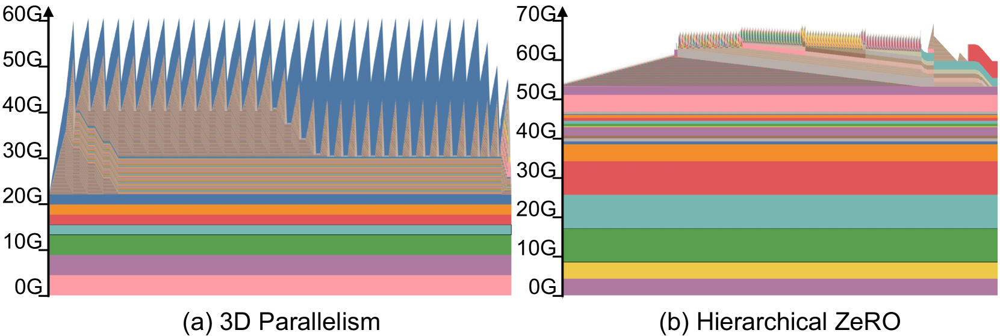

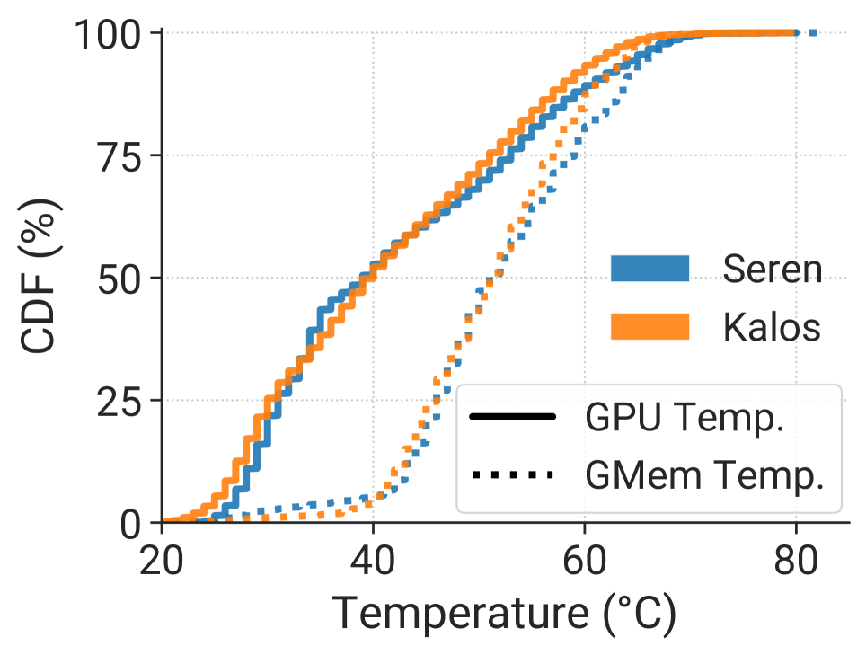

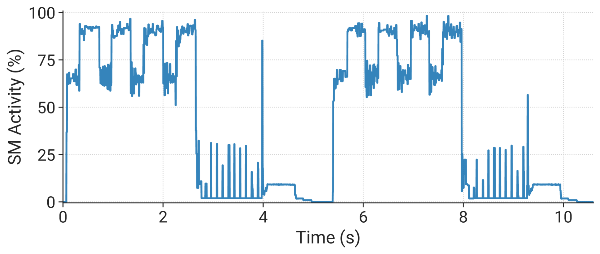

[Arxiv](https://arxiv.org/abs/2403.07648)