# 数据解码者：大型语言模型驱动的数据科学智能助手

发布时间：2024年03月12日

`Agent

这篇论文介绍了一种基于大型语言模型（LLM）的代理——数据解释器，它专门设计来提升在数据科学领域中的性能，特别是在需要实时数据调整、复杂任务依赖优化以及精确推理逻辑错误识别的场景中。数据解释器通过三种关键技术来实现这一目标，包括分层图结构的动态规划、动态整合工具以提升代码熟练度，以及识别并纠正逻辑不一致。这些特性使得数据解释器在多项测试中表现出色，显著优于现有的开源基准。因此，这篇论文属于Agent分类，因为它描述了一个具体的LLM应用实例，即一个能够执行数据科学任务的智能代理。` `数据科学` `机器学习`

> Data Interpreter: An LLM Agent For Data Science

# 摘要

> 基于LLM的代理在数据科学领域表现出色，但在需要实时数据调整、复杂任务依赖优化以及精确推理逻辑错误识别的场景中，其性能可能受限。为此，我们提出了数据解释器，这一方案通过三种关键技术提升数据科学问题解决能力：1）利用分层图结构实现动态规划，以适应实时数据变化；2）动态整合工具，提升执行中的代码熟练度，增强专业技能；3）识别反馈中的逻辑不一致，并通过经验记录提高效率。在多项数据科学和实际任务测试中，数据解释器相比开源基准表现更优，机器学习任务性能从0.86提升至0.95，MATH数据集性能提升26%，开放式任务性能更是惊人地提升了112%。该解决方案将在GitHub上发布，网址为https://github.com/geekan/MetaGPT。

> Large Language Model (LLM)-based agents have demonstrated remarkable effectiveness. However, their performance can be compromised in data science scenarios that require real-time data adjustment, expertise in optimization due to complex dependencies among various tasks, and the ability to identify logical errors for precise reasoning. In this study, we introduce the Data Interpreter, a solution designed to solve with code that emphasizes three pivotal techniques to augment problem-solving in data science: 1) dynamic planning with hierarchical graph structures for real-time data adaptability;2) tool integration dynamically to enhance code proficiency during execution, enriching the requisite expertise;3) logical inconsistency identification in feedback, and efficiency enhancement through experience recording. We evaluate the Data Interpreter on various data science and real-world tasks. Compared to open-source baselines, it demonstrated superior performance, exhibiting significant improvements in machine learning tasks, increasing from 0.86 to 0.95. Additionally, it showed a 26% increase in the MATH dataset and a remarkable 112% improvement in open-ended tasks. The solution will be released at https://github.com/geekan/MetaGPT.

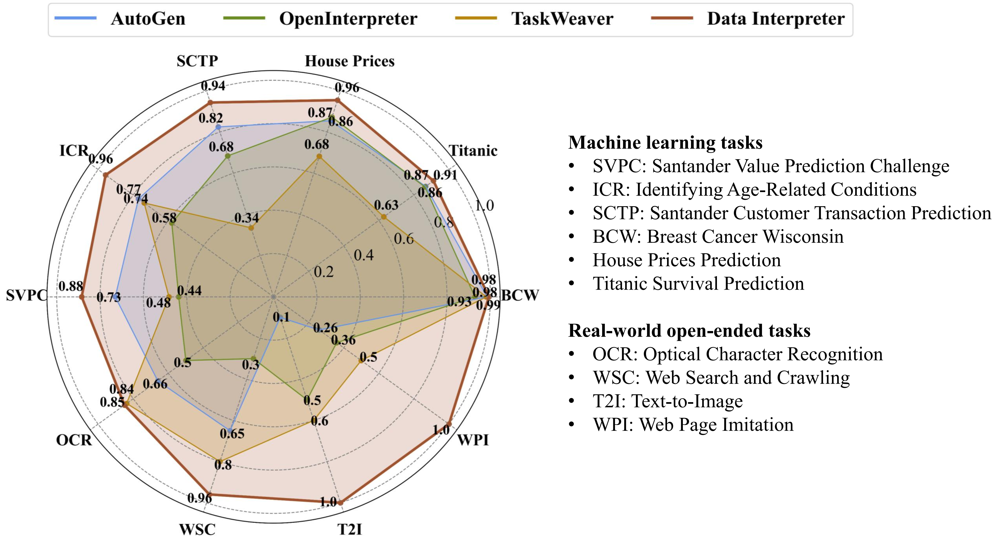

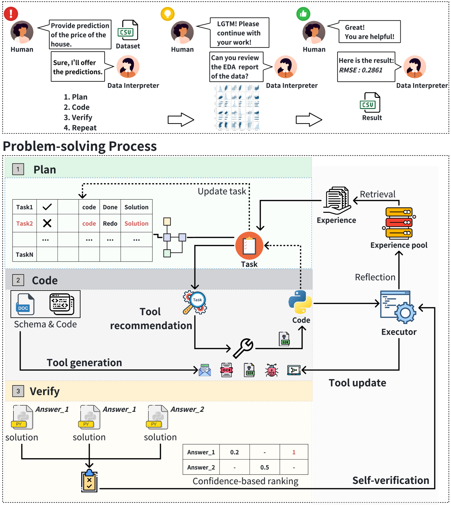

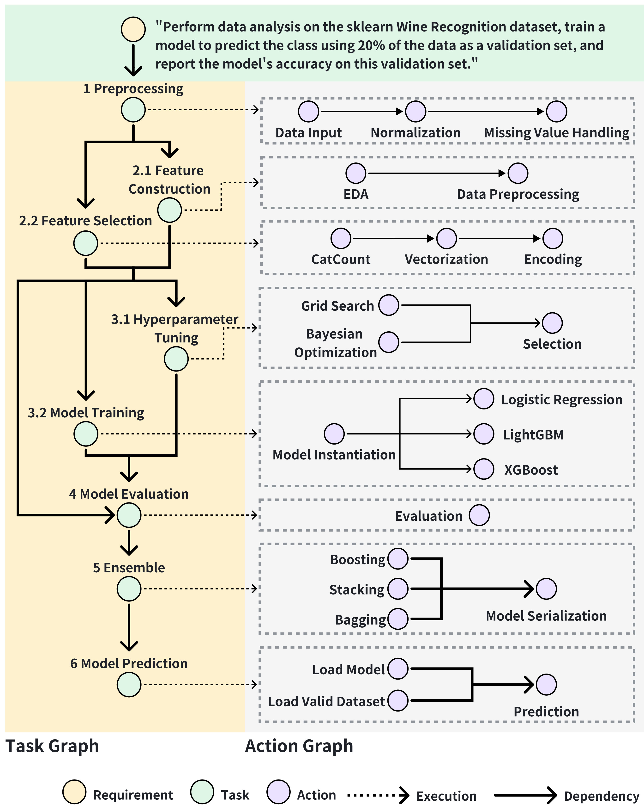

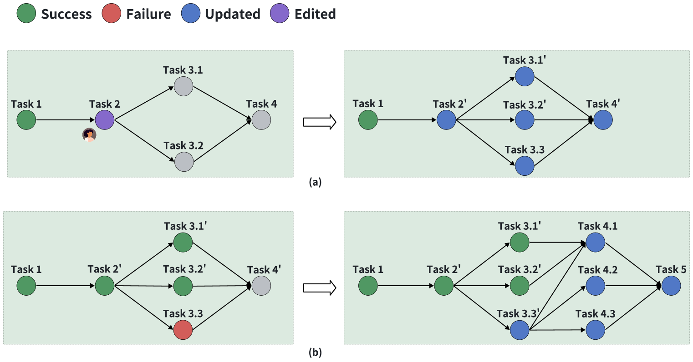

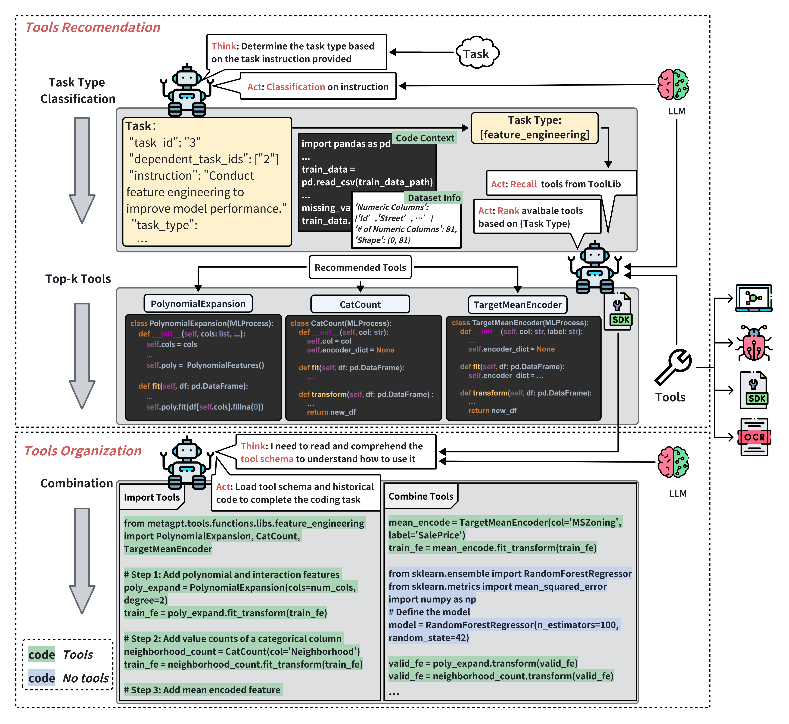

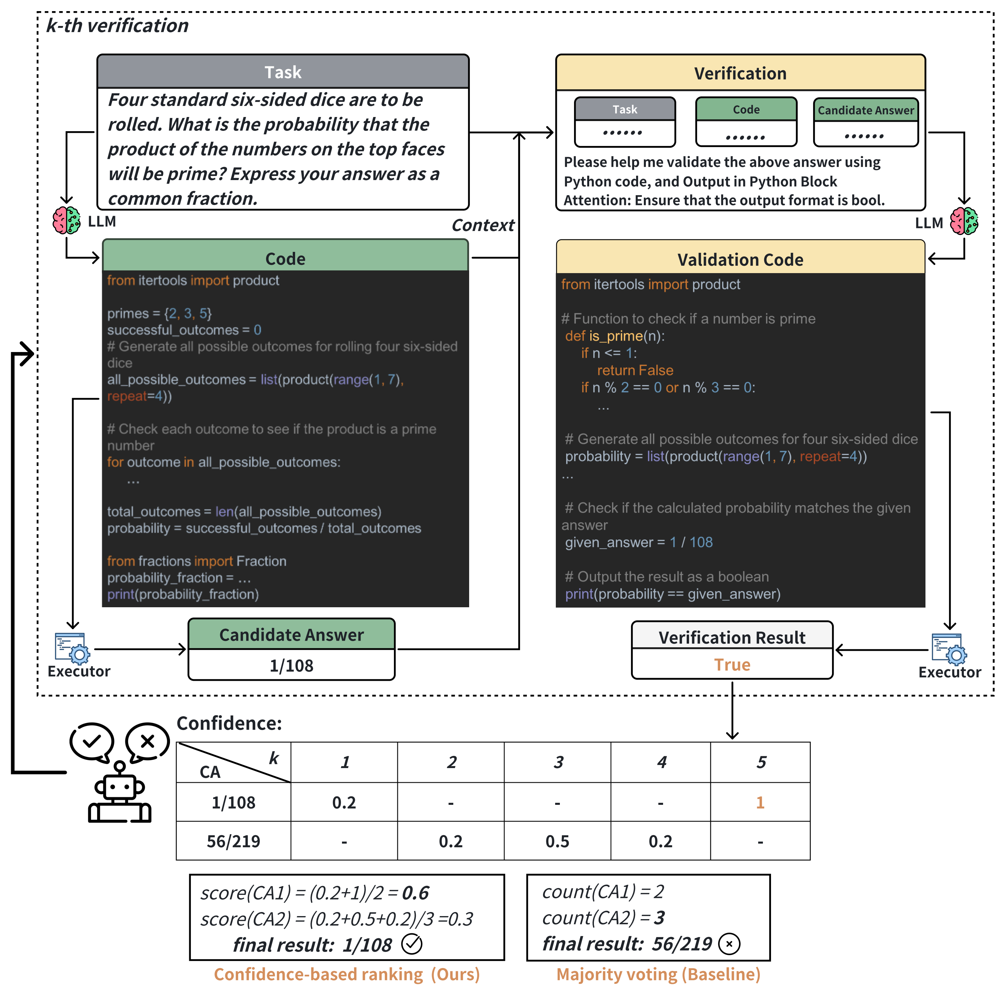

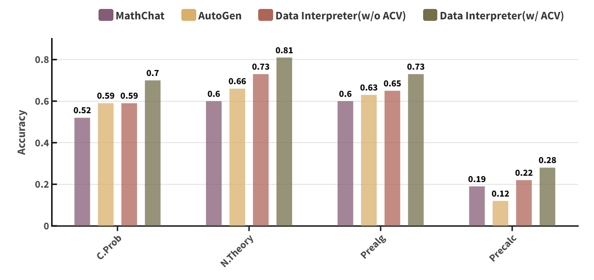

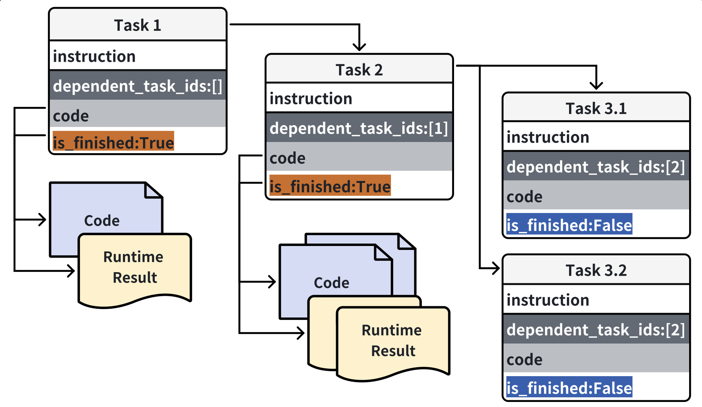

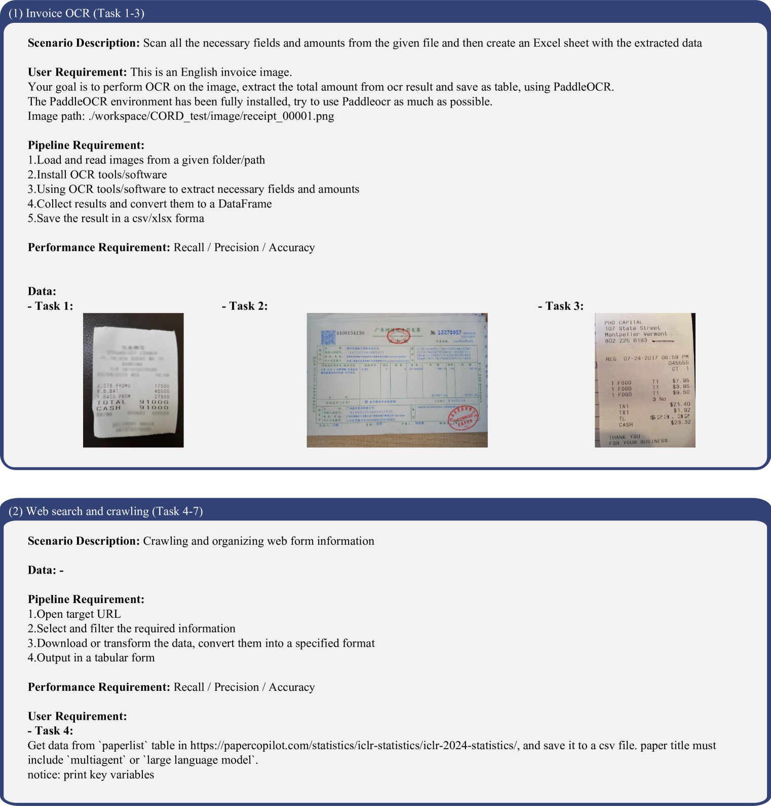

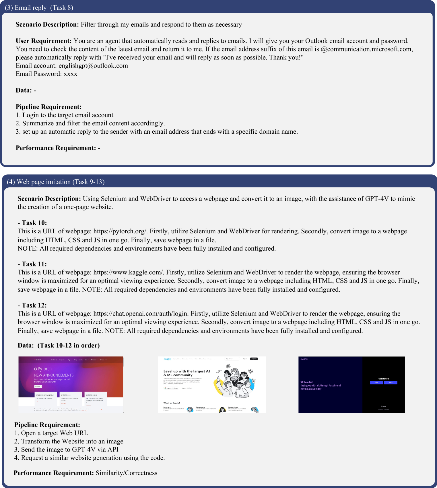

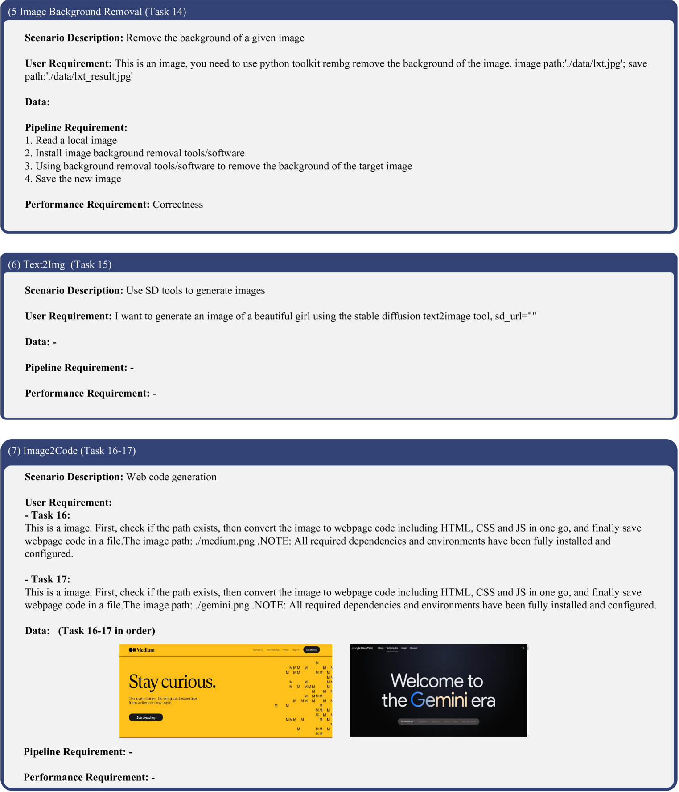

[Arxiv](https://arxiv.org/abs/2402.18679)