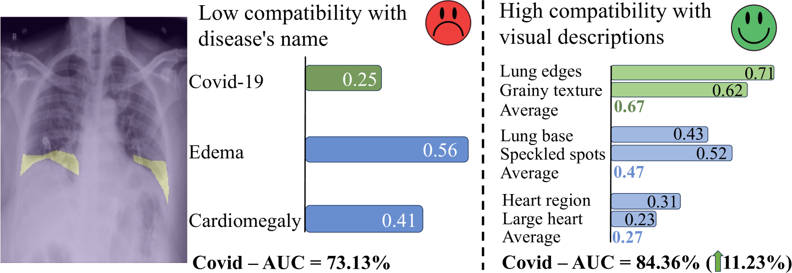
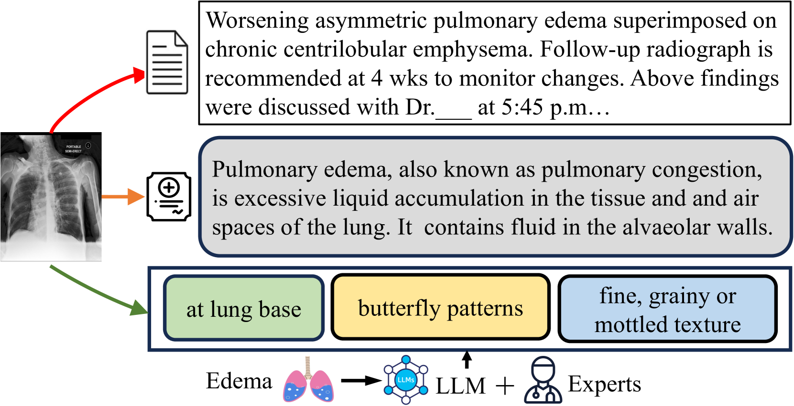
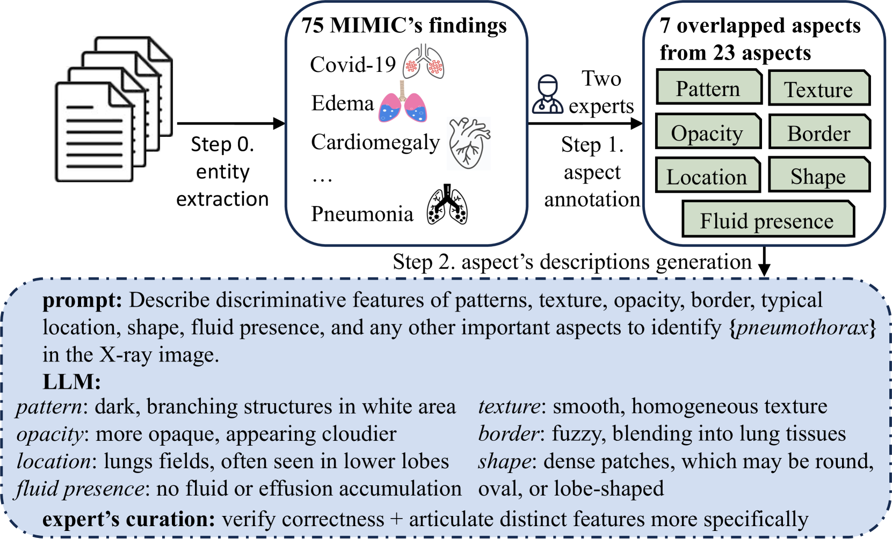
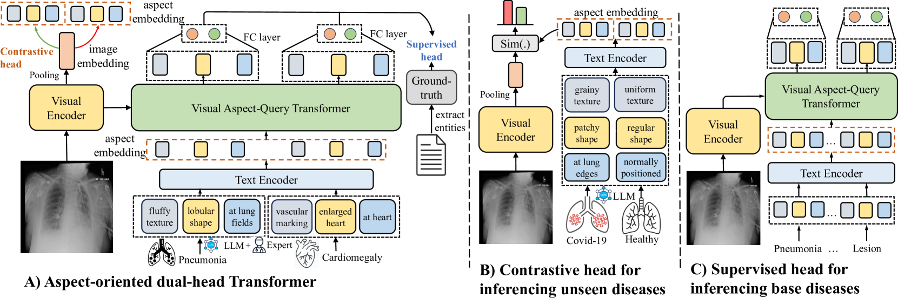
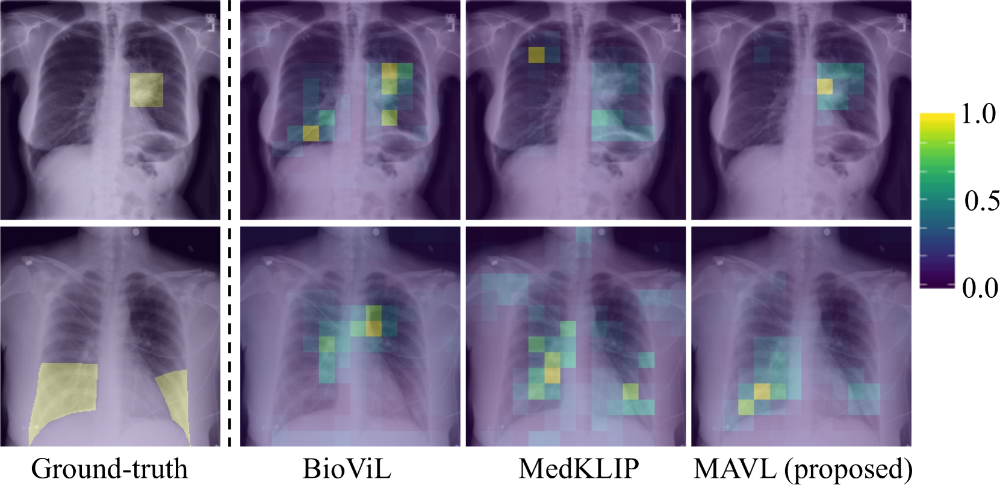

# 为了提升病理检测的准确性，我们提出了一种分解疾病描述的方法，并构建了一个结合多方面视觉信息与语言描述匹配的框架。该框架旨在通过深度理解和匹配病灶特征与医学文本描述的不同方面，从而强化病理检测效能。

发布时间：2024年03月12日

`Agent`

> Decomposing Disease Descriptions for Enhanced Pathology Detection: A Multi-Aspect Vision-Language Matching Framework

> 随着医疗视觉语言预训练技术（VLP）的发展，通过对比查询图像与各类疾病的文本描述，实现了无需预先训练就能识别病理特征。但受限于复杂的生物医学文本语义，现有方法在将医学图像与非结构化报告中关键病理特征对应时面临挑战，导致图像与目标疾病文字描述间的错位问题。本论文创新性地提出一个VLP框架，它借助大规模语言模型及医学专家的专业知识，将疾病描述拆解为多个基本层面，并通过整合Transformer模块，让输入图像与疾病的各种组成元素精准对接，形成以“方面”为核心的图像表达。通过综合各个方面的匹配信息，我们提升了图像与其相关疾病的匹配度。更进一步，我们运用这种面向方面的表征方式，定制了一款双头Transformer，既能高效处理已知疾病，又能优化对未知疾病的全面检测效能。实验证明，在七个下游数据集上，我们的方法相较于近期技术在已知类别的AUC得分提高达8.07%，在新类别上的提升更是高达11.23%。项目代码已开源至GitHub：<https://github.com/HieuPhan33/MAVL>。

> Medical vision language pre-training (VLP) has emerged as a frontier of research, enabling zero-shot pathological recognition by comparing the query image with the textual descriptions for each disease. Due to the complex semantics of biomedical texts, current methods struggle to align medical images with key pathological findings in unstructured reports. This leads to the misalignment with the target disease's textual representation. In this paper, we introduce a novel VLP framework designed to dissect disease descriptions into their fundamental aspects, leveraging prior knowledge about the visual manifestations of pathologies. This is achieved by consulting a large language model and medical experts. Integrating a Transformer module, our approach aligns an input image with the diverse elements of a disease, generating aspect-centric image representations. By consolidating the matches from each aspect, we improve the compatibility between an image and its associated disease. Additionally, capitalizing on the aspect-oriented representations, we present a dual-head Transformer tailored to process known and unknown diseases, optimizing the comprehensive detection efficacy. Conducting experiments on seven downstream datasets, ours outperforms recent methods by up to 8.07% and 11.23% in AUC scores for seen and novel categories, respectively. Our code is released at \href{https://github.com/HieuPhan33/MAVL}{https://github.com/HieuPhan33/MAVL}.

[Arxiv](https://arxiv.org/abs/2403.07636)