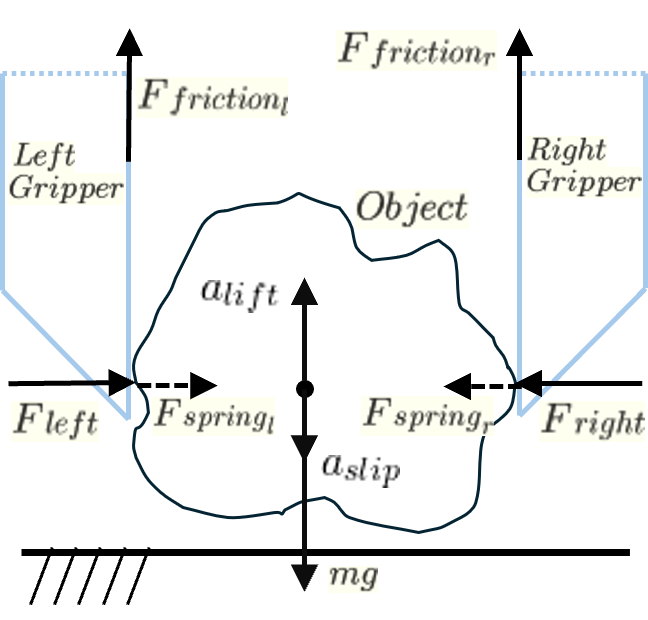

# [DeliGrasp 是一项技术，通过大型语言模型（LLMs）推算物体的质量、摩擦系数及顺应性，从而制定出能适应不同物体且抓取时变形极小的智能抓取策略。](https://arxiv.org/abs/2403.07832)

发布时间：2024年03月12日

`Agent`

> DeliGrasp: Inferring Object Mass, Friction, and Compliance with LLMs for Adaptive and Minimally Deforming Grasp Policies

> 借助LLMs对实物深入详尽的物理描述，机器人能以更高明的方式进行抓取操作。我们巧妙运用LLMs的常识物理推理与编程能力，从对象的语义描述中推算出其质量、摩擦系数及弹性常数等物理属性，并进一步转化为切实可行的动态抓取策略。实验采用装备有内置深度相机的电流可调双指夹爪，在涵盖两数量级质量与所需握取力度范围内的12种精巧且易变形物品（包括食物、果蔬、玩具以及其他日常生活用品）的个性化测试基准上，证明了基于物理原则生成的LLM抓取策略明显优于传统策略。同时，我们也揭示了DeliGrasp策略在后续任务中，如判断果蔬成熟度时，其所提供的柔顺反馈机制所起到的重要辅助作用。更多详情与演示视频，敬请访问：https://deligrasp.github.io

> Large language models (LLMs) can provide rich physical descriptions of most worldly objects, allowing robots to achieve more informed and capable grasping. We leverage LLMs' common sense physical reasoning and code-writing abilities to infer an object's physical characteristics--mass $m$, friction coefficient $μ$, and spring constant $k$--from a semantic description, and then translate those characteristics into an executable adaptive grasp policy. Using a current-controllable, two-finger gripper with a built-in depth camera, we demonstrate that LLM-generated, physically-grounded grasp policies outperform traditional grasp policies on a custom benchmark of 12 delicate and deformable items including food, produce, toys, and other everyday items, spanning two orders of magnitude in mass and required pick-up force. We also demonstrate how compliance feedback from DeliGrasp policies can aid in downstream tasks such as measuring produce ripeness. Our code and videos are available at: https://deligrasp.github.io

