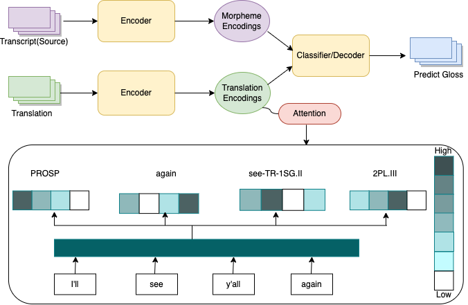
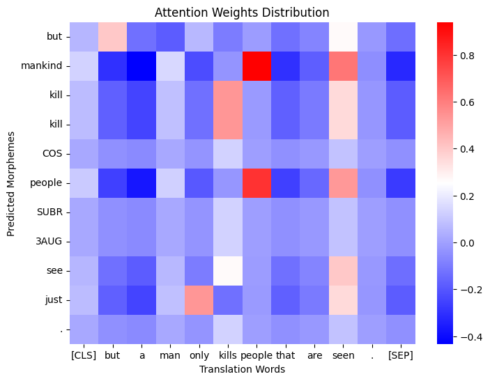
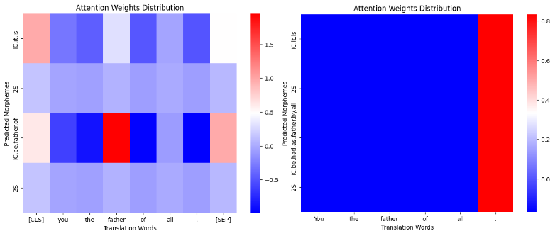
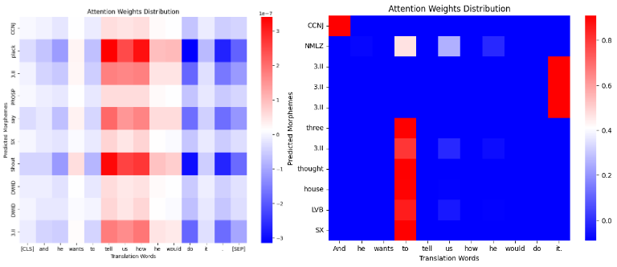
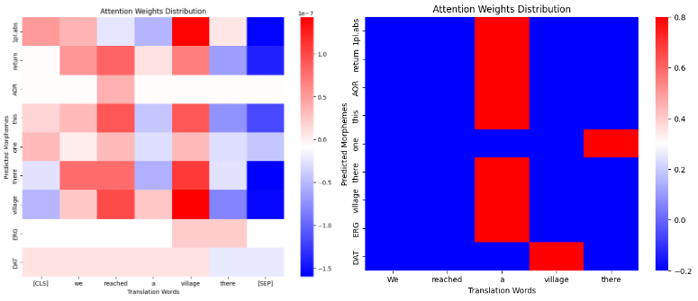
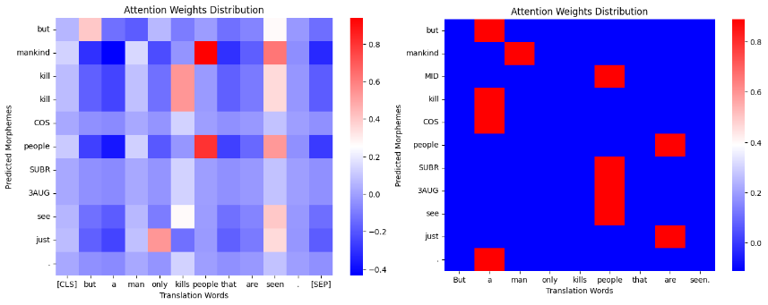
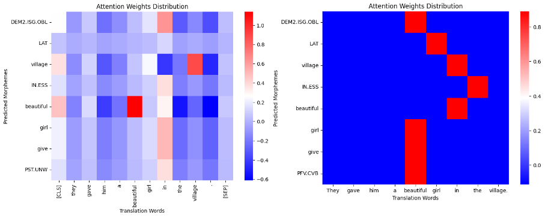
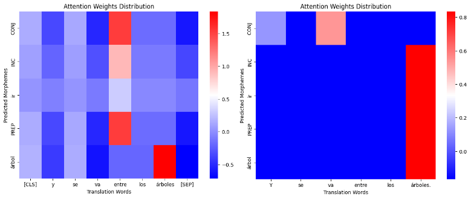

# 为解决低资源环境下自动术语注解问题，我们提出嵌入式翻译方法。该方法旨在利用嵌入技术，高效实现对稀有语言或词汇的精准翻译和注解。

发布时间：2024年03月12日

`LLM应用` `语言学` `机器翻译`

> Embedded Translations for Low-resource Automated Glossing

# 摘要

> 本研究探索了如何在资源匮乏条件下实现自动双行注释，通过对双行注释文本挖掘出的嵌入式翻译信息进行强化，并运用BERT和T5等大模型进行编码，我们设计了一个能生成标注输出的字符级解码器。这一系列创新使得我们的模型在SIGMORPHON 2023双行注释共享任务的多个数据集中，相较于以往最优成果平均提升了3.97个百分点。而在模拟超低资源场景下，即使仅使用100句样本来训练，该系统仍能超越基础硬注意力模型平均9.78个百分点，有力证明了翻译信息在提升系统效能、尤其是在处理小规模语料时的重要性。这一研究成果为语言的记录与保护开辟了新的可能性，且在共享任务数据集上的实验证明已取得重大突破。

> We investigate automatic interlinear glossing in low-resource settings. We augment a hard-attentional neural model with embedded translation information extracted from interlinear glossed text. After encoding these translations using large language models, specifically BERT and T5, we introduce a character-level decoder for generating glossed output. Aided by these enhancements, our model demonstrates an average improvement of 3.97\%-points over the previous state of the art on datasets from the SIGMORPHON 2023 Shared Task on Interlinear Glossing. In a simulated ultra low-resource setting, trained on as few as 100 sentences, our system achieves an average 9.78\%-point improvement over the plain hard-attentional baseline. These results highlight the critical role of translation information in boosting the system's performance, especially in processing and interpreting modest data sources. Our findings suggest a promising avenue for the documentation and preservation of languages, with our experiments on shared task datasets indicating significant advancements over the existing state of the art.

[Arxiv](https://arxiv.org/abs/2403.08189)