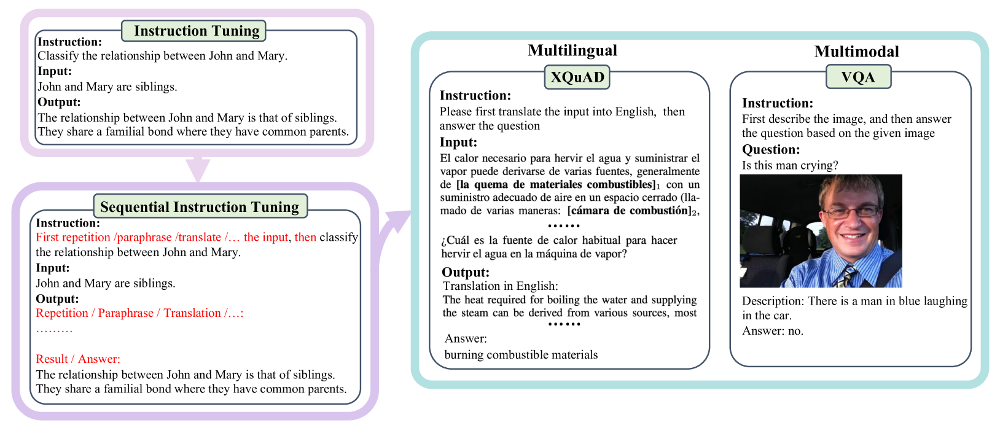
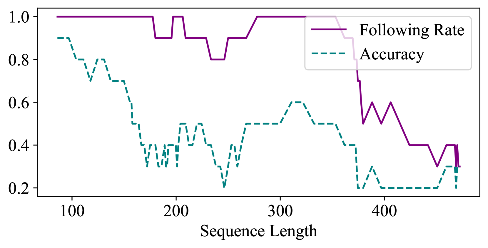

# [针对大型语言模型，我们采用连续指令进行微调，旨在探究这种微调方式如何提升模型性能和适应性。](https://arxiv.org/abs/2403.07794)

发布时间：2024年03月12日

`LLM应用`

> Fine-tuning Large Language Models with Sequential Instructions

> 现今的大型语言模型（LLMs）在面对单次输入的一系列指令时，由于可能忽视或误解部分内容，往往难以按顺序执行。这导致它们在解决需多步操作的复杂问题上表现欠佳，如多语言任务和多模态任务。通过使用诸如LLaMA-2 70B和Mixtral-8x7B等大规模开源模型，我们实证了这一点。鉴于目前数据中缺乏连续指令的现状，我们创新提出“顺序指令微调”方法，这是一种简便而高效的策略，能够自动丰富指令微调数据，助力LLMs习得执行多个连续指令的能力。在对包含多种中间任务的数据集（如Alpaca）进行指令交织实验后，我们发现，在涉及推理、多语言及多模态能力的下游任务中，采用顺序指令微调的模型表现持续超越常规指令微调基准。为进一步揭示这一技术的优势，我们深入探究了对抗性中间文本、未知任务类型、提示词句形式、任务数量及提示长度等因素对SIT（顺序指令微调）的影响。我们期待这种方法能够开启复杂任务指令微调领域的全新研究方向。

> Large language models (LLMs) struggle to follow a sequence of instructions in a single query as they may ignore or misinterpret part of it. This impairs their performance in complex problems whose solution requires multiple intermediate steps, such as multilingual (translate then answer) and multimodal (caption then answer) tasks. We empirically verify this with open-source LLMs as large as LLaMA-2 70B and Mixtral-8x7B. Targeting the scarcity of sequential instructions in present-day data, we propose sequential instruction tuning, a simple yet effective strategy to automatically augment instruction tuning data and equip LLMs with the ability to execute multiple sequential instructions. After exploring interleaving instructions in existing datasets, such as Alpaca, with a wide range of intermediate tasks, we find that sequential instruction-tuned models consistently outperform the conventional instruction-tuned baselines in downstream tasks involving reasoning, multilingual, and multimodal abilities. To shed further light on our technique, we analyse how adversarial intermediate texts, unseen tasks, prompt verbalization, number of tasks, and prompt length affect SIT. We hope that this method will open new research avenues on instruction tuning for complex tasks.

[Arxiv](https://arxiv.org/abs/2403.07794)