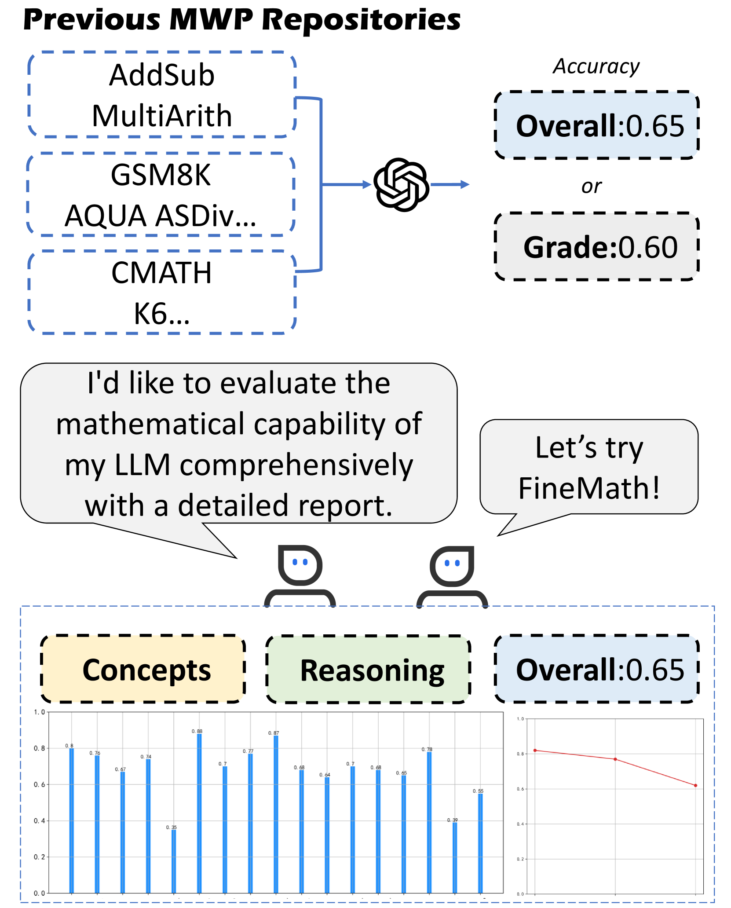
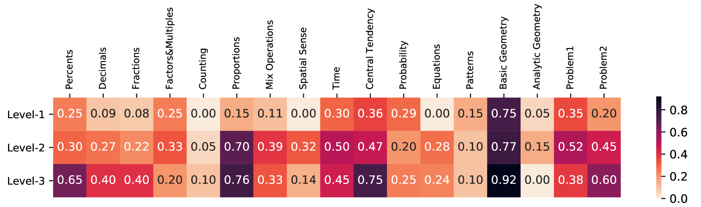
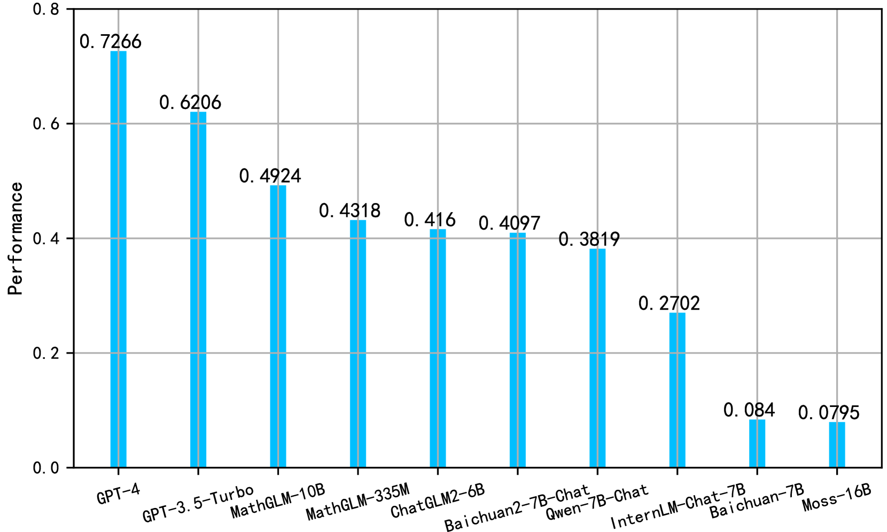
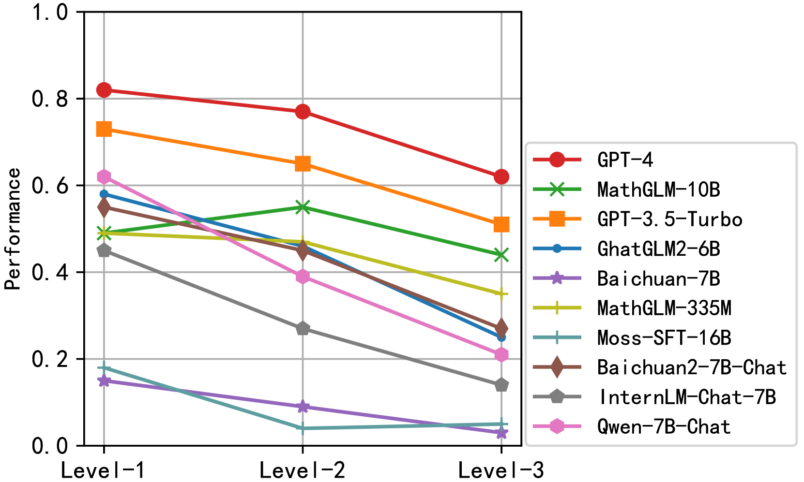

# [FineMath 是专为评测中文大型语言模型而设计的精细数学评估基准，旨在从更细致的角度衡量和检验模型在数学相关任务上的表现。](https://arxiv.org/abs/2403.07747)

发布时间：2024年03月12日

`LLM应用`

> FineMath: A Fine-Grained Mathematical Evaluation Benchmark for Chinese Large Language Models

> 为了全面摸底LLMs的数学推理功力，我们设计了精心编排、覆盖多元数学概念和各级别难题的评估数据集。本文推出的FineMath就是这样一款面向中文LLMs的精细化数学评测基准，它围绕小学数学核心知识点展开，细分出17类数学应用题目，有助于深入剖析LLMs的数学思维能力。所有17类问题都依据解题所需的推理步数人工标注了难度等级。通过在FineMath上对一系列LLMs进行大规模实验，我们发现中文LLMs在数学推理方面尚有较大的进步空间。此外，我们还对先前未充分关注的评估手段和方法进行了深度探究，这两点对于模型表现及我们对其数学推理能力的认知具有重要影响。FineMath数据集即将对外开放。

> To thoroughly assess the mathematical reasoning abilities of Large Language Models (LLMs), we need to carefully curate evaluation datasets covering diverse mathematical concepts and mathematical problems at different difficulty levels. In pursuit of this objective, we propose FineMath in this paper, a fine-grained mathematical evaluation benchmark dataset for assessing Chinese LLMs. FineMath is created to cover the major key mathematical concepts taught in elementary school math, which are further divided into 17 categories of math word problems, enabling in-depth analysis of mathematical reasoning abilities of LLMs. All the 17 categories of math word problems are manually annotated with their difficulty levels according to the number of reasoning steps required to solve these problems. We conduct extensive experiments on a wide range of LLMs on FineMath and find that there is still considerable room for improvements in terms of mathematical reasoning capability of Chinese LLMs. We also carry out an in-depth analysis on the evaluation process and methods that have been overlooked previously. These two factors significantly influence the model results and our understanding of their mathematical reasoning capabilities. The dataset will be publicly available soon.

