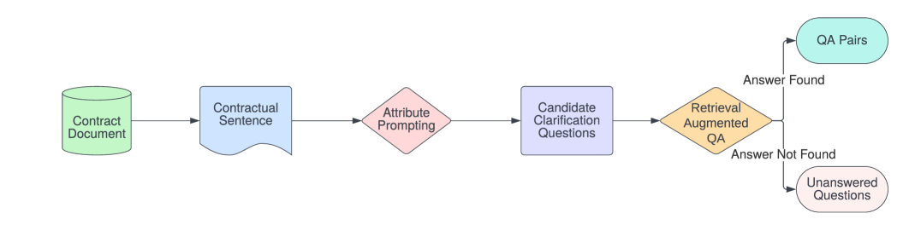
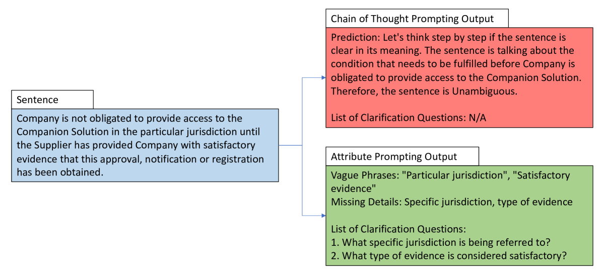
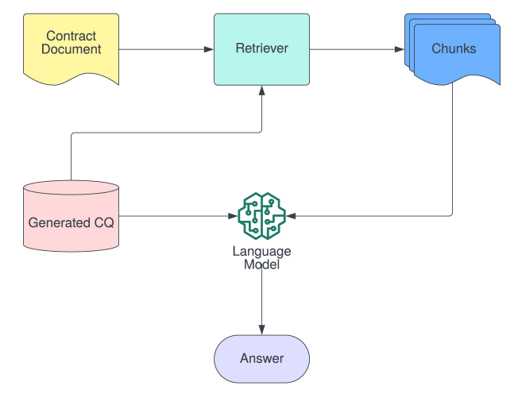

# [为解决合同中的歧义，我们致力于生成有针对性的澄清问题。](https://arxiv.org/abs/2403.08053)

发布时间：2024年03月12日

`LLM应用`

> Generating Clarification Questions for Disambiguating Contracts

> 企业签订的商业合同常常成为项目具体要求的重要源泉，但其中充斥着法律术语及复杂表达，让非法律背景的相关人员（如需求分析师、工程师及交付团队成员）在解读时感到费解并易出差错。尽管合同中的条款具有约束力，并能细化下游执行活动的要求，但其模糊表述常使得各方难以准确把握。为此，本研究提出一项创新的法律NLP任务——为合同自动生成澄清问题，旨在通过文档级别的问题定位合同中的模糊之处，助力非法律相关方精确提炼需求细节。这项任务面对三大难题：数据稀缺性、合同篇幅长且结构松散、法律文本本身的复杂度。针对这些挑战，我们设计了名为ConRAP的检索增强型提示框架，该框架专门用于生成澄清问题以解析合同文本的歧义。实验采用公开的CUAD数据集中的合同样本，结果显示，与ChatGPT结合后的ConRAP系统成功实现了0.87的F2得分来检测合同模糊点，而且其中70%的自动生成的澄清问题得到了人工评估的认可，认为具有实际应用价值。

> Enterprises frequently enter into commercial contracts that can serve as vital sources of project-specific requirements. Contractual clauses are obligatory, and the requirements derived from contracts can detail the downstream implementation activities that non-legal stakeholders, including requirement analysts, engineers, and delivery personnel, need to conduct. However, comprehending contracts is cognitively demanding and error-prone for such stakeholders due to the extensive use of Legalese and the inherent complexity of contract language. Furthermore, contracts often contain ambiguously worded clauses to ensure comprehensive coverage. In contrast, non-legal stakeholders require a detailed and unambiguous comprehension of contractual clauses to craft actionable requirements. In this work, we introduce a novel legal NLP task that involves generating clarification questions for contracts. These questions aim to identify contract ambiguities on a document level, thereby assisting non-legal stakeholders in obtaining the necessary details for eliciting requirements. This task is challenged by three core issues: (1) data availability, (2) the length and unstructured nature of contracts, and (3) the complexity of legal text. To address these issues, we propose ConRAP, a retrieval-augmented prompting framework for generating clarification questions to disambiguate contractual text. Experiments conducted on contracts sourced from the publicly available CUAD dataset show that ConRAP with ChatGPT can detect ambiguities with an F2 score of 0.87. 70% of the generated clarification questions are deemed useful by human evaluators.

[Arxiv](https://arxiv.org/abs/2403.08053)