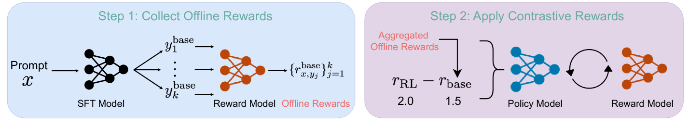

# 利用对比性奖励优化基于人类反馈的强化学习方法，以提升其效果。

发布时间：2024年03月12日

`Agent`

> Improving Reinforcement Learning from Human Feedback Using Contrastive Rewards

# 摘要

> RLHF是当前让LLMs适应人类偏好的主流方式，但其高度依赖精确且富含信息的奖励模型，易受人标注误差等各类噪声干扰，导致该流程较为脆弱。为此，本文提出了一种创新思路——“对比奖励”，通过对奖励施加惩罚项以提升奖励模型的有效性。这一方法包含两步走：第一步，离线抽样得到基准计算所需的提示回应；第二步，利用基准回应计算对比奖励，并将其融入到PPO算法中。结果显示，对比奖励能够助力LLM有效应对奖励不确定性，增强稳健性，激励超越基准表现，依据任务难度调整自身，并减少PPO中的变异性。经GPTs和人类双重验证，采用对比奖励的RLHF效果显著提升，且本方法持续优于多个强劲基准方法。

> Reinforcement learning from human feedback (RLHF) is the mainstream paradigm used to align large language models (LLMs) with human preferences. Yet existing RLHF heavily relies on accurate and informative reward models, which are vulnerable and sensitive to noise from various sources, e.g. human labeling errors, making the pipeline fragile. In this work, we improve the effectiveness of the reward model by introducing a penalty term on the reward, named as \textit{contrastive rewards}. %Contrastive rewards Our approach involves two steps: (1) an offline sampling step to obtain responses to prompts that serve as baseline calculation and (2) a contrastive reward calculated using the baseline responses and used in the Proximal Policy Optimization (PPO) step. We show that contrastive rewards enable the LLM to penalize reward uncertainty, improve robustness, encourage improvement over baselines, calibrate according to task difficulty, and reduce variance in PPO. We show empirically contrastive rewards can improve RLHF substantially, evaluated by both GPTs and humans, and our method consistently outperforms strong baselines.

[Arxiv](https://arxiv.org/abs/2403.07708)