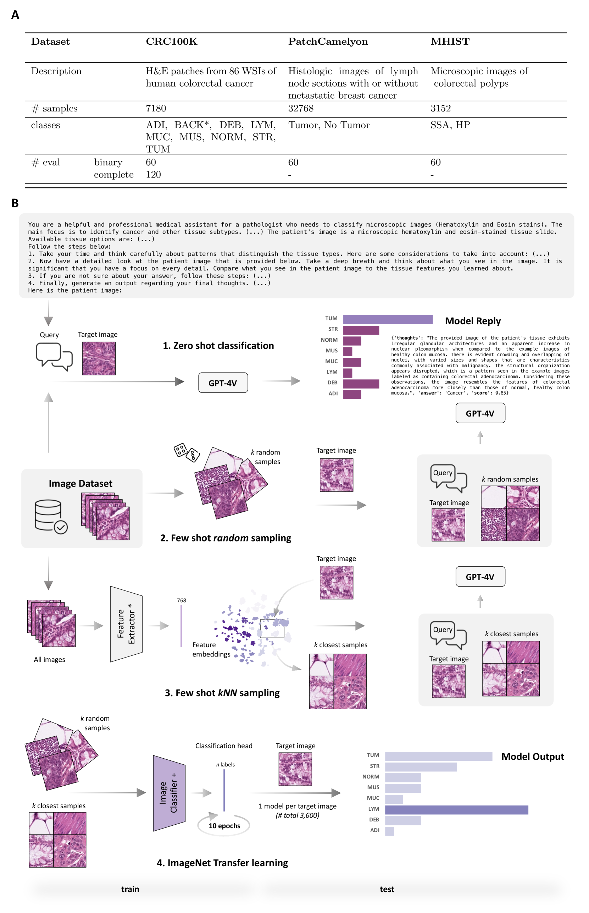
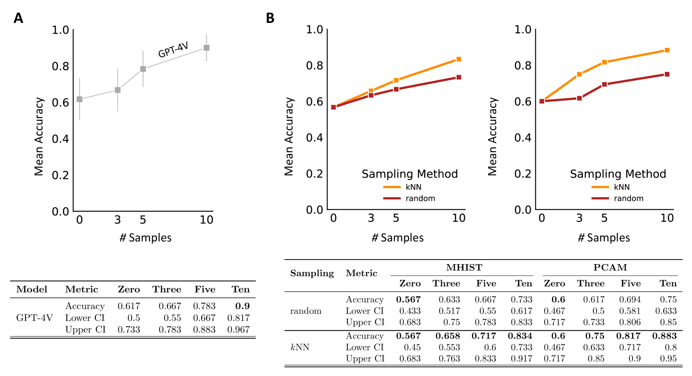
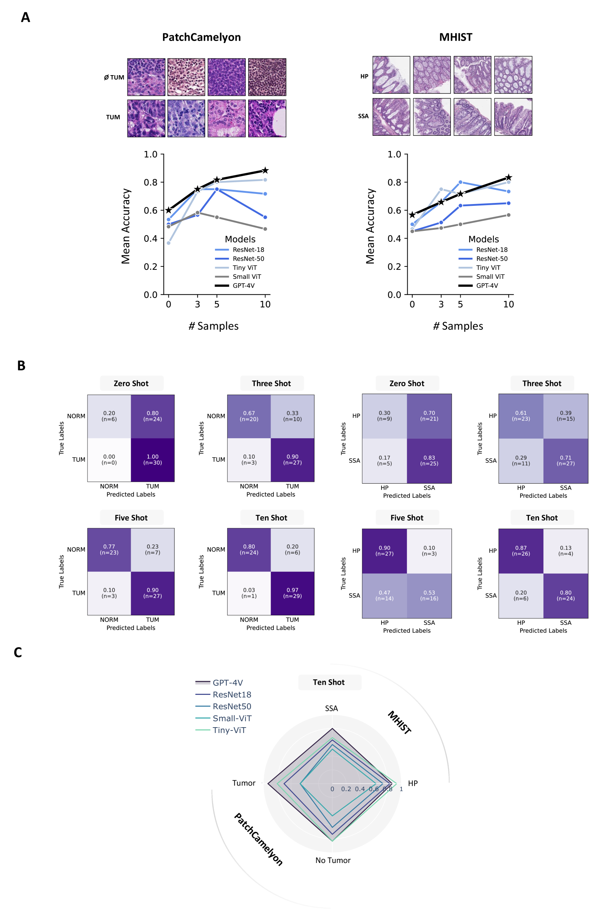
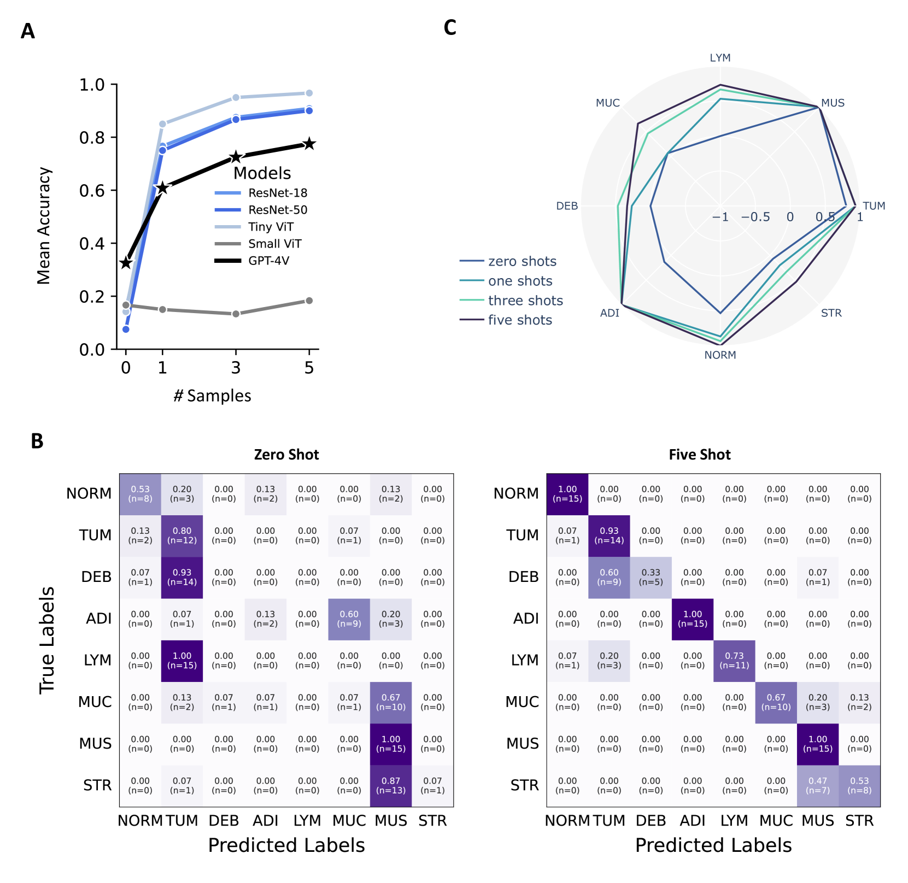
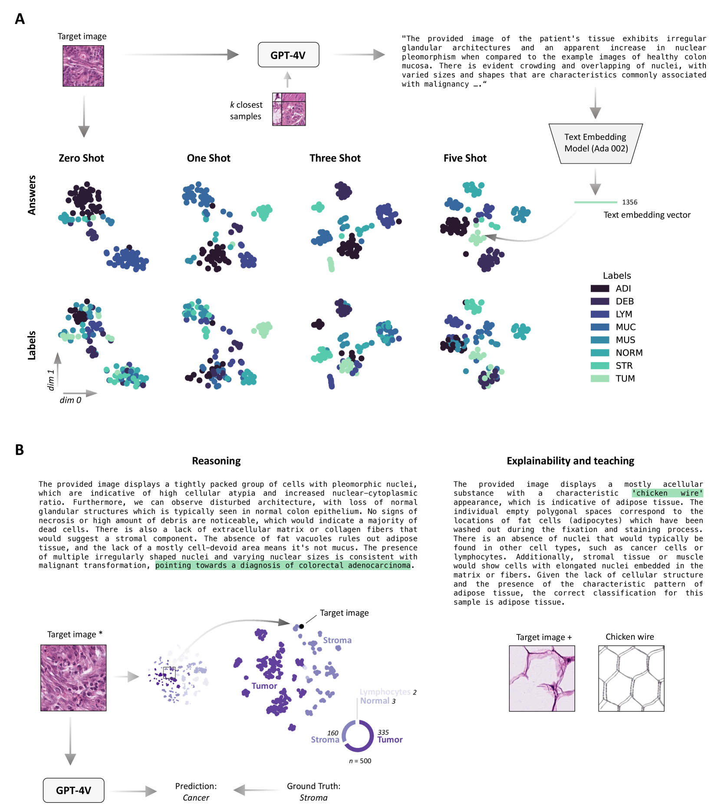

# ICL 技术赋能多模态 LLM，使其能够对癌症病理图片进行精准分类

发布时间：2024年03月12日

`LLM应用`

> In-context learning enables multimodal large language models to classify cancer pathology images

# 摘要

> 医疗影像分类需依赖特定任务的带标签数据集来训练深度学习网络，但这过程耗算力且技术难度大。而在自然语言处理中，上下文学习能有效避开繁琐的参数更新，让模型直接从提示中学习。尽管如此，这种上下文学习方法在医疗影像分析领域的潜力尚待深入挖掘。我们系统评估了具备视觉能力的生成预训练变换器4（GPT-4V）模型，在三大关键癌症组织病理学任务上的上下文学习表现，包括结直肠癌组织亚型分类、结肠息肉细分类型识别以及淋巴结切片中的乳腺肿瘤检测。实验结果显示，借助上下文学习，GPT-4V仅需极少量样本即可达到甚至超过专门针对某一任务训练的神经网络的性能水平。总结来说，本研究证实了大规模非领域特定数据训练出的视觉语言模型可即插即用地解决组织病理学中的医疗影像处理难题，从而有力推动了对缺乏标注数据领域医疗专家们获取和运用通用AI模型的民主化进程。

> Medical image classification requires labeled, task-specific datasets which are used to train deep learning networks de novo, or to fine-tune foundation models. However, this process is computationally and technically demanding. In language processing, in-context learning provides an alternative, where models learn from within prompts, bypassing the need for parameter updates. Yet, in-context learning remains underexplored in medical image analysis. Here, we systematically evaluate the model Generative Pretrained Transformer 4 with Vision capabilities (GPT-4V) on cancer image processing with in-context learning on three cancer histopathology tasks of high importance: Classification of tissue subtypes in colorectal cancer, colon polyp subtyping and breast tumor detection in lymph node sections. Our results show that in-context learning is sufficient to match or even outperform specialized neural networks trained for particular tasks, while only requiring a minimal number of samples. In summary, this study demonstrates that large vision language models trained on non-domain specific data can be applied out-of-the box to solve medical image-processing tasks in histopathology. This democratizes access of generalist AI models to medical experts without technical background especially for areas where annotated data is scarce.

[Arxiv](https://arxiv.org/abs/2403.07407)