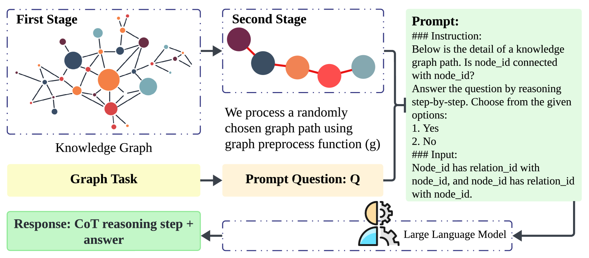
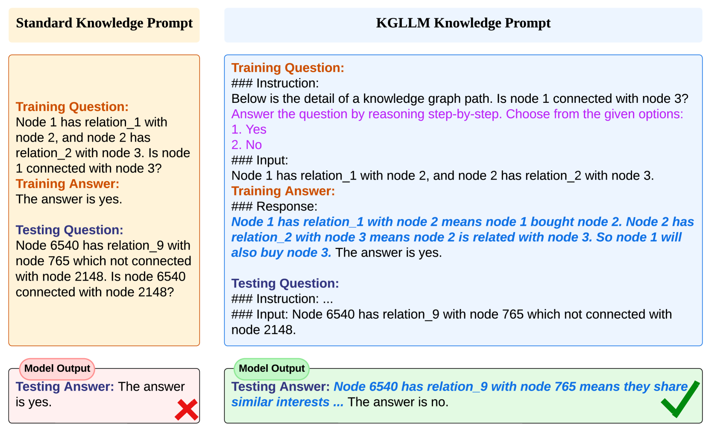
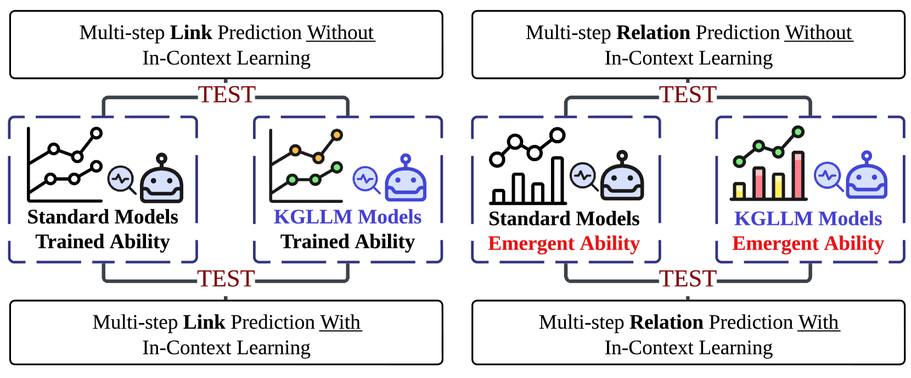

# 面向链接预测的KG-LLM，即知识图谱与大型语言模型结合的新颖框架，专注于通过大型语言模型对知识图谱中的实体间关系进行精准预测。

发布时间：2024年03月12日

`LLM应用`

> Knowledge Graph Large Language Model (KG-LLM) for Link Prediction

> 预测知识图谱内部多个关联是当前研究的一大挑战，而随着NLP技术和KG嵌入技术的发展，这一难题已逐渐明朗。本文介绍一种新颖的方法——知识图谱大型语言模型框架（KG-LLM），它巧妙运用了核心NLP理念，如链式思考（CoT）提示和上下文学习（ICL），来强化知识图谱中多跳链接预测的能力。我们通过将知识图谱转化为CoT提示形式，使框架能够洞察并习得实体及其相互联系的潜在表达方式。为了验证KG-LLM框架的实际效果，我们对该框架内的三大前沿大型语言模型（LLMs）进行了细致调整，并通过非ICL任务和ICL任务进行全面考核。同时，我们也探讨了该框架赋予LLMs应对新奇提示的零样本能力的可能性。实验结果显示，融入ICL与CoT不仅增强了我们的方法表现，还极大地提升了模型的泛化能力，从而确保在未知情境下也能作出精准预测。

> The task of predicting multiple links within knowledge graphs (KGs) stands as a challenge in the field of knowledge graph analysis, a challenge increasingly resolvable due to advancements in natural language processing (NLP) and KG embedding techniques. This paper introduces a novel methodology, the Knowledge Graph Large Language Model Framework (KG-LLM), which leverages pivotal NLP paradigms, including chain-of-thought (CoT) prompting and in-context learning (ICL), to enhance multi-hop link prediction in KGs. By converting the KG to a CoT prompt, our framework is designed to discern and learn the latent representations of entities and their interrelations. To show the efficacy of the KG-LLM Framework, we fine-tune three leading Large Language Models (LLMs) within this framework, employing both non-ICL and ICL tasks for a comprehensive evaluation. Further, we explore the framework's potential to provide LLMs with zero-shot capabilities for handling previously unseen prompts. Our experimental findings discover that integrating ICL and CoT not only augments the performance of our approach but also significantly boosts the models' generalization capacity, thereby ensuring more precise predictions in unfamiliar scenarios.

[Arxiv](https://arxiv.org/abs/2403.07311)