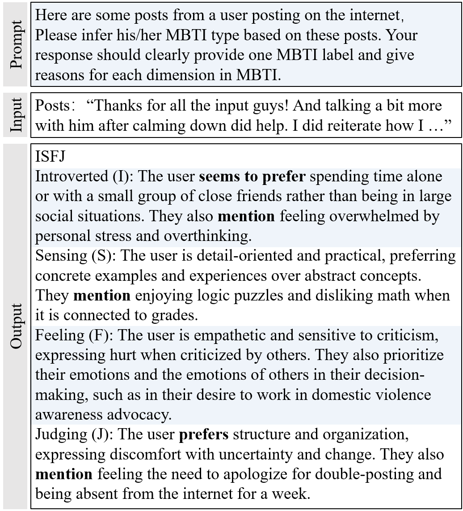
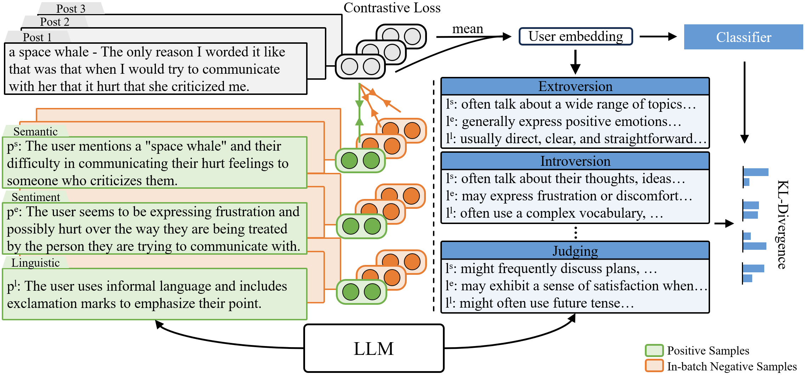
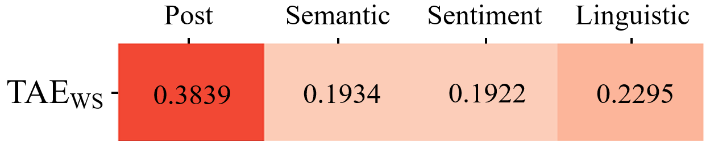
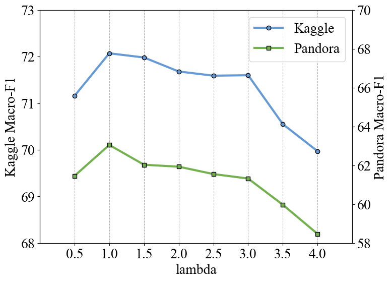

# 在个性化检测模型领域，采用大型语言模型（LLM）进行文本增强显著提升了性能。本文探讨了以LLM为核心的文本增强技术如何相较于小型模型，在这一任务上展现更优效果。

发布时间：2024年03月12日

`LLM应用`

> LLMvsSmall Model? Large Language Model Based Text Augmentation Enhanced Personality Detection Model

> 本研究针对人格检测问题，旨在从社交媒体帖子中揭示个体的性格特征，但面临的难题在于缺乏基于自报问卷的真实性格特质数据。现有多数方法依赖于少量人格标签对预训练语言模型进行微调以提取帖子特征，这种做法降低了特征质量，进而影响整体性能。同时，这些方法将人格特质简单当作独热分类标签处理，忽视了内部蕴含的语义信息。为此，我们创新性地提出了一个基于大型语言模型（LLM）的文本增强型人格检测模型，在LLM对此任务表现不佳时，仍能萃取其内在知识，有效提升小型模型的人格检测能力。我们特别设计让LLM从语义、情感及语言结构三个关键维度生成帖子分析增强内容，并运用对比学习策略将其紧密联系在一起，使帖子编码器能够在嵌入空间中更准确地捕捉到反映心理语言学特征的信息，从而优化人格检测结果。此外，我们还借助LLM的力量丰富人格标签信息，进一步提升检测性能。实验证明，相较于当前最先进的人格检测方法，我们的模型在基准数据集上取得了更好的性能表现。

> Personality detection aims to detect one's personality traits underlying in social media posts. One challenge of this task is the scarcity of ground-truth personality traits which are collected from self-report questionnaires. Most existing methods learn post features directly by fine-tuning the pre-trained language models under the supervision of limited personality labels. This leads to inferior quality of post features and consequently affects the performance. In addition, they treat personality traits as one-hot classification labels, overlooking the semantic information within them. In this paper, we propose a large language model (LLM) based text augmentation enhanced personality detection model, which distills the LLM's knowledge to enhance the small model for personality detection, even when the LLM fails in this task. Specifically, we enable LLM to generate post analyses (augmentations) from the aspects of semantic, sentiment, and linguistic, which are critical for personality detection. By using contrastive learning to pull them together in the embedding space, the post encoder can better capture the psycho-linguistic information within the post representations, thus improving personality detection. Furthermore, we utilize the LLM to enrich the information of personality labels for enhancing the detection performance. Experimental results on the benchmark datasets demonstrate that our model outperforms the state-of-the-art methods on personality detection.

[Arxiv](https://arxiv.org/abs/2403.07581)