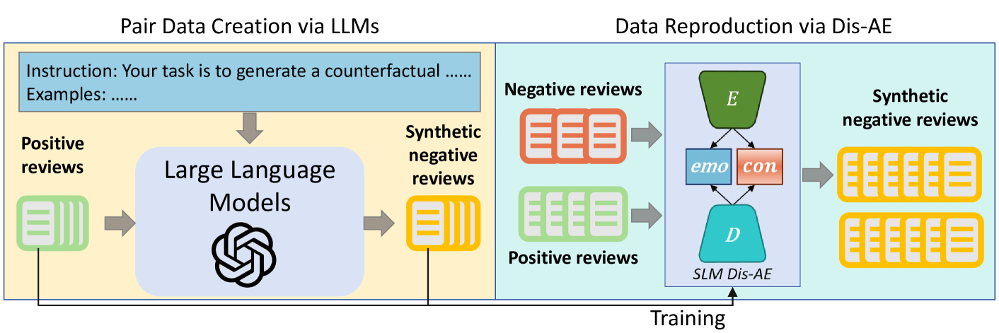
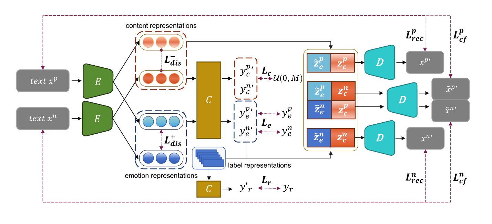

# 创新提出了一种新的数据增强框架，它结合了大、小规模语言模型的力量，旨在有效消除意见摘要中的偏见问题。

发布时间：2024年03月12日

`LLM应用`

> Large, Small or Both: A Novel Data Augmentation Framework Based on Language Models for Debiasing Opinion Summarization

> 鉴于现有观点摘要数据集中大部分（超70%）为正面评价，导致现有方法在面对负面文本时难以生成负面摘要。为此，我们提出一种创新方案，无需过度依赖特定框架，而是借助大型语言模型生成更多数据以均衡数据集情感分布。然而，基于大型语言模型的数据增强面临双重挑战：潜在的问题与毒性，以及高昂成本。故此，本文提出了一个新的融合大型和小型语言模型的数据增强框架，用于缓解观点摘要的情感偏见。首先，运用大型语言模型将少量正面评论改写为合成的负面评论，接着基于这些数据训练解耦重建模型。训练后，通过对不同样本表征的组合及基于混淆度和情感分类的筛选，解码出大量高质量合成数据。实验证明，该框架在有效减轻情感偏见方面表现出色，且比单纯依赖大型模型更具经济效益。

> As more than 70$\%$ of reviews in the existing opinion summary data set are positive, current opinion summarization approaches are reluctant to generate negative summaries given the input of negative texts. To address such sentiment bias, a direct approach without the over-reliance on a specific framework is to generate additional data based on large language models to balance the emotional distribution of the dataset. However, data augmentation based on large language models faces two disadvantages: 1) the potential issues or toxicity in the augmented data; 2) the expensive costs. Therefore, in this paper, we propose a novel data augmentation framework based on both large and small language models for debiasing opinion summarization. In specific, a small size of synthesized negative reviews is obtained by rewriting the positive text via a large language model. Then, a disentangle reconstruction model is trained based on the generated data. After training, a large amount of synthetic data can be obtained by decoding the new representation obtained from the combination of different sample representations and filtering based on confusion degree and sentiment classification. Experiments have proved that our framework can effectively alleviate emotional bias same as using only large models, but more economically.

[Arxiv](https://arxiv.org/abs/2403.07693)