# [大型语言模型展现出了显著的对比推理能力]

发布时间：2024年03月12日

`LLM应用` `预训练模型`

> Large Language Models are Contrastive Reasoners

> 提示技术对于提升预训练大型语言模型功能至关重要。我们探究了对比提示（CP）如何有效地大幅增强LLMs进行复杂推理的表现力。只需在LLMs作答前加入一句“先给出正确和错误答案”，就可揭示出LLMs具备出色的对比推理能力。实验证明，在不依赖任何人工设计的少量示例条件下，针对多种算术、常识及符号推理任务，零样本对比提示方法能够有效提升性能，例如，在顶级GPT-4模型上，使GSM8K任务的准确率从35.9%跃升至88.8%，同时令AQUA-RAT任务的准确率从41.3%提高到62.2%。该方法不仅在多数算术与常识推理任务中超越零样本CoT和少量样本CoT表现，并且能够与现有的提示策略紧密结合，从而在与最新最优方法比较时，带来更优或相媲美的成果。访问https://github.com/yao8839836/cp即可查看我们的代码资源。

> Prompting methods play a crucial role in enhancing the capabilities of pre-trained large language models (LLMs). We explore how contrastive prompting (CP) significantly improves the ability of large language models to perform complex reasoning. We demonstrate that LLMs are decent contrastive reasoners by simply adding "Let's give a correct and a wrong answer." before LLMs provide answers. Experiments on two large language models show that zero-shot contrastive prompting improves performance on a range of arithmetic, commonsense, and symbolic reasoning tasks without any hand-crafted few-shot examples, such as increasing the accuracy on GSM8K from 35.9% to 88.8% and AQUA-RAT from 41.3% to 62.2% with the state-of-the-art GPT-4 model. Our method not only surpasses zero-shot CoT and few-shot CoT in most arithmetic and commonsense reasoning tasks but also can seamlessly integrate with existing prompting methods, resulting in improved or comparable results when compared to state-of-the-art methods. Our code is available at https://github.com/yao8839836/cp

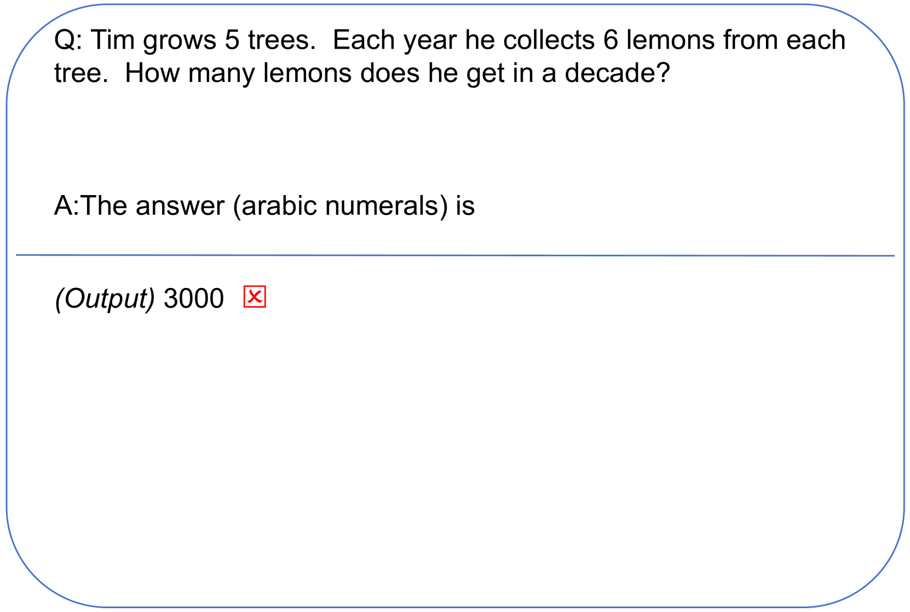

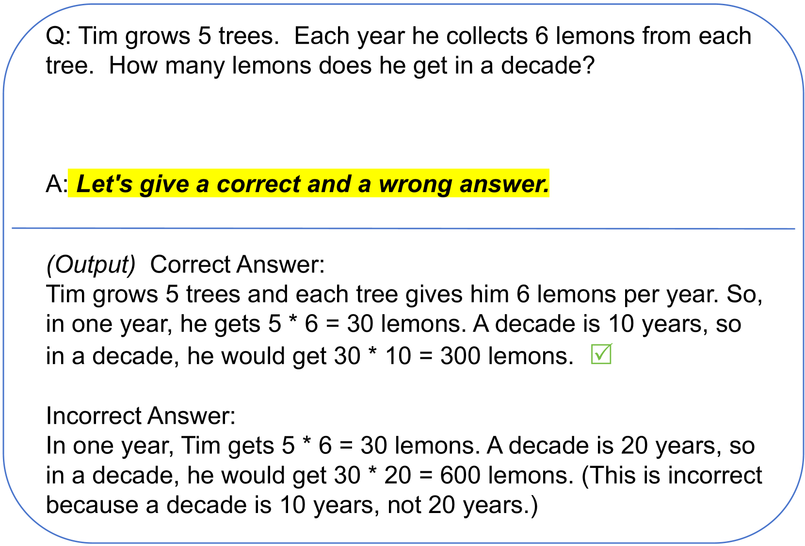

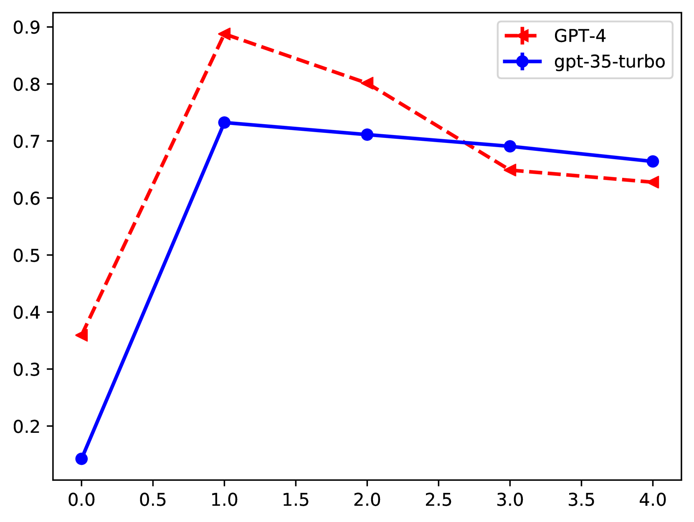

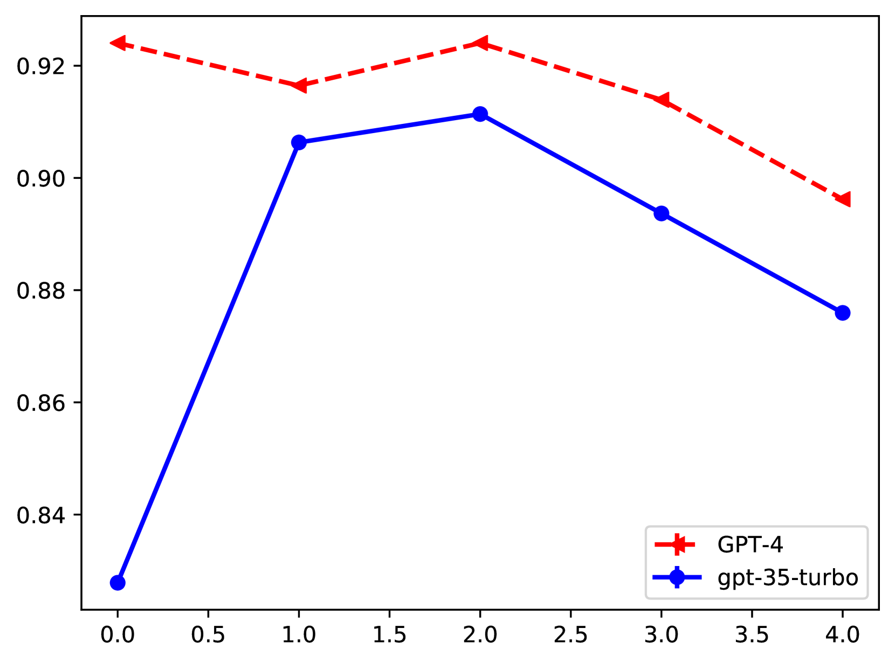

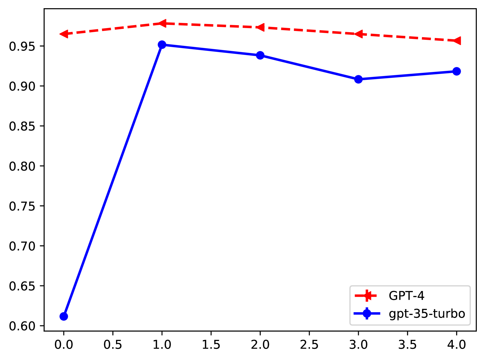

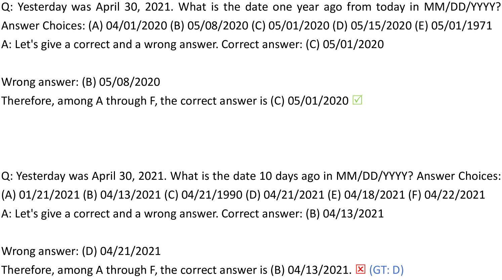

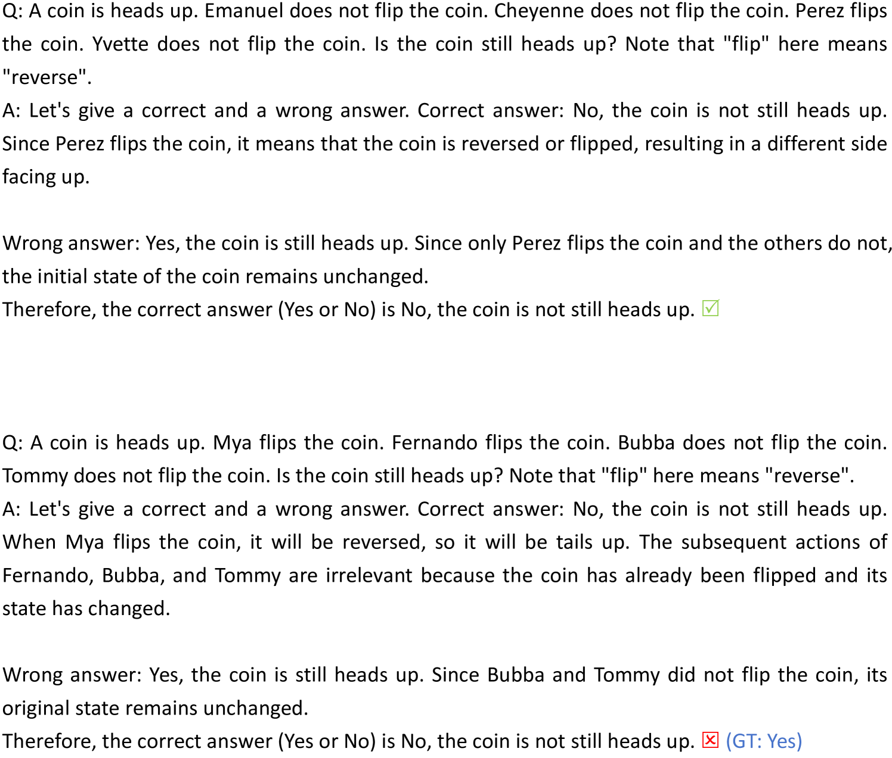

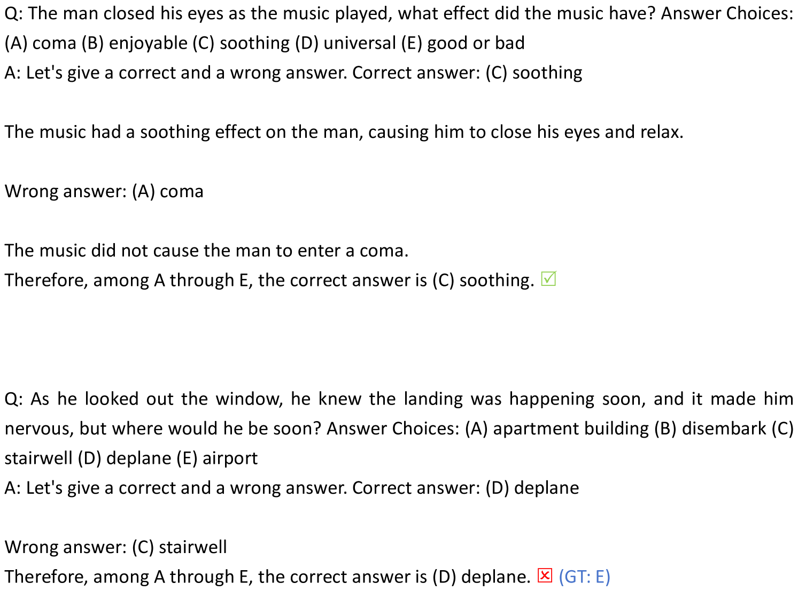

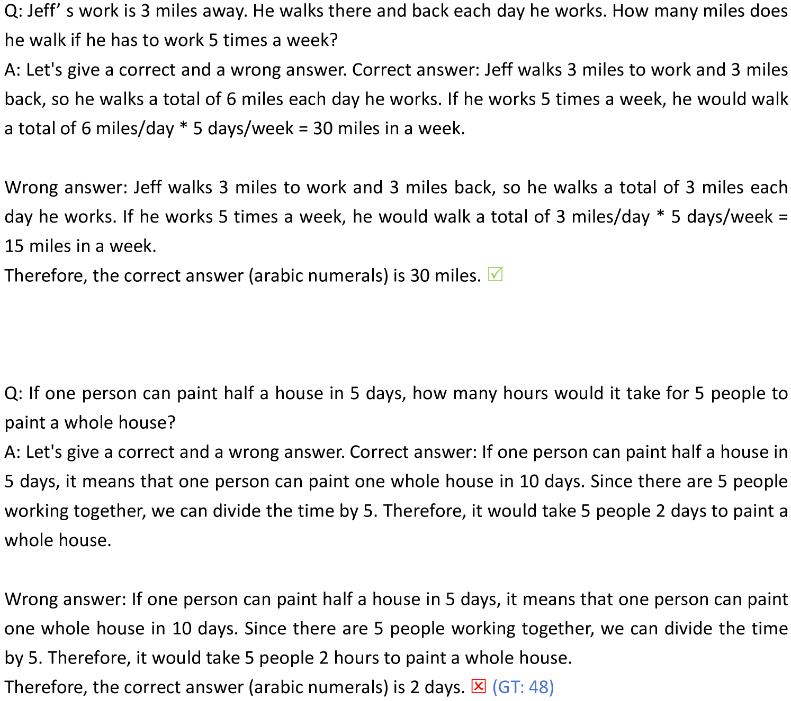

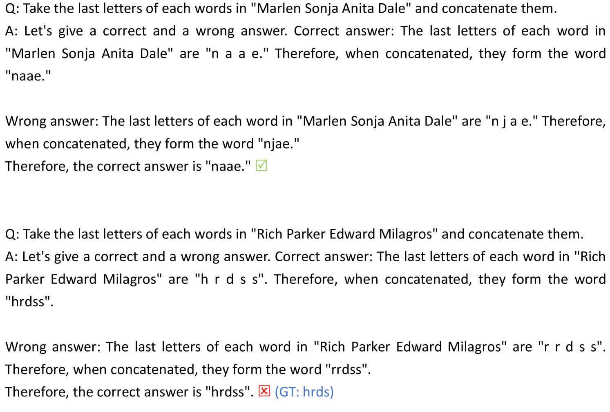

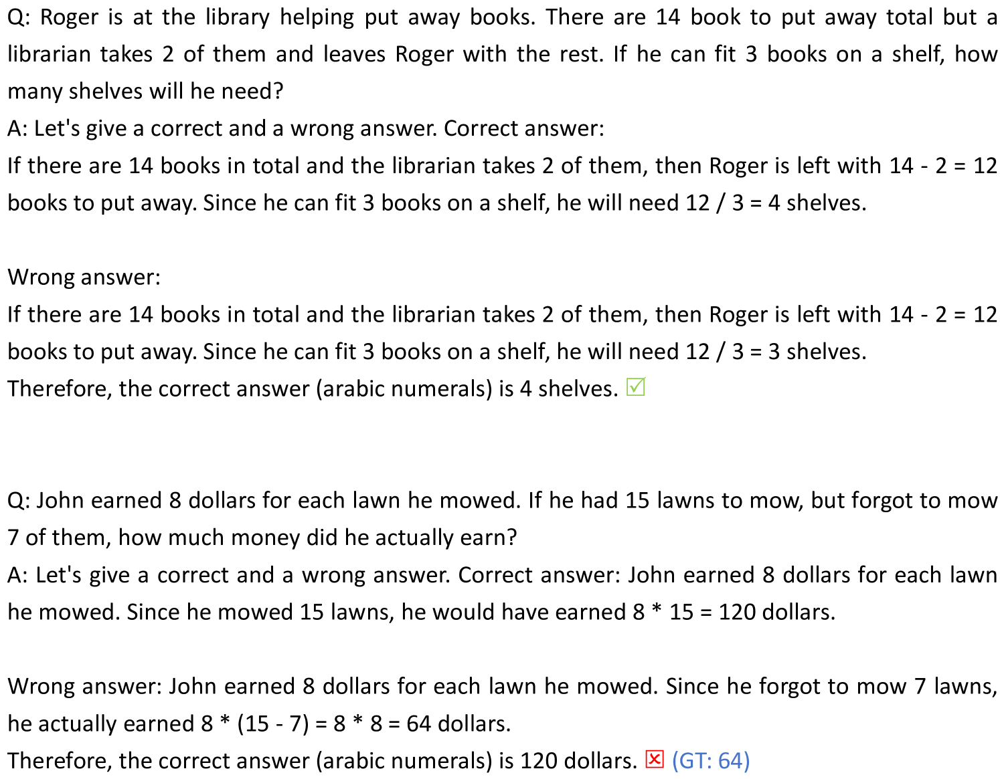

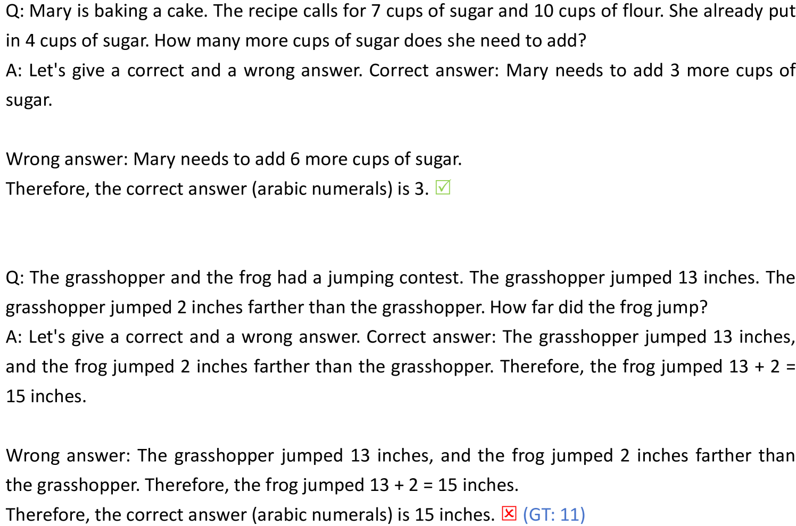

[Arxiv](https://arxiv.org/abs/2403.08211)