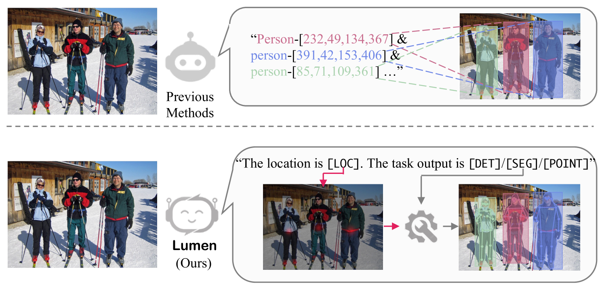
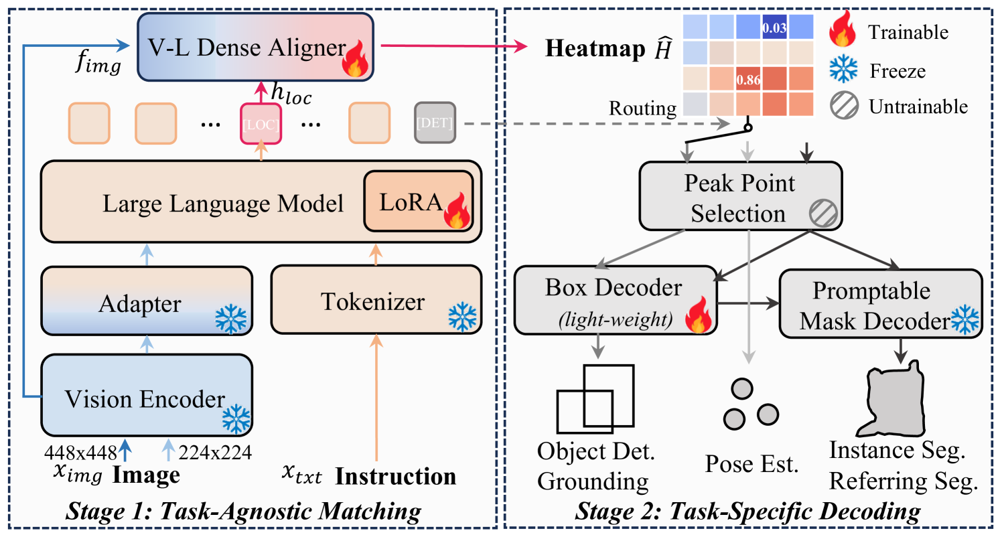

# [Lumen：致力于解锁大型多模态模型中蕴含的强大且多样的视觉核心功能]

发布时间：2024年03月12日

`LLM应用`

> Lumen: Unleashing Versatile Vision-Centric Capabilities of Large Multimodal Models

> LMM 是计算机视觉研究中的热点，其强大的跨学科应用潜力引人注目。最近的研究趋势是深化并强化 LMM 的感知功能，但现有方法多采用将视觉任务输出转换成语言模型可处理的形式，虽然简化了模型开发过程，却忽略了不同视觉任务的独特性，限制了感知能力的学习进步。为此，我们创新性地提出了名为“Lumen”的新型 LMM 架构，它是一个具备强大视觉核心能力的大型多模态模型。Lumen 将感知能力的学习巧妙地划分为通用阶段和特定任务阶段，首先通过细致入微的视觉-语言概念对齐构建各类视觉任务的基础能力，生成一组适用于本文所涉所有任务的共享表征。随后，通过灵活调度这些共享表征至训练负担极小的轻量级任务解码器，实现了针对不同任务的高效解码。得益于此种精妙的解耦设计，Lumen 在 COCO 目标检测基准测试中大幅超越了其他基于 LMM 的方案，并能轻松应对新增视觉任务的挑战。同时，我们还进行了深度的消融研究和广泛的泛化性能评估，以揭示更多的内在规律。相关代码将会在 GitHub 地址 https://github.com/SxJyJay/Lumen 上公开发布。

> Large Multimodal Model (LMM) is a hot research topic in the computer vision area and has also demonstrated remarkable potential across multiple disciplinary fields. A recent trend is to further extend and enhance the perception capabilities of LMMs. The current methods follow the paradigm of adapting the visual task outputs to the format of the language model, which is the main component of a LMM. This adaptation leads to convenient development of such LMMs with minimal modifications, however, it overlooks the intrinsic characteristics of diverse visual tasks and hinders the learning of perception capabilities. To address this issue, we propose a novel LMM architecture named Lumen, a Large multimodal model with versatile vision-centric capability enhancement. We decouple the LMM's learning of perception capabilities into task-agnostic and task-specific stages. Lumen first promotes fine-grained vision-language concept alignment, which is the fundamental capability for various visual tasks. Thus the output of the task-agnostic stage is a shared representation for all the tasks we address in this paper. Then the task-specific decoding is carried out by flexibly routing the shared representation to lightweight task decoders with negligible training efforts. Benefiting from such a decoupled design, our Lumen surpasses existing LMM-based approaches on the COCO detection benchmark with a clear margin and exhibits seamless scalability to additional visual tasks. Furthermore, we also conduct comprehensive ablation studies and generalization evaluations for deeper insights. The code will be released at https://github.com/SxJyJay/Lumen.

[Arxiv](https://arxiv.org/abs/2403.07304)