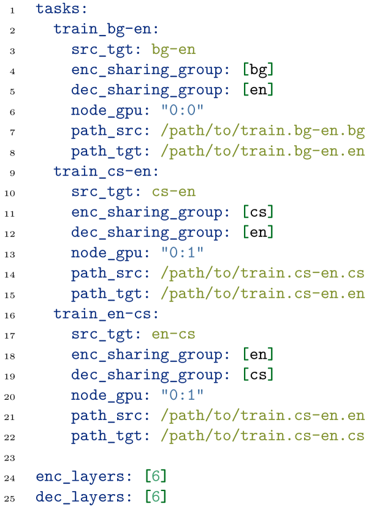
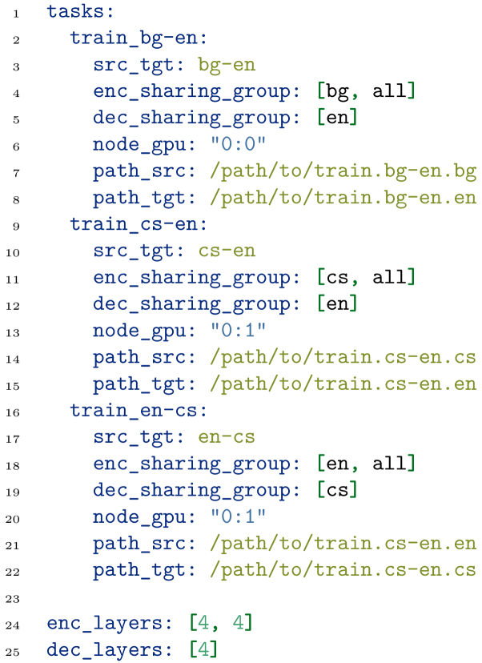
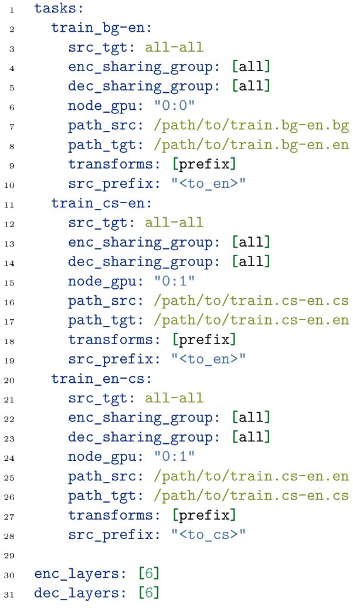
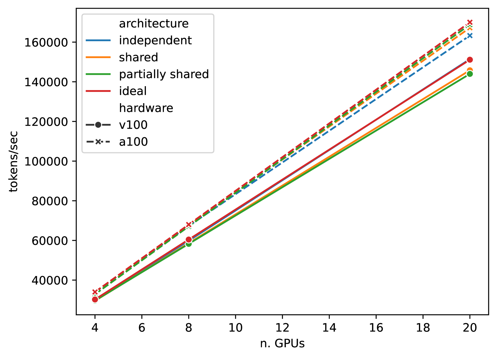
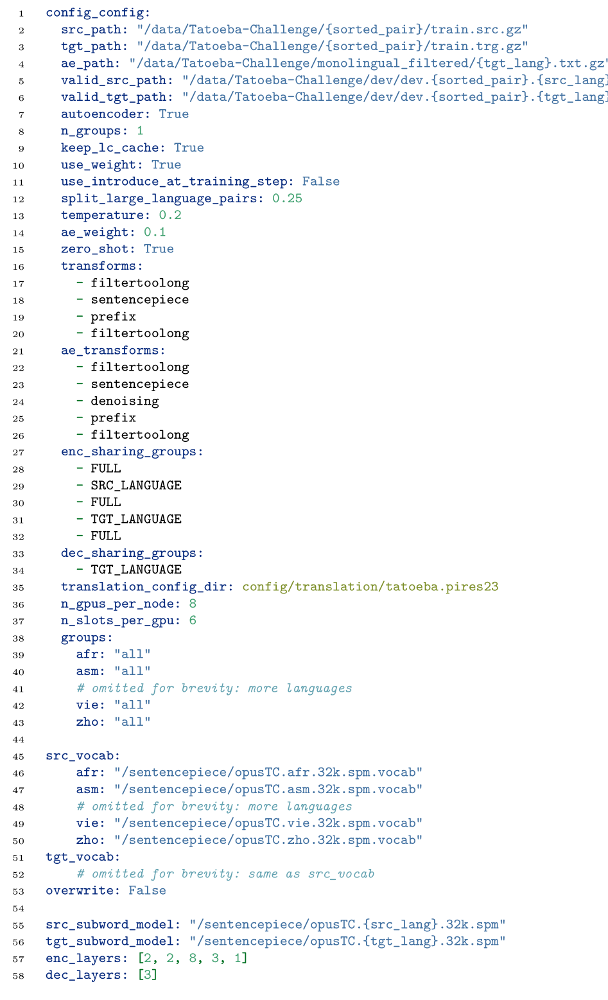
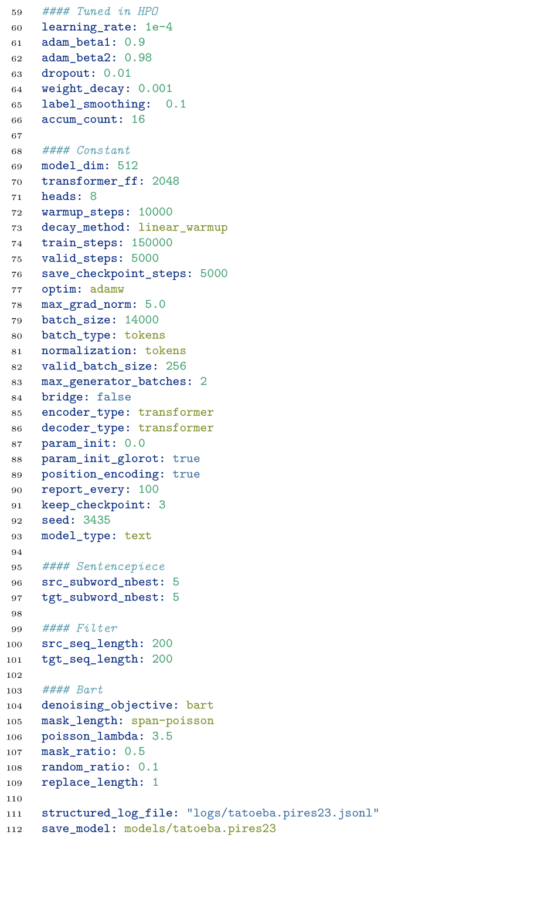

# MAMMOTH 是赫尔辛基研发的一款大规模、多语言且模块化的开源翻译工具，致力于推动翻译技术的创新与发展。

发布时间：2024年03月12日

`Agent`

> MAMMOTH: Massively Multilingual Modular Open Translation @ Helsinki

> 随着大型单体语言模型时代的来临，NLP 正面临处理规模与信息量的瓶颈。当前的趋势是转向模块化，即构建具备特定功能的小型子网络和组件。本文介绍的 MAMMOTH 工具包，正是为此应运而生。它基于 OpenNMT-py 框架演化而来，特别针对大规模多语言模块化机器翻译系统的训练进行了优化和调整，有效实现了跨计算集群的高效训练。我们通过在 A100 和 V100 NVIDIA GPU 集群上的实践验证了其高效性，并分享了我们的设计理念以及未来信息处理方向的计划。目前，该工具包已在网上公开发布，供公众使用。

> NLP in the age of monolithic large language models is approaching its limits in terms of size and information that can be handled. The trend goes to modularization, a necessary step into the direction of designing smaller sub-networks and components with specialized functionality. In this paper, we present the MAMMOTH toolkit: a framework designed for training massively multilingual modular machine translation systems at scale, initially derived from OpenNMT-py and then adapted to ensure efficient training across computation clusters. We showcase its efficiency across clusters of A100 and V100 NVIDIA GPUs, and discuss our design philosophy and plans for future information. The toolkit is publicly available online.

[Arxiv](https://arxiv.org/abs/2403.07544)