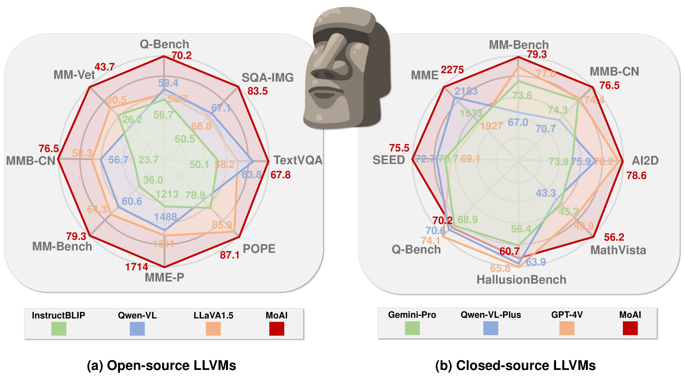
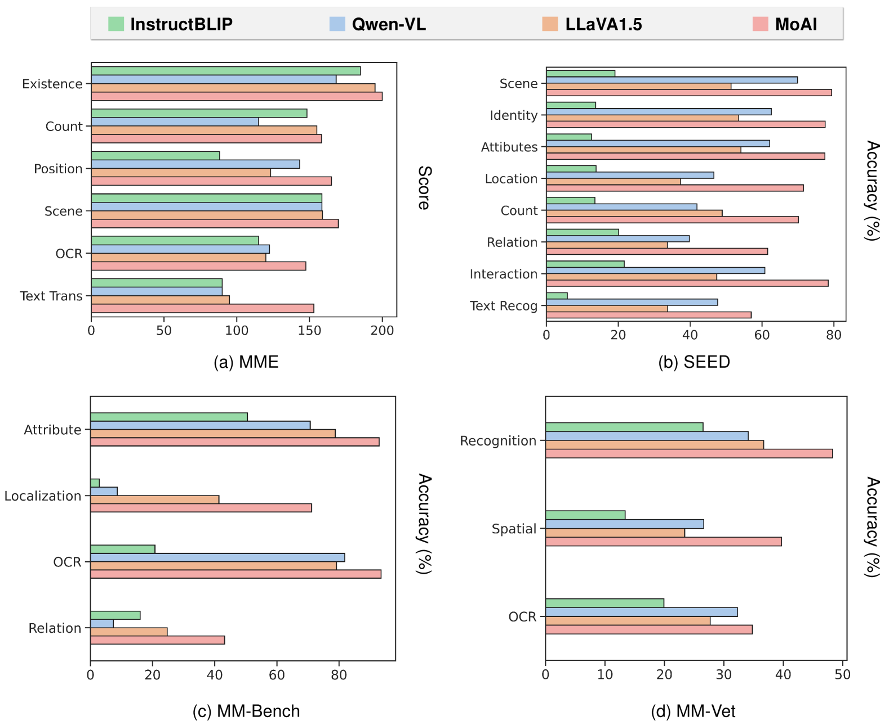
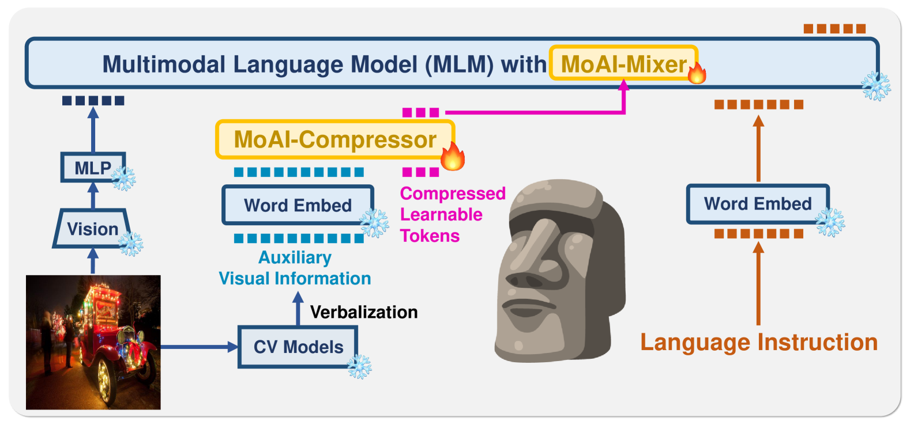
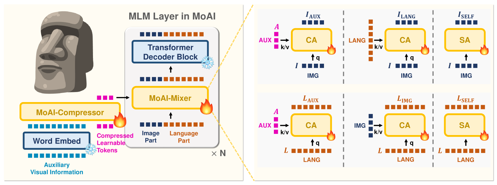
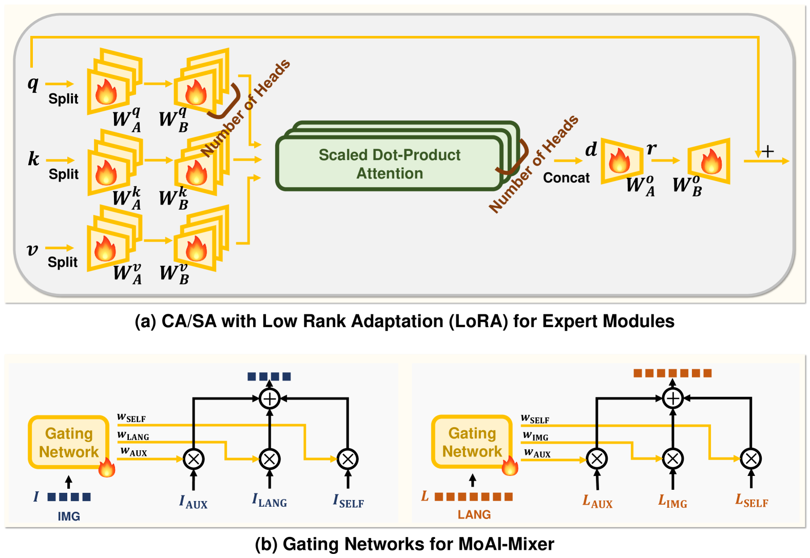

# [MoAI——集多种智能于一体的解决方案，专为大型语言和视觉模型设计，融合了多元化的智能技术。]

发布时间：2024年03月12日

`LLM应用`

> MoAI: Mixture of All Intelligence for Large Language and Vision Models

> 随着LLMs和指令微调技术的发展，如今主流趋势是构建并优化指令微调的LLVMs。这类模型或是精细设计各种针对性目标的数据集，或是提升模型规模来应对大规模VL数据挑战。但当前的LLVMs在处理像分割、检测、SGG、OCR等视觉感知任务时，未能充分利用专业CV模型提供的对真实场景深入细致的理解。它们更多地倚仗于LLM主干的强大容量和内在能力。为此，我们创新提出一款名为MoAI的新型LLVM，它能汲取来自外部CV模型（如分割、检测、SGG和OCR模型）的辅助视觉信息。MoAI包含两大核心组件：MoAI-Compressor和MoAI-Mixer。前者先将CV模型输出的结果转化为语言描述，再对其进行对齐压缩，有效提取与VL任务相关的辅助视觉信息。后者运用“专家混合”理念，巧妙融合视觉特征、CV模型提供的辅助特征以及语言特征这三大类智慧元素。得益于这种一体化设计，MoAI在众多无需预先训练的VL任务中表现出色，尤其在涉及现实场景理解的任务如物体是否存在、位置关系及OCR识别方面，更是大幅超越同类开源或闭源LLVMs，并且无需增加模型大小或另行定制视觉指令微调数据集。

> The rise of large language models (LLMs) and instruction tuning has led to the current trend of instruction-tuned large language and vision models (LLVMs). This trend involves either meticulously curating numerous instruction tuning datasets tailored to specific objectives or enlarging LLVMs to manage vast amounts of vision language (VL) data. However, current LLVMs have disregarded the detailed and comprehensive real-world scene understanding available from specialized computer vision (CV) models in visual perception tasks such as segmentation, detection, scene graph generation (SGG), and optical character recognition (OCR). Instead, the existing LLVMs rely mainly on the large capacity and emergent capabilities of their LLM backbones. Therefore, we present a new LLVM, Mixture of All Intelligence (MoAI), which leverages auxiliary visual information obtained from the outputs of external segmentation, detection, SGG, and OCR models. MoAI operates through two newly introduced modules: MoAI-Compressor and MoAI-Mixer. After verbalizing the outputs of the external CV models, the MoAI-Compressor aligns and condenses them to efficiently use relevant auxiliary visual information for VL tasks. MoAI-Mixer then blends three types of intelligence (1) visual features, (2) auxiliary features from the external CV models, and (3) language features by utilizing the concept of Mixture of Experts. Through this integration, MoAI significantly outperforms both open-source and closed-source LLVMs in numerous zero-shot VL tasks, particularly those related to real-world scene understanding such as object existence, positions, relations, and OCR without enlarging the model size or curating extra visual instruction tuning datasets.

[Arxiv](https://arxiv.org/abs/2403.07508)