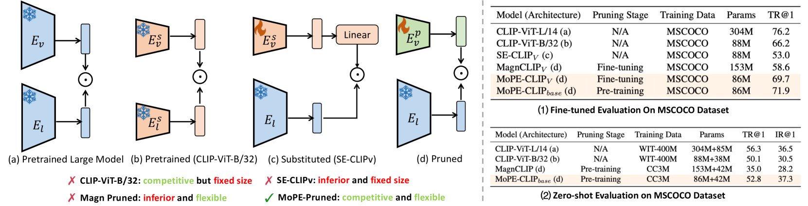
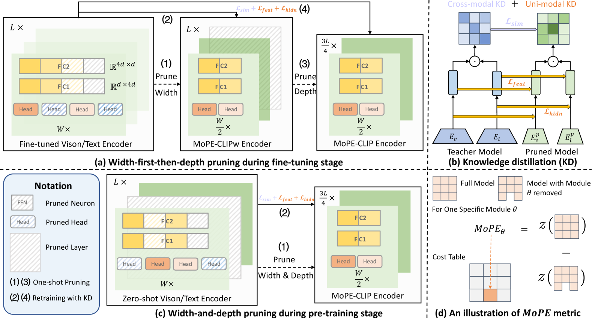
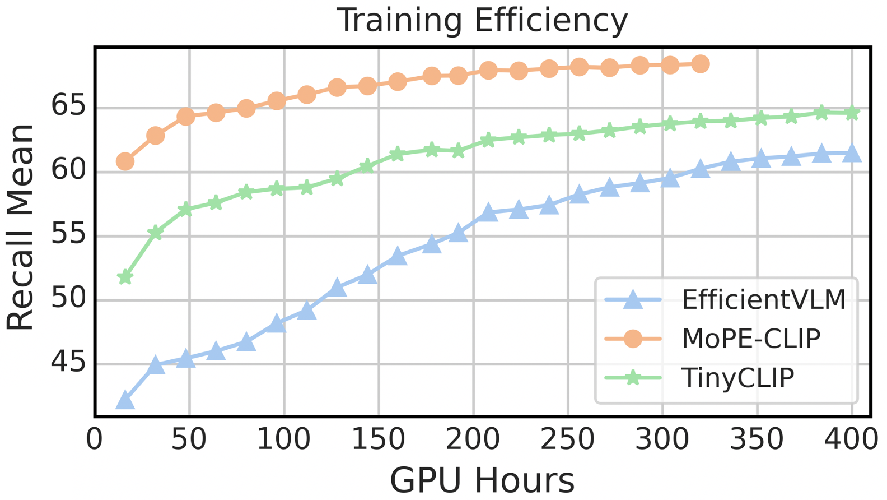
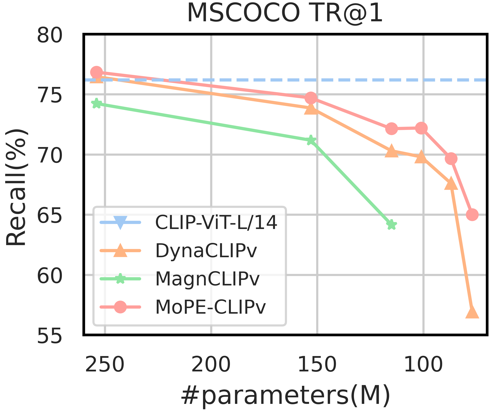
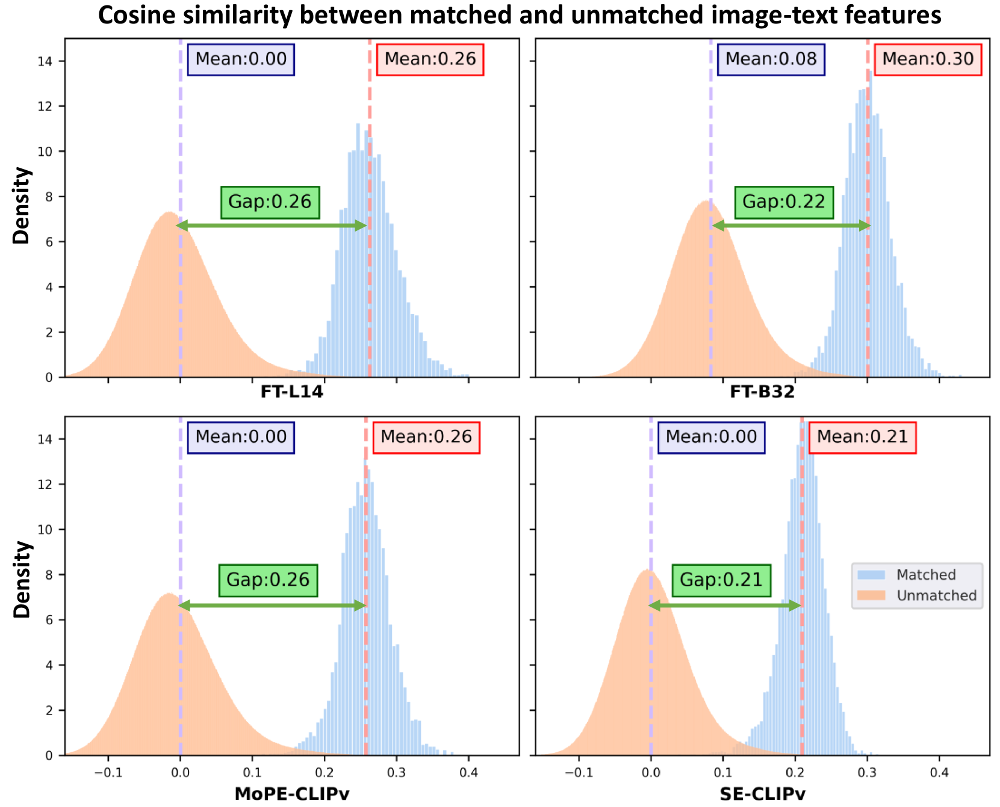

# [MoPE-CLIP 是一种创新方法，它通过模块化剪枝误差度量实现了对高效视觉-语言模型的结构化剪枝优化。这一技术针对视觉-语言模型进行精细化处理，采用模块化剪枝策略并引入特定的误差评估指标，旨在提升模型性能的同时减少计算资源消耗。](https://arxiv.org/abs/2403.07839)

发布时间：2024年03月12日

`Agent`

> MoPE-CLIP: Structured Pruning for Efficient Vision-Language Models with Module-wise Pruning Error Metric

> 视觉语言预训练模型展现出了在多种下游任务上卓越的能力，然而其庞大的模型尺寸制约了其在计算资源有限环境中的应用。研究发现，简单地使用小型预训练模型并对 CLIP 模型实施基于幅度的剪枝法会降低模型灵活性并导致性能下滑。目前对 VLP 压缩技术的研究或是采用了仅关注单模态的压缩度量标准而导致性能瓶颈，或是需要耗时的带有可学习掩码的搜索过程。本文创新性地提出了模块化剪枝误差（MoPE）这一评价指标，它通过在跨模态任务上性能衰减的程度精确衡量 CLIP 模块的重要程度。运用 MoPE 指标，我们构建了一种通用的剪枝框架，该框架既可用于预训练阶段也适应于特定任务微调阶段的压缩。在预训练阶段，MoPE-CLIP 精准借鉴教师模型的知识，显著降低预训练成本的同时保证了强大的零样本性能。在微调阶段，逐步从模型宽度到深度进行剪枝，最终得到竞争力极强的特定任务模型。经过两个阶段的充分实验验证，MoPE 指标展现出显著的有效性，而 MoPE-CLIP 方法也在当前最先进的 VLP 压缩技术中脱颖而出，实现了更优的性能。

> Vision-language pre-trained models have achieved impressive performance on various downstream tasks. However, their large model sizes hinder their utilization on platforms with limited computational resources. We find that directly using smaller pre-trained models and applying magnitude-based pruning on CLIP models leads to inflexibility and inferior performance. Recent efforts for VLP compression either adopt uni-modal compression metrics resulting in limited performance or involve costly mask-search processes with learnable masks. In this paper, we first propose the Module-wise Pruning Error (MoPE) metric, accurately assessing CLIP module importance by performance decline on cross-modal tasks. Using the MoPE metric, we introduce a unified pruning framework applicable to both pre-training and task-specific fine-tuning compression stages. For pre-training, MoPE-CLIP effectively leverages knowledge from the teacher model, significantly reducing pre-training costs while maintaining strong zero-shot capabilities. For fine-tuning, consecutive pruning from width to depth yields highly competitive task-specific models. Extensive experiments in two stages demonstrate the effectiveness of the MoPE metric, and MoPE-CLIP outperforms previous state-of-the-art VLP compression methods.

