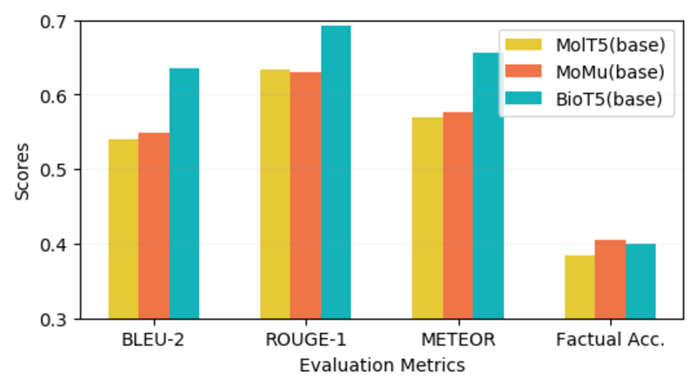
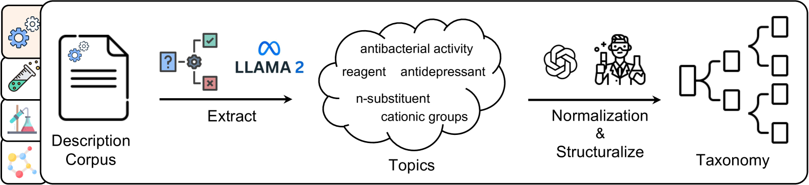
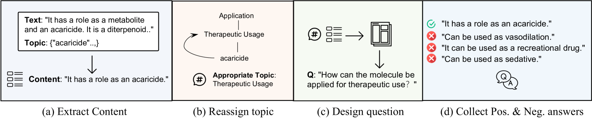
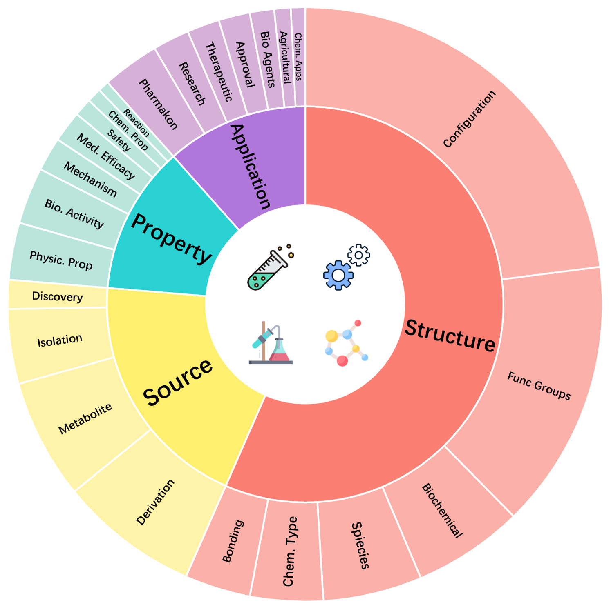
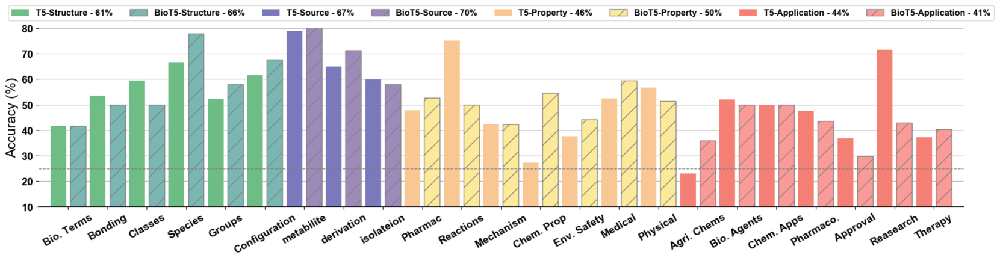
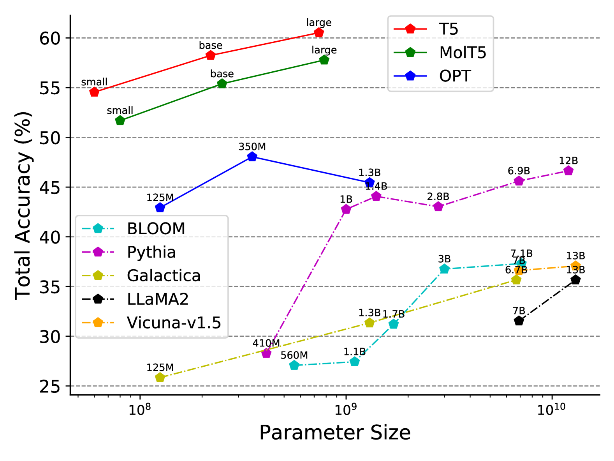
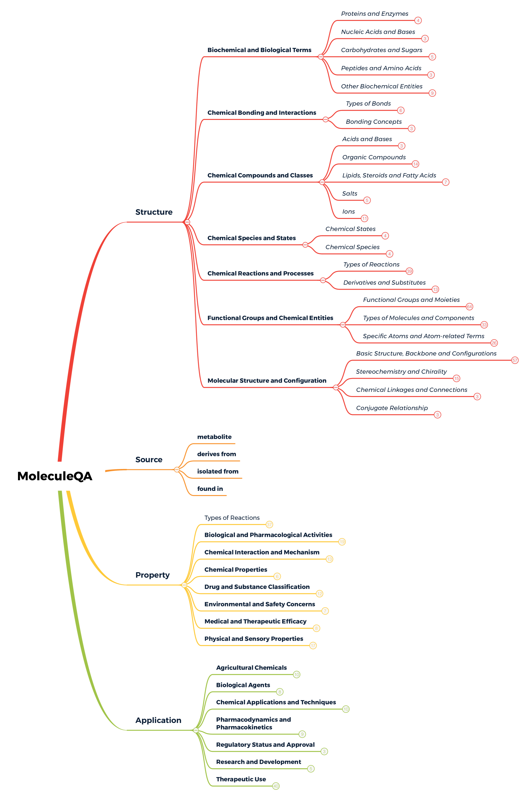
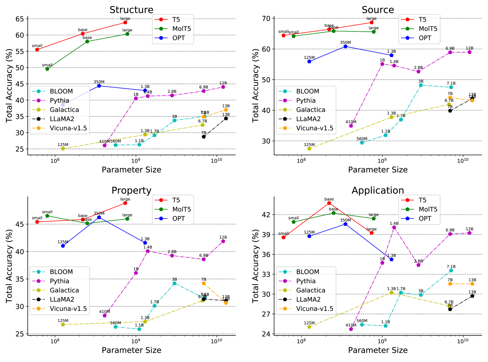

# [MoleculeQA 是专为检验分子理解领域中事实准确性而设计的数据集，旨在助力科研人员评测模型在解析分子信息时的精准度。]

发布时间：2024年03月12日

`LLM应用` `问答系统`

> MoleculeQA: A Dataset to Evaluate Factual Accuracy in Molecular Comprehension

> 大型语言模型日渐成为分子研究的核心工具，然而现存模型常会产生误导信息，给精确理解分子带来困扰。传统的生成内容评价标准难以衡量模型在分子层面的精准度。为此，我们创新推出 MoleculeQA，一个拥有超过 2.3 万个分子、共计 6.2 万对问答对的独特问答数据集。每一个问答对都包含精心设计的问题、一个正确答案及三个干扰项，确保其语义与权威分子库中的分子描述相吻合。MoleculeQA 不仅填补了对分子理解的事实性评估空白，还是目前最大规模的分子研究问答数据资源。通过对 MoleculeQA 的全面检验，现行的分子大型语言模型在某些领域的短板得以暴露，同时明确了分子理解过程中的若干关键要素。

> Large language models are playing an increasingly significant role in molecular research, yet existing models often generate erroneous information, posing challenges to accurate molecular comprehension. Traditional evaluation metrics for generated content fail to assess a model's accuracy in molecular understanding. To rectify the absence of factual evaluation, we present MoleculeQA, a novel question answering (QA) dataset which possesses 62K QA pairs over 23K molecules. Each QA pair, composed of a manual question, a positive option and three negative options, has consistent semantics with a molecular description from authoritative molecular corpus. MoleculeQA is not only the first benchmark for molecular factual bias evaluation but also the largest QA dataset for molecular research. A comprehensive evaluation on MoleculeQA for existing molecular LLMs exposes their deficiencies in specific areas and pinpoints several particularly crucial factors for molecular understanding.

[Arxiv](https://arxiv.org/abs/2403.08192)