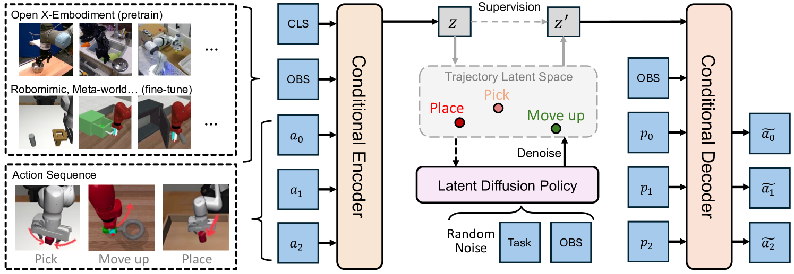
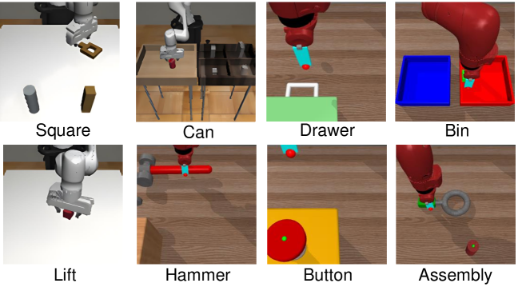
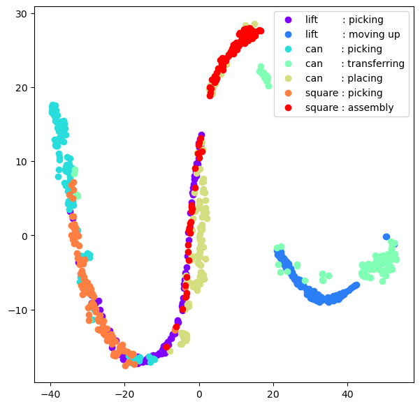
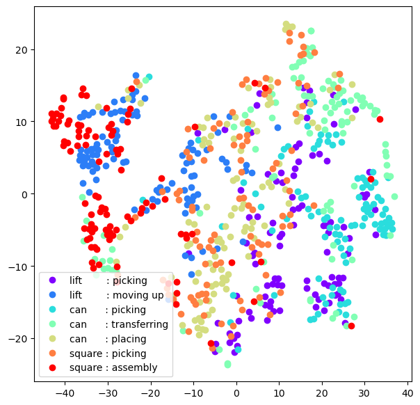
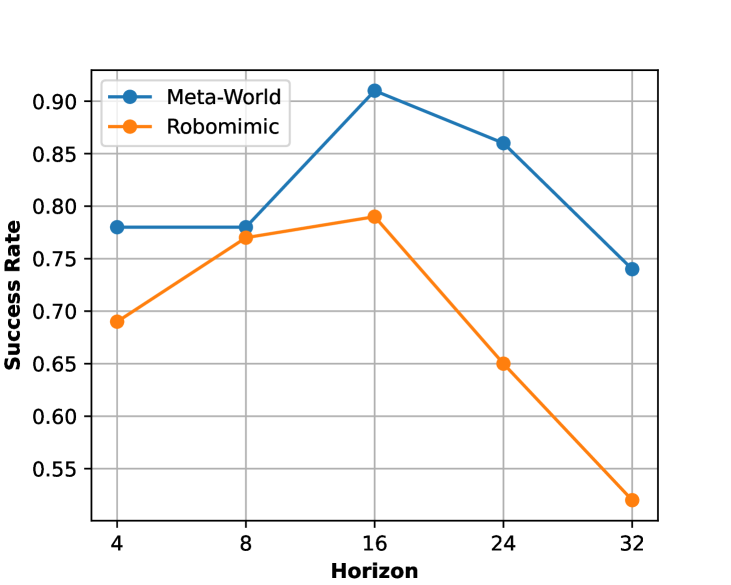
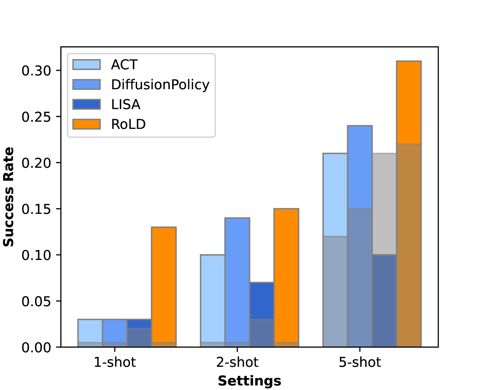
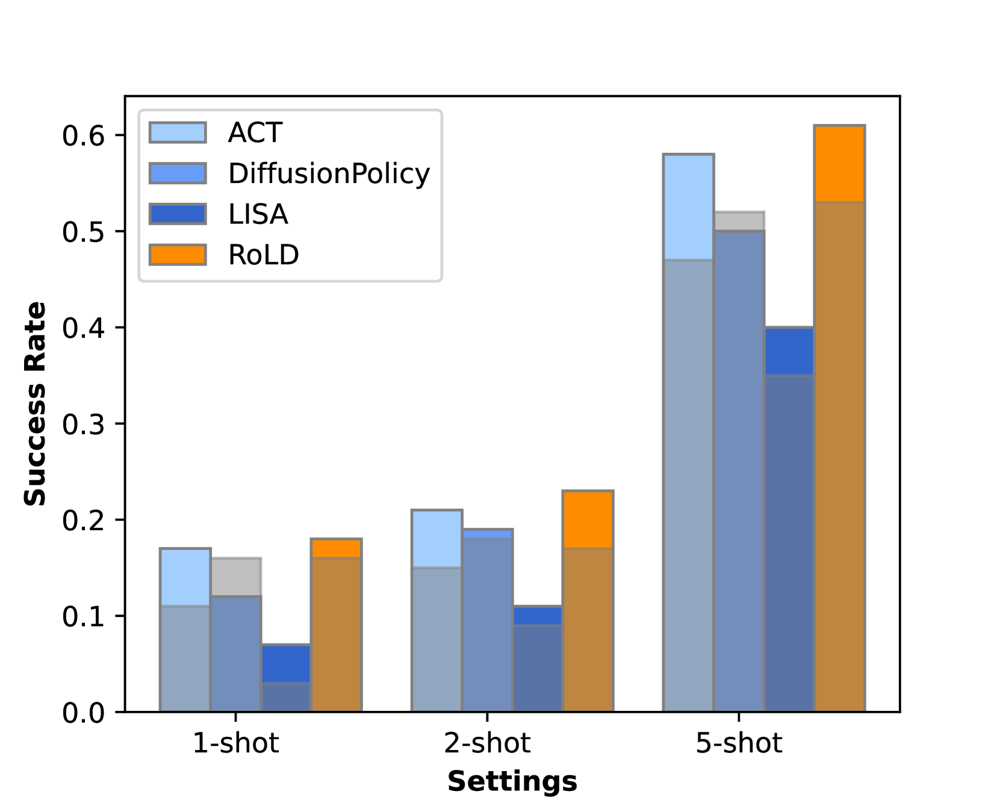
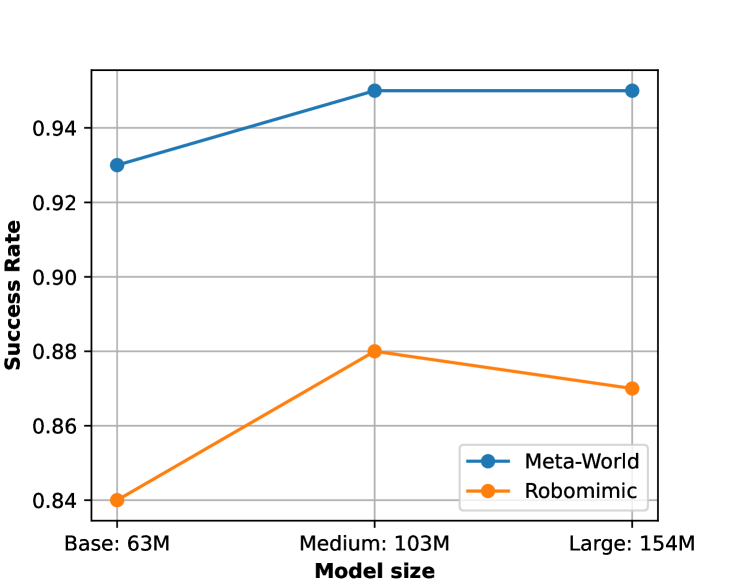

# [运用视觉运动潜在扩散技术进行多任务操控策略模型构建，旨在探索在不同任务中灵活高效地实现操作策略的方法。]

发布时间：2024年03月12日

`Agent`

> Multi-task Manipulation Policy Modeling with Visuomotor Latent Diffusion

> 长期以来，构建一种通用的视觉运动控制策略一直是计算机视觉和机器人研究的重大课题。当前方法大多无法高效利用跨数据集资源，或是过于依赖计算资源消耗巨大的视觉-语言模型，导致其在多任务表现及应用前景方面受限。本文创新性地提出一种新范式，通过巧妙利用操作技能的潜在表征模型和高效的视觉运动潜在扩散策略，极大提升了对跨体现和跨环境数据集的利用效率，进而增强了系统的多任务能力。我们的方法分为两步走：动作建模和策略建模。首先，我们设计了一个无视任务差异、关注载体特性的轨迹潜在自编码器，它能将多样动作数据和观察信息整合至精简的潜在空间，从而最大化利用大规模跨数据集的优势。接着，我们采用视觉运动潜在扩散策略，在噪声中还原出目标技能的潜在表达，以确保任务执行的有效性。经过在两大主流基准上的广泛实验验证，我们的新范式在多任务处理和预训练方面展现出了显著效果。相关代码已开源，访问地址为 https://github.com/AlbertTan404/RoLD。

> Modeling a generalized visuomotor policy has been a longstanding challenge for both computer vision and robotics communities. Existing approaches often fail to efficiently leverage cross-dataset resources or rely on heavy Vision-Language models, which require substantial computational resources, thereby limiting their multi-task performance and application potential. In this paper, we introduce a novel paradigm that effectively utilizes latent modeling of manipulation skills and an efficient visuomotor latent diffusion policy, which enhances the utilizing of existing cross-embodiment and cross-environment datasets, thereby improving multi-task capabilities. Our methodology consists of two decoupled phases: action modeling and policy modeling. Firstly, we introduce a task-agnostic, embodiment-aware trajectory latent autoencoder for unified action skills modeling. This step condenses action data and observation into a condensed latent space, effectively benefiting from large-scale cross-datasets. Secondly, we propose to use a visuomotor latent diffusion policy that recovers target skill latent from noises for effective task execution. We conducted extensive experiments on two widely used benchmarks, and the results demonstrate the effectiveness of our proposed paradigms on multi-tasking and pre-training. Code is available at https://github.com/AlbertTan404/RoLD.

[Arxiv](https://arxiv.org/abs/2403.07312)