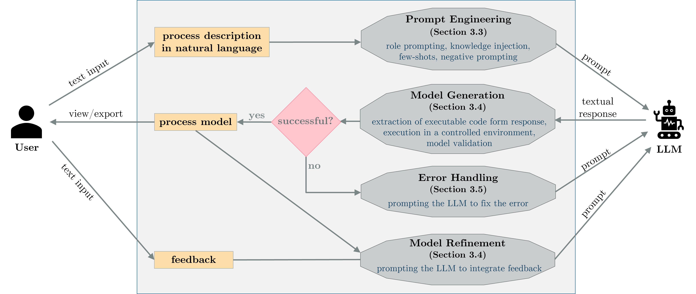
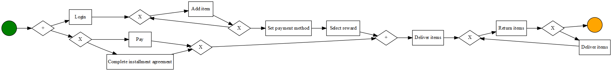
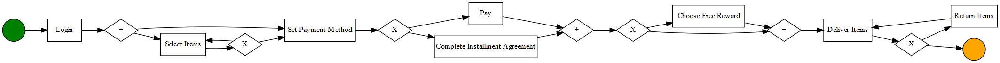
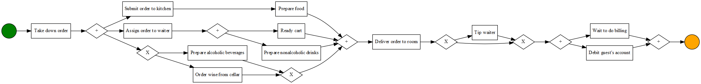
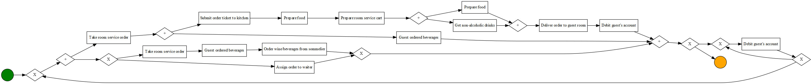
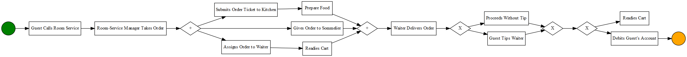

# 探索大型语言模型在过程建模中的应用

发布时间：2024年03月12日

`LLM应用`

> Process Modeling With Large Language Models

# 摘要

> 在 BPM 领域内，过程建模犹如翻译家，将复杂的流程运作转化为直观易懂的视觉化表达，有力推动企业流程的理解优化与自动化。然而传统建模方式常需深厚的专业背景且耗时较多。为此，本文探索将 LLMs 应用于流程建模中，旨在提升专家与非专家用户的建模灵活性、效率和友好度。我们构建了一套基于 LLMs 的框架，通过智能引导和迭代深化，能自动从文本描述生成并优化流程模型。该框架运用创新的提示策略高效调动 LLMs 资源，同时搭载安全生成机制和错误处理方案。不仅如此，我们还实例化了一个具体的系统，依托此框架运行。该系统确保生成模型的质量稳定可靠，并支持以 BPMN、Petri 网等业内标准符号导出。初步实验表明，这一框架大大简化了流程建模工作流程，充分展现了生成式 AI 在 BPM 领域的革新力量。

> In the realm of Business Process Management (BPM), process modeling plays a crucial role in translating complex process dynamics into comprehensible visual representations, facilitating the understanding, analysis, improvement, and automation of organizational processes. Traditional process modeling methods often require extensive expertise and can be time-consuming. This paper explores the integration of Large Language Models (LLMs) into process modeling to enhance flexibility, efficiency, and accessibility of process modeling for both expert and non-expert users. We propose a framework that leverages LLMs for the automated generation and iterative refinement of process models starting from textual descriptions. Our framework involves innovative prompting strategies for effective LLM utilization, along with a secure model generation protocol and an error-handling mechanism. Moreover, we instantiate a concrete system extending our framework. This system provides robust quality guarantees on the models generated and supports exporting them in standard modeling notations, such as the Business Process Modeling Notation (BPMN) and Petri nets. Preliminary results demonstrate the framework's ability to streamline process modeling tasks, underscoring the transformative potential of generative AI in the BPM field.

[Arxiv](https://arxiv.org/abs/2403.07541)