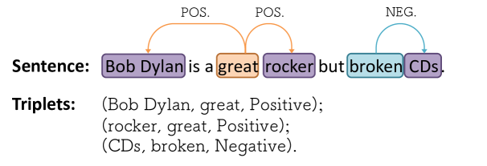
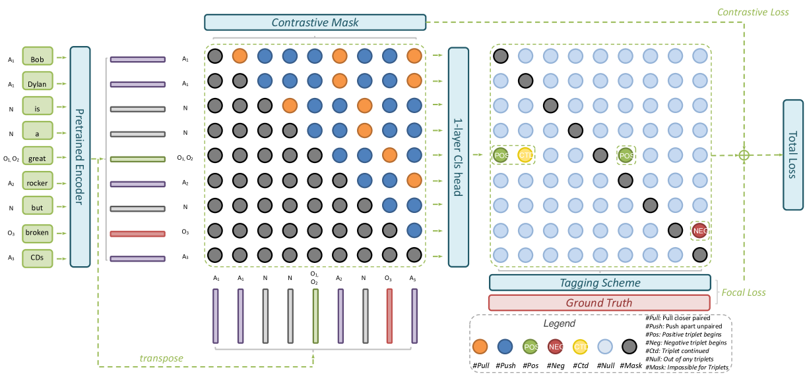
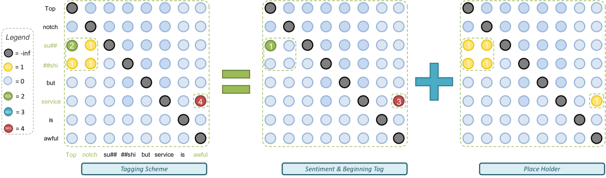
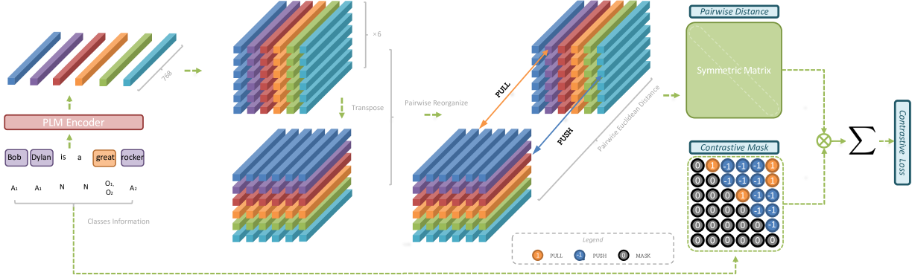
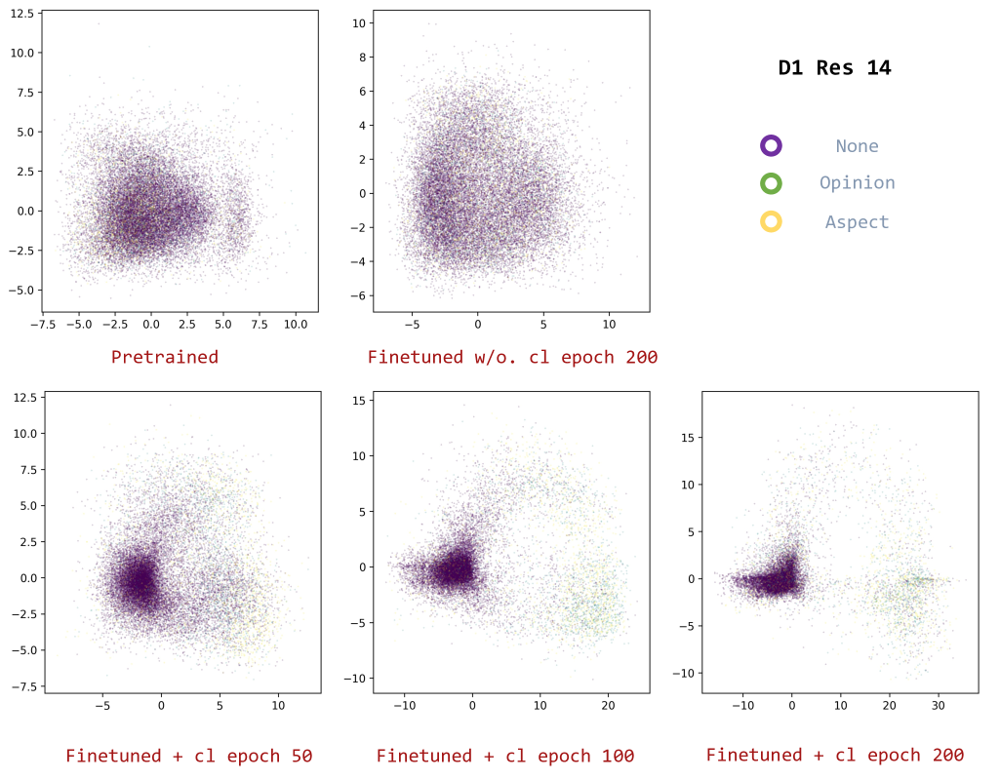

# [我们对 ASTE 进行重新审视，提出了一种与对比学习并行运作的简约标签方案。](https://arxiv.org/abs/2403.07342)

发布时间：2024年03月12日

`LLM应用`

> Rethinking ASTE: A Minimalist Tagging Scheme Alongside Contrastive Learning

> ASTE 是一项崭露头角的细粒度情感分析子任务，致力于从松散的文本数据中提炼出结构清晰的情感三元组。然而，当前的方法常因附加结构和外部数据而使问题变得复杂。为此，我们创新性地设计了一套新的标注方案，并结合对比学习策略来应对这些难题。新方法不仅展现出了与现有顶尖技术相媲美甚至超越的性能，而且结构更为精炼、计算成本更低。尤为引人注目的是，在LLMs盛行的时代，该方法在小样本学习情境下，其效能明显优于GPT 3.5和GPT 4。此外，此项研究还为LLMs框架内深化ASTE技术发展提供了重要启示。

> Aspect Sentiment Triplet Extraction (ASTE) is a burgeoning subtask of fine-grained sentiment analysis, aiming to extract structured sentiment triplets from unstructured textual data. Existing approaches to ASTE often complicate the task with additional structures or external data. In this research, we propose a novel tagging scheme and employ a contrastive learning approach to mitigate these challenges. The proposed approach demonstrates comparable or superior performance in comparison to state-of-the-art techniques, while featuring a more compact design and reduced computational overhead. Notably, even in the era of Large Language Models (LLMs), our method exhibits superior efficacy compared to GPT 3.5 and GPT 4 in a few-shot learning scenarios. This study also provides valuable insights for the advancement of ASTE techniques within the paradigm of large language models.

[Arxiv](https://arxiv.org/abs/2403.07342)