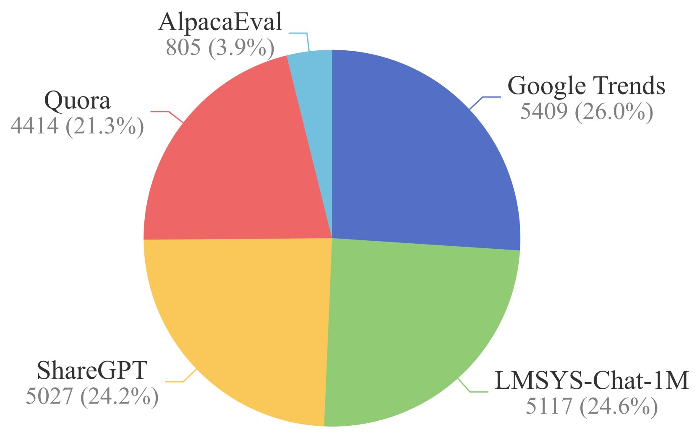
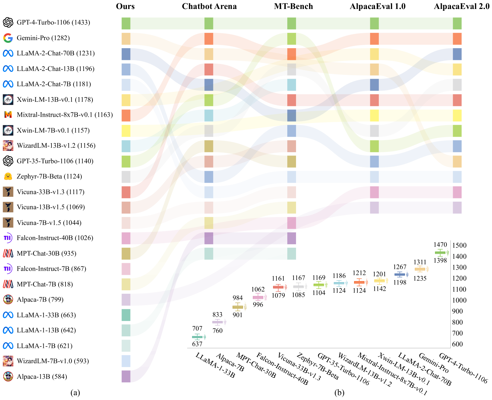
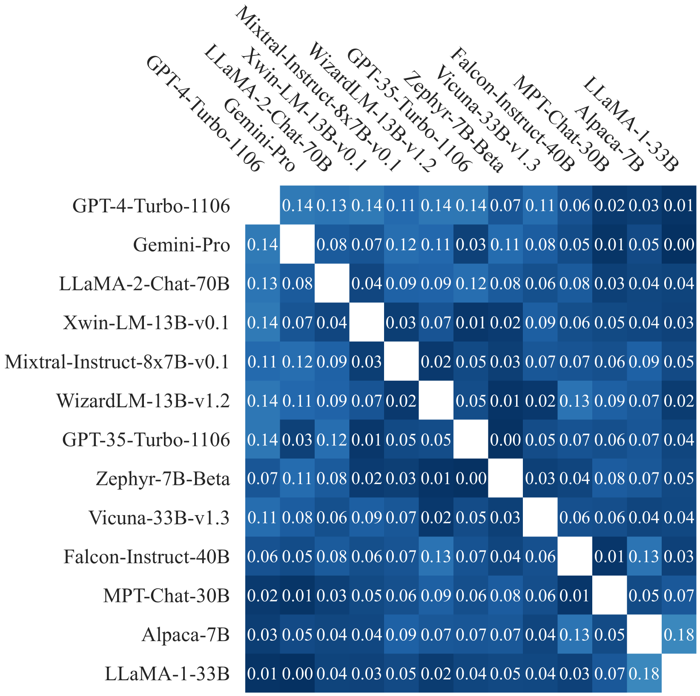
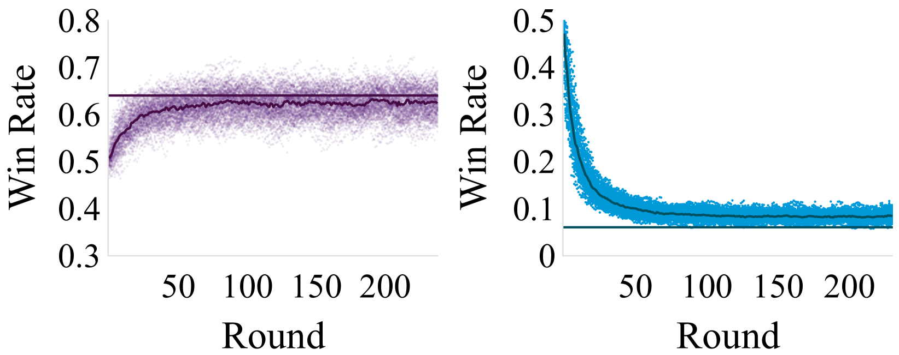
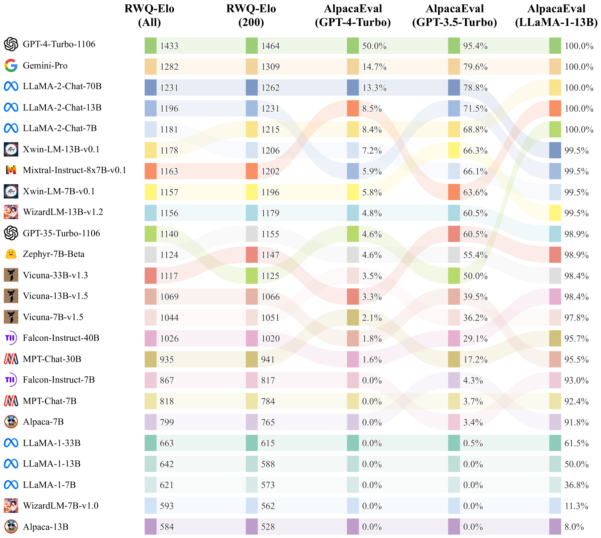
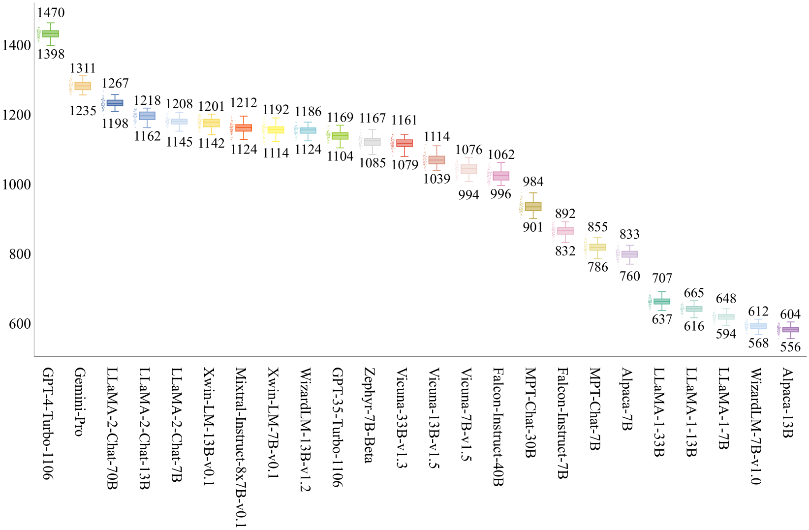
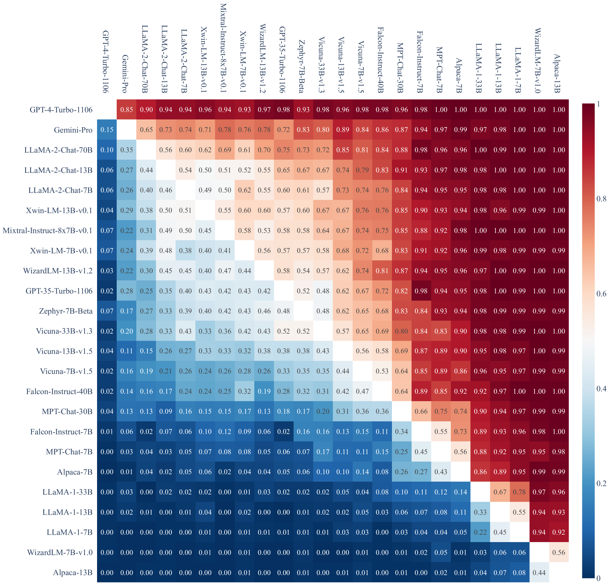
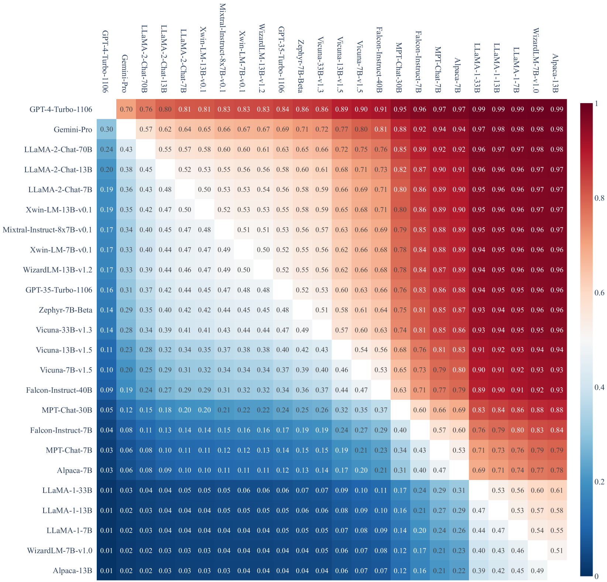
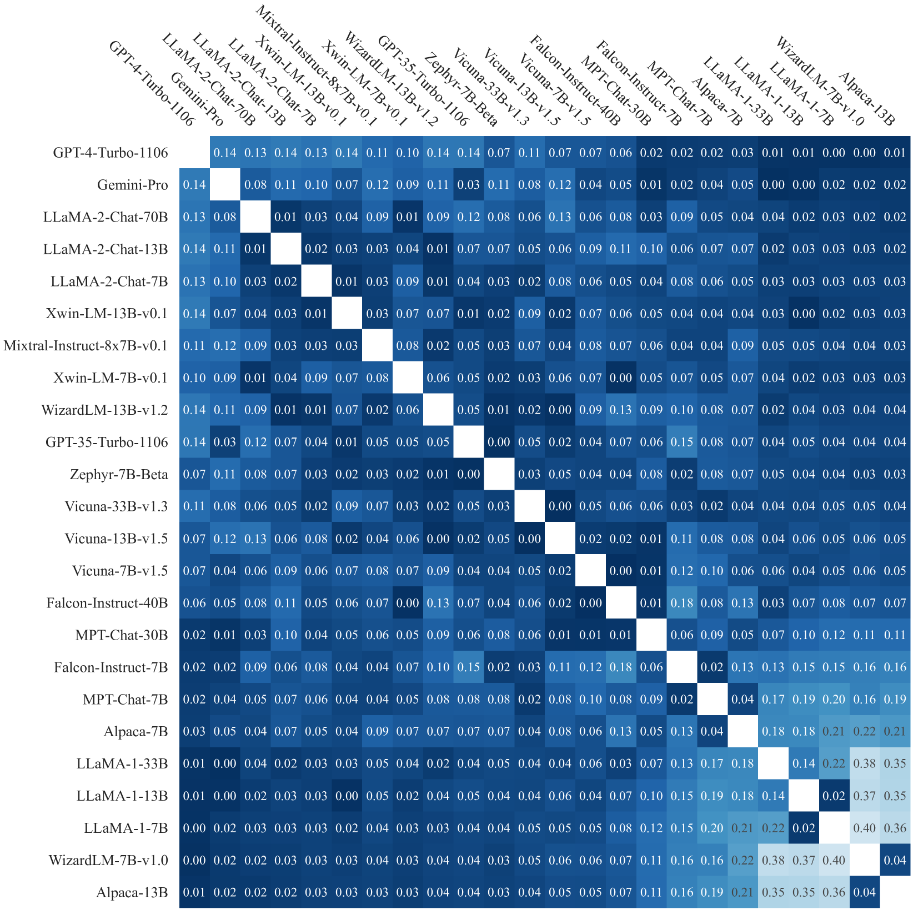

# [为深入探究语义理解能力，本研究对大型语言模型生成评估方法进行重新审视与思考。](https://arxiv.org/abs/2403.07872)

发布时间：2024年03月12日

`LLM应用`

> Rethinking Generative Large Language Model Evaluation for Semantic Comprehension

> 虽然LLMs能力强大，但其有效评估却遭遇瓶颈。本文首先关注了广泛使用的MCQA评估方式，它能直观衡量准确性。然而，在对涵盖11项基准测试的24个模型详尽评估后，我们发现MCQA存在局限性，比如在实际场景中，MCQA与开放式回答生成的效果并不一致。因此，我们创新性地推出了RWQ-Elo评级系统，邀请包括GPT-4、GPT-3.5、Google-Gemini-Pro和LLaMA-1/-2在内的24位LLMs以双人竞技模式参与，由GPT-4担当裁判，并为每个模型分配Elo评分。此系统贴近真实应用场景，我们特此创建了包含20,772条真实用户问题的新基准“真实世界问题”（RWQ）。同时，我们深度剖析了RWQ-Elo系统的特点，并将其与AlpacaEval和MT-Bench等既有排行榜进行了比较。结果显示，RWQ-Elo系统稳定可靠，便于新模型注册，并有望重塑LLM排行榜格局。

> Despite their sophisticated capabilities, large language models (LLMs) encounter a major hurdle in effective assessment. This paper first revisits the prevalent evaluation method-multiple choice question answering (MCQA), which allows for straightforward accuracy measurement. Through a comprehensive evaluation of 24 models across 11 benchmarks, we highlight several potential drawbacks of MCQA, for instance, the inconsistency between the MCQA evaluation and the generation of open-ended responses in practical scenarios. In response, we introduce an RWQ-Elo rating system, engaging 24 LLMs such as GPT-4, GPT-3.5, Google-Gemini-Pro and LLaMA-1/-2, in a two-player competitive format, with GPT-4 serving as the judge. Each LLM receives an Elo rating thereafter. This system is designed to mirror real-world usage, and for this purpose, we have compiled a new benchmark called ``Real-world questions'' (RWQ), comprising 20,772 authentic user inquiries. Additionally, we thoroughly analyze the characteristics of our system and compare it with prior leaderboards like AlpacaEval and MT-Bench. Our analysis reveals the stability of our RWQ-Elo system, the feasibility of registering new models, and its potential to reshape LLM leaderboards.

[Arxiv](https://arxiv.org/abs/2403.07872)