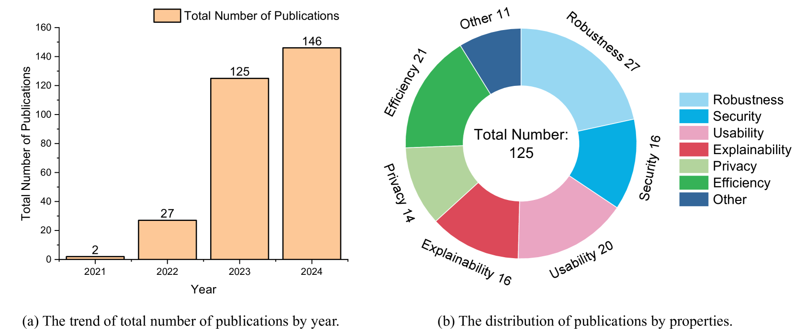
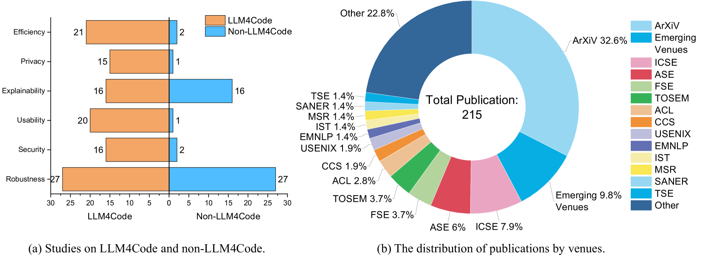

# [针对大型语言模型应用于代码场景时，其稳健性、安全防护、隐私保护、可解释性、效能及易用性等方面的探讨与研究](https://arxiv.org/abs/2403.07506)

发布时间：2024年03月12日

`LLM应用`

> Robustness, Security, Privacy, Explainability, Efficiency, and Usability of Large Language Models for Code

> LLM4Code 在源代码处理上展现出强劲实力，有力推动了软件工程的发展。尽管多份研究单独关注其非功能性属性，但缺乏对这些属性评估与优化的整体审视。本论文细致梳理了146篇相关研究，首次完成了系统性的文献回顾，揭示出除准确性外，还包括健壮性、安全、隐私保护、可解释性、效率及用户体验在内的七大关键属性。我们剖析了当前的技术前沿与发展趋势，找出现有研究的不足，并为未来的研究方向提供了前瞻性的指引。

> Large language models for code (LLM4Code), which demonstrate strong performance (e.g., high accuracy) in processing source code, have significantly transformed software engineering. Many studies separately investigate the non-functional properties of LM4Code, but there is no systematic review of how these properties are evaluated and enhanced. This paper fills this gap by thoroughly examining 146 relevant studies, thereby presenting the first systematic literature review to identify seven important properties beyond accuracy, including robustness, security, privacy, explainability, efficiency, and usability. We discuss the current state-of-the-art methods and trends, identify gaps in existing research, and present promising directions for future study.

