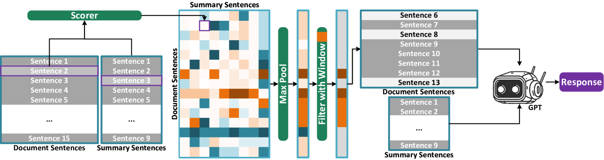

# SIFiD：借助LLM技术，我们对摘要中事实不一致性检测进行重新审视和评估。

发布时间：2024年03月12日

`LLM应用`

> SIFiD: Reassess Summary Factual Inconsistency Detection with LLM

> 在摘要生成领域，保证摘要内容与原文的一致性至关重要，为此研究人员投入大量精力开发检测工具。随着LLMs的发展，人们尝试利用其卓越的语言理解能力来探测不一致性问题，但初步结果显示，相比传统模型，LLMs因遵循指令能力受限以及缺乏高效检测策略，在这方面表现欠佳。本次研究再次探讨了运用LLMs（如GPT-3.5和GPT-4）检测摘要不一致性的可能性，并在此基础上创新提出SIFiD方案，它能借助自然语言推理技术或计算摘要与原文之间的语义相似度，从文档中精准定位关键信息，从而提升LLM在检测摘要不一致性上的效能。

> Ensuring factual consistency between the summary and the original document is paramount in summarization tasks. Consequently, considerable effort has been dedicated to detecting inconsistencies. With the advent of Large Language Models (LLMs), recent studies have begun to leverage their advanced language understanding capabilities for inconsistency detection. However, early attempts have shown that LLMs underperform traditional models due to their limited ability to follow instructions and the absence of an effective detection methodology. In this study, we reassess summary inconsistency detection with LLMs, comparing the performances of GPT-3.5 and GPT-4. To advance research in LLM-based inconsistency detection, we propose SIFiD (Summary Inconsistency Detection with Filtered Document) that identify key sentences within documents by either employing natural language inference or measuring semantic similarity between summaries and documents.

[Arxiv](https://arxiv.org/abs/2403.07557)