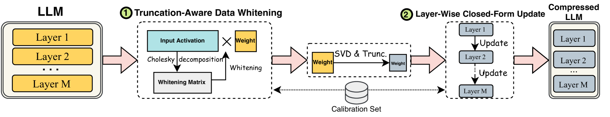
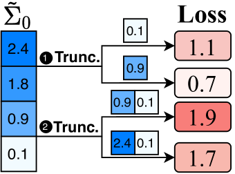
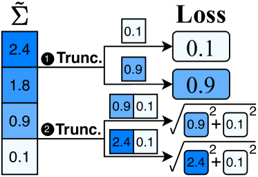
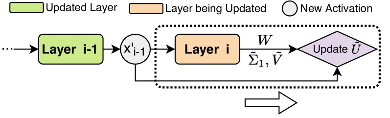
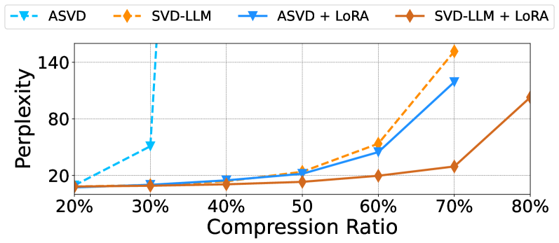
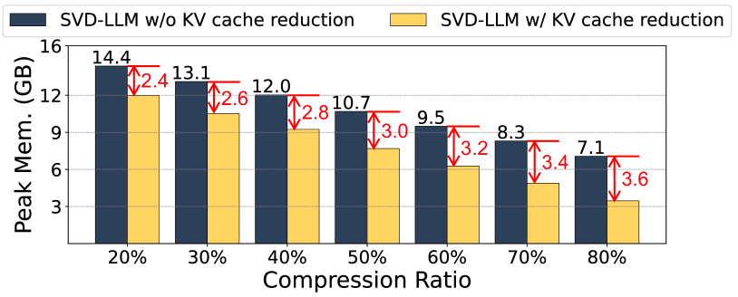

# [SVD-LLM 是一种考虑截断影响的奇异值分解方法，专门用于大型语言模型的高效压缩。](https://arxiv.org/abs/2403.07378)

发布时间：2024年03月12日

`LLM理论`

> SVD-LLM: Truncation-aware Singular Value Decomposition for Large Language Model Compression

> 由于LLMs巨大的体积限制了其应用发展，必须对其进行压缩才能有效部署，而SVD为此提供了一种颇具潜力的压缩手段。不过，当前顶尖的基于SVD的LLM压缩技术存在两大瓶颈：一是截断小奇异值可能导致更高的信息损失；二是SVD截断后未对剩余模型参数进行更新优化。本研究创新性地提出了SVD-LLM这一新型压缩方案，成功解决了上述问题。SVD-LLM采用了智能感知截断影响的数据白化技术，确保奇异值与压缩损失间的直观对应关系。并且，该方法还引入了一种逐层封闭形式的模型参数更新策略，有效抵消了因SVD截断造成的精度衰退。我们在涵盖三大LLM家族、四个不同规模的共计11个数据集和七种模型上验证了SVD-LLM的有效性，实验结果显示，在特别是高压缩比的情况下，SVD-LLM显著超越现有顶尖技术。相关源代码已开放在https://github.com/AIoT-MLSys-Lab/SVD-LLM供查阅。

> The advancements in Large Language Models (LLMs) have been hindered by their substantial sizes, which necessitate LLM compression methods for practical deployment. Singular Value Decomposition (SVD) offers a promising solution for LLM compression. However, state-of-the-art SVD-based LLM compression methods have two key limitations: truncating smaller singular values may lead to higher compression loss, and the lack of update on the remaining model parameters after SVD truncation. In this work, we propose SVD-LLM, a new SVD-based LLM compression method that addresses the limitations of existing methods. SVD-LLM incorporates a truncation-aware data whitening strategy to ensure a direct mapping between singular values and compression loss. Moreover, SVD-LLM adopts a layer-wise closed-form model parameter update strategy to compensate for accuracy degradation caused by SVD truncation. We evaluate SVD-LLM on a total of 11 datasets and seven models from three different LLM families at four different scales. Our results demonstrate the superiority of SVD-LLM over state-of-the-arts, especially at high model compression ratios. The source code is available at https://github.com/AIoT-MLSys-Lab/SVD-LLM.

