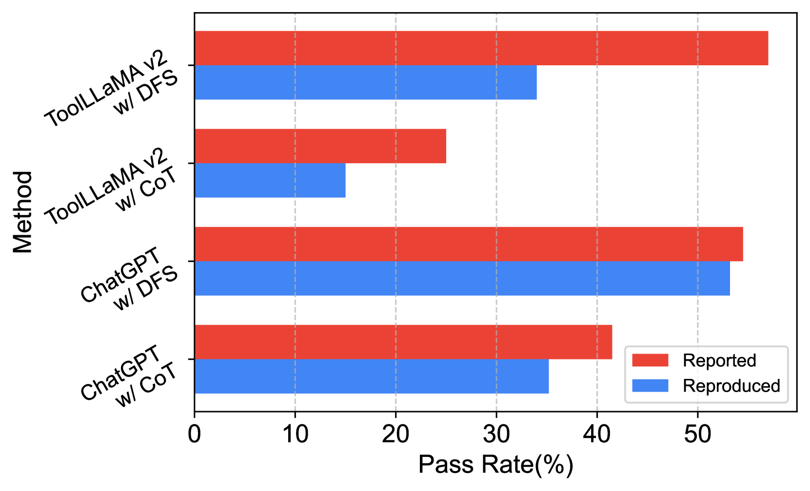
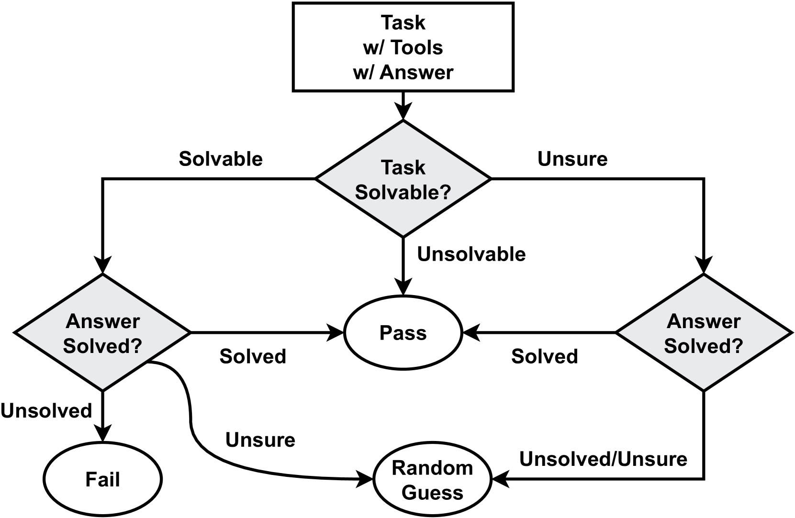
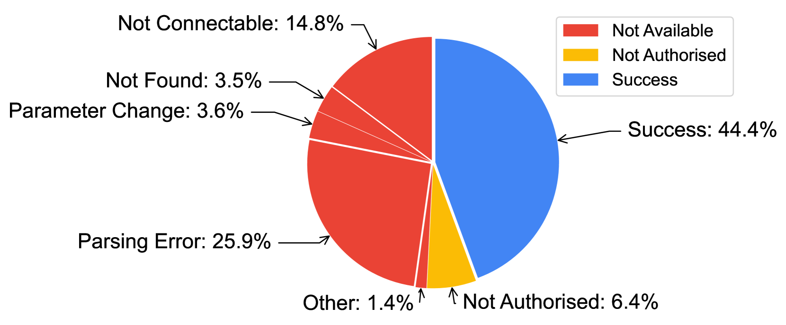
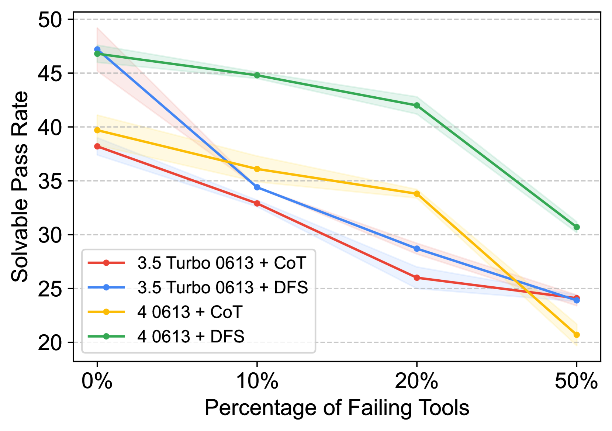
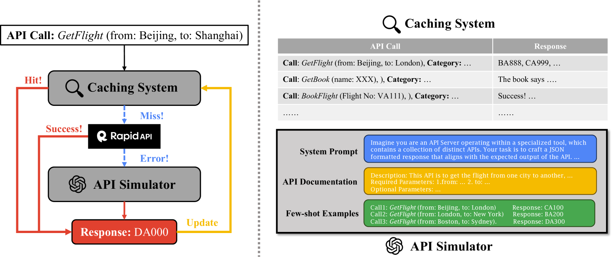
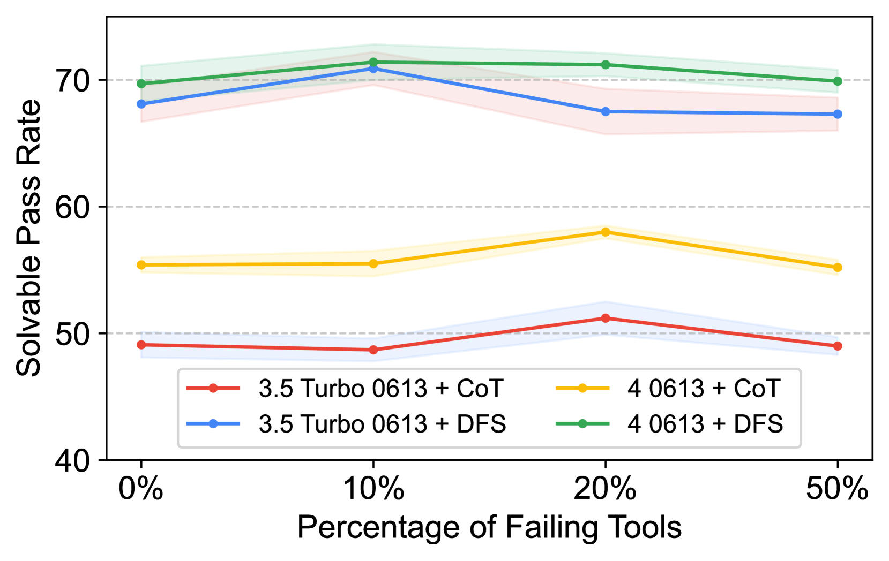
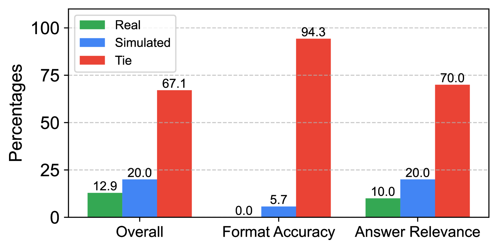

# StableToolBench项目旨在为大型语言模型的工具学习提供一个稳定且具备大规模基准测试能力的平台。

发布时间：2024年03月12日

`LLM应用`

> StableToolBench: Towards Stable Large-Scale Benchmarking on Tool Learning of Large Language Models

> 随着LLMs近年来突飞猛进的发展，研究人员开始探究将LLMs与外部工具结合以解决实际问题的工具学习领域。为了准确评估LLMs对工具的有效利用程度，建立大规模且稳定的基准测试至关重要。然而，之前的研究在基准数据集的选择上存在局限，或是使用规模较小的人工制作在线工具，或是采用大规模但API状态易变的真实在线APIs。为此，我们推出了进化版的ToolBench——StableToolBench，创新地构建了虚拟API服务器和稳固的评估体系。其中，虚拟API服务器配备了一套缓存机制和API模拟器，两者相辅相成，有效减轻了因API状态变动带来的影响。此外，该稳定评估系统借助GPT-4作为自动化评估工具，精心设计了可解任务的通过率和胜率指标，从而消除了评估过程中的随机因素。实验证明StableToolBench具有高度稳定性，并深入讨论了API模拟器、缓存系统以及评估系统的实际效能。

> Large Language Models (LLMs) have witnessed remarkable advancements in recent years, prompting the exploration of tool learning, which integrates LLMs with external tools to address diverse real-world challenges. Assessing the capability of LLMs to utilise tools necessitates large-scale and stable benchmarks. However, previous works relied on either hand-crafted online tools with limited scale, or large-scale real online APIs suffering from instability of API status. To address this problem, we introduce StableToolBench, a benchmark evolving from ToolBench, proposing a virtual API server and stable evaluation system. The virtual API server contains a caching system and API simulators which are complementary to alleviate the change in API status. Meanwhile, the stable evaluation system designs solvable pass and win rates using GPT-4 as the automatic evaluator to eliminate the randomness during evaluation. Experimental results demonstrate the stability of StableToolBench, and further discuss the effectiveness of API simulators, the caching system, and the evaluator system.

[Arxiv](https://arxiv.org/abs/2403.07714)