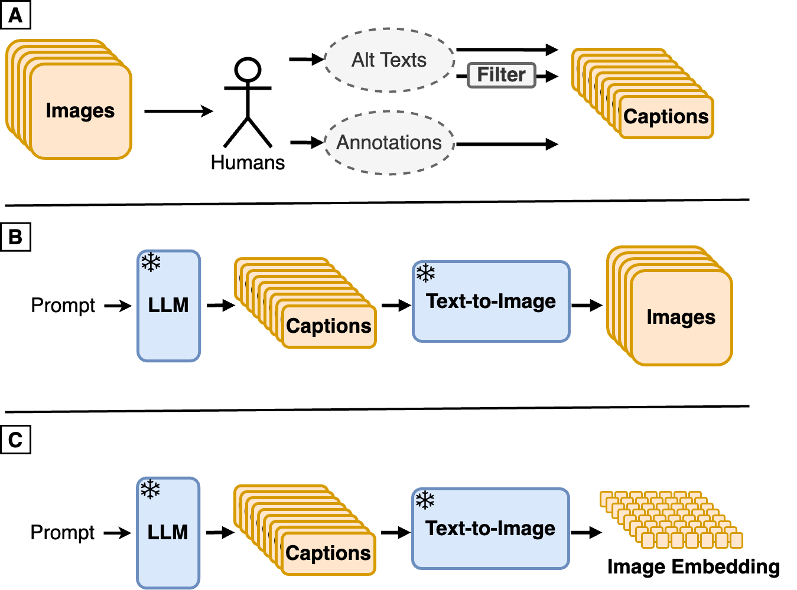
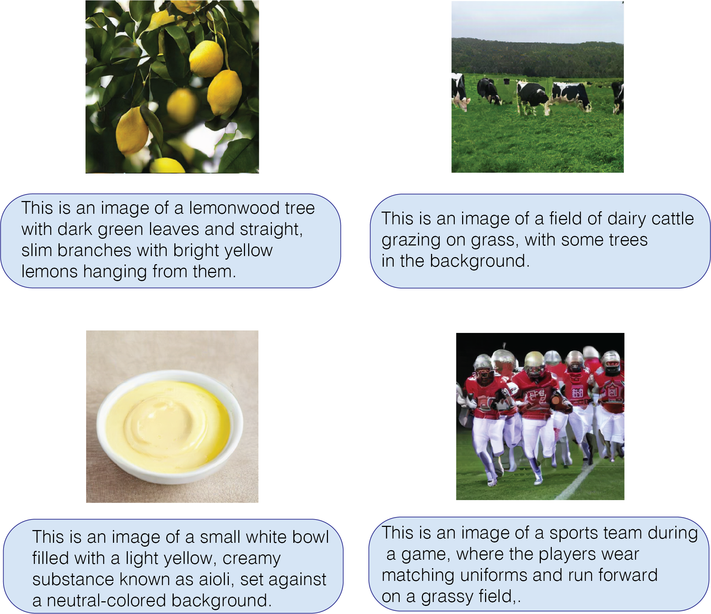
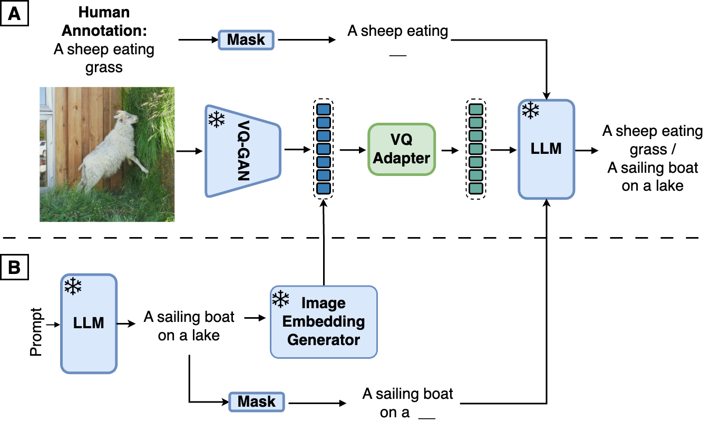
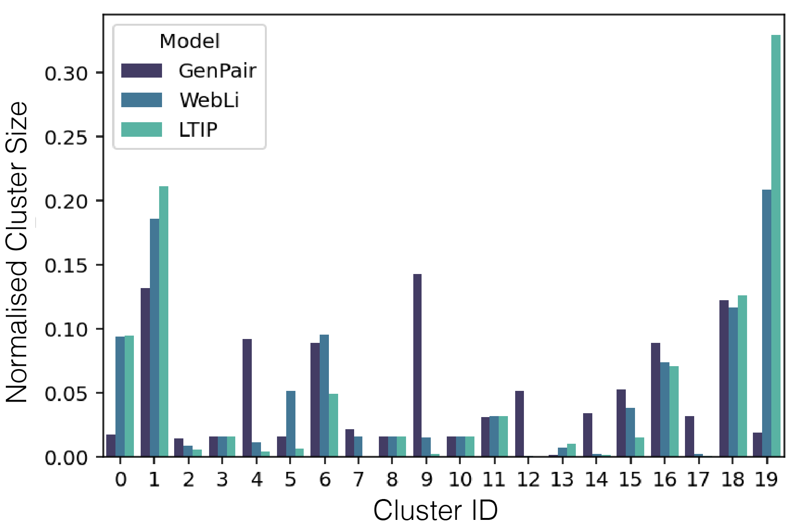
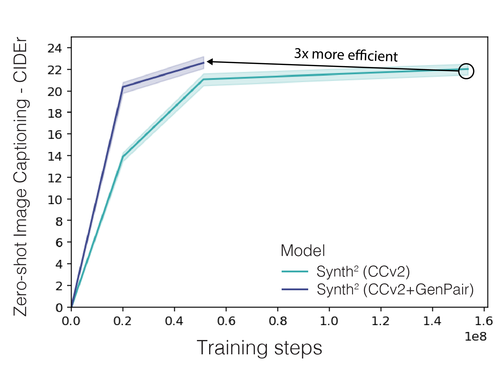

# [Synth$^2$：借助于合成的图片说明和图像嵌入技术，有力地增强了视觉-语言模型的功能与性能。](https://arxiv.org/abs/2403.07750)

发布时间：2024年03月12日

`LLM应用`

> Synth$^2$: Boosting Visual-Language Models with Synthetic Captions and Image Embeddings

> 在构建高质量人类标注的图像配文数据集方面，成为制约视觉-语言模型（VLMs）发展的一大难题。我们创新性地提出一种方案，巧妙结合大型语言模型（LLMs）与图像生成模型的力量，创造出可用于高效训练VLM的合成图像-文本对。具体来说，我们首先预训练一个基于LLM生成的标题生成图像嵌入的文本转图像模型，随后将这些合成对应用于VLM训练。大量实验证明，采用合成数据训练的VLM在图像 captioning任务上展现出了与仅依赖人工标注数据训练模型相当的性能，而且所需数据量仅为后者的小部分。尤其值得一提的是，借助合成数据集增强策略，我们成功超越基线水平达17%。另外，我们发现相较于像素空间，在图像嵌入空间中进行合成速度快了25%。这项研究揭示了一种颇具潜力的大规模、可定制图像数据集生成技术，有助于提升VLM性能，拓宽其在各类领域的应用范围，并同时优化了数据效率和资源利用。

> The creation of high-quality human-labeled image-caption datasets presents a significant bottleneck in the development of Visual-Language Models (VLMs). We propose a novel approach that leverages the strengths of Large Language Models (LLMs) and image generation models to create synthetic image-text pairs for efficient and effective VLM training. Our method employs pretraining a text-to-image model to synthesize image embeddings starting from captions generated by an LLM. These synthetic pairs are then used to train a VLM. Extensive experiments demonstrate that the VLM trained with synthetic data exhibits comparable performance on image captioning, while requiring a fraction of the data used by models trained solely on human-annotated data. In particular, we outperform the baseline by 17% through augmentation with a synthetic dataset. Furthermore, we show that synthesizing in the image embedding space is 25% faster than in the pixel space. This research introduces a promising technique for generating large-scale, customizable image datasets, leading to enhanced VLM performance and wider applicability across various domains, all with improved data efficiency and resource utilization.

