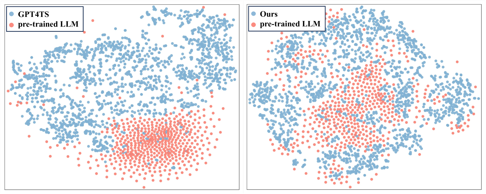
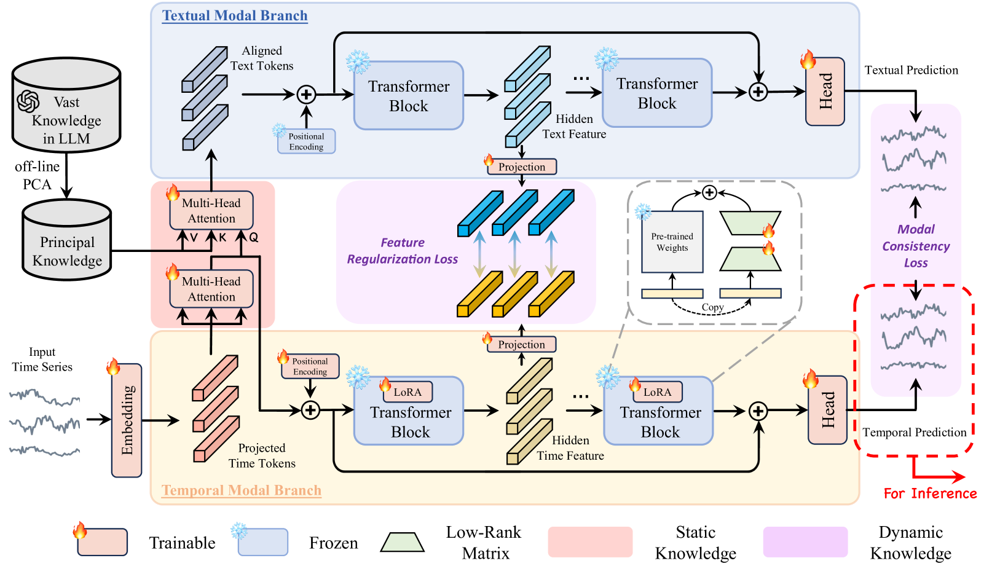
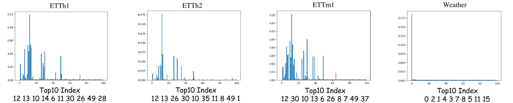
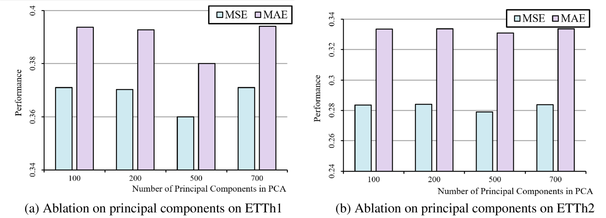

# [运用跨模态知识蒸馏技术，让预训练的大型语言模型（LLM）更好地服务于通用时间序列预测任务，实现对此类预测的有效驾驭和提升。](https://arxiv.org/abs/2403.07300)

发布时间：2024年03月12日

`LLM应用`

> Taming Pre-trained LLMs for Generalised Time Series Forecasting via Cross-modal Knowledge Distillation

> 近年来，受益于深度学习技术的飞速发展，多元时间序列预测取得了显著突破。不过，现存方法大多依赖有限时序数据从零开始训练模型，这限制了模型的泛化能力。随着大型语言模型（LLMs）的崛起，部分研究试图将其应用于时间序列预测任务中，尽管取得了一些积极成果，但此类方法直接将时间序列输入到LLMs，却忽视了时间数据与文本数据之间内在的模态差异。为此，我们创新性地提出了一个名为LLaTA的大型语言模型与时间序列对齐框架，旨在全面挖掘LLMs在时间序列预测挑战中的潜能。通过运用跨模态知识蒸馏技术，LLaTA有效利用了预训练LLMs中既包含与输入无关的静态知识，也涵盖了与输入相关的动态知识。这样一来，预测模型不仅能够展现出卓越的性能表现，还具备出色的泛化能力。大量的实验证明，这一新方法已经在长期和短期预测领域树立了全新的标杆，相关代码已开源并可在GitHub上找到（\url{https://github.com/Hank0626/LLaTA}）。

> Multivariate time series forecasting has recently gained great success with the rapid growth of deep learning models. However, existing approaches usually train models from scratch using limited temporal data, preventing their generalization. Recently, with the surge of the Large Language Models (LLMs), several works have attempted to introduce LLMs into time series forecasting. Despite promising results, these methods directly take time series as the input to LLMs, ignoring the inherent modality gap between temporal and text data. In this work, we propose a novel Large Language Models and time series alignment framework, dubbed LLaTA, to fully unleash the potentials of LLMs in the time series forecasting challenge. Based on cross-modal knowledge distillation, the proposed method exploits both input-agnostic static knowledge and input-dependent dynamic knowledge in pre-trained LLMs. In this way, it empowers the forecasting model with favorable performance as well as strong generalization abilities. Extensive experiments demonstrate the proposed method establishes a new state of the art for both long- and short-term forecasting. Code is available at \url{https://github.com/Hank0626/LLaTA}.

[Arxiv](https://arxiv.org/abs/2403.07300)