# [文本信息在其中起着关键作用，我们提出了一种名为“跨模态协同教学”的方法，旨在助力广泛而有效的视觉类别发现。这种方法充分利用了文本与视觉信息之间的相互作用，以实现对各类视觉概念的泛化发现能力。]

发布时间：2024年03月12日

`LLM应用`

> Textual Knowledge Matters: Cross-Modality Co-Teaching for Generalized Visual Class Discovery

> 本文探讨了利用已知类别标注信息去聚类包含已知与未知类别无标注数据的广义类别发现难题。现有方法过于倚重单一视觉线索，却忽略了人在探索新视觉类别时所体现的多模态认知特点。因此，我们创新提出了TextGCD双阶段框架，借助强大的视觉-语言模型实现对多模态GCD的有效探索。TextGCD的核心包括两个步骤：第一步是基于检索的文本生成（RTG），它巧妙地运用多样化数据集中的类别标签及大型语言模型产出的属性构建视觉词汇表，并以检索方式生成图像的描述性文本；第二步则是跨模态协同教学（CCT），它巧妙利用文本和视觉两种模态间的差异，推动二者相互学习，从而提升视觉GCD的能力。同时，我们精心设计了一种自适应类别对齐策略，确保不同模态间类别认知的一致性，还引入了软投票机制整合多模态信号。实验证明，在涵盖八个数据集的对比中，我们的方法显著超越当前最优技术，特别是在ImageNet-1k和CUB数据集中，整体准确率分别提高了7.7%和10.8%，展现了明显优势。

> In this paper, we study the problem of Generalized Category Discovery (GCD), which aims to cluster unlabeled data from both known and unknown categories using the knowledge of labeled data from known categories. Current GCD methods rely on only visual cues, which however neglect the multi-modality perceptive nature of human cognitive processes in discovering novel visual categories. To address this, we propose a two-phase TextGCD framework to accomplish multi-modality GCD by exploiting powerful Visual-Language Models. TextGCD mainly includes a retrieval-based text generation (RTG) phase and a cross-modality co-teaching (CCT) phase. First, RTG constructs a visual lexicon using category tags from diverse datasets and attributes from Large Language Models, generating descriptive texts for images in a retrieval manner. Second, CCT leverages disparities between textual and visual modalities to foster mutual learning, thereby enhancing visual GCD. In addition, we design an adaptive class aligning strategy to ensure the alignment of category perceptions between modalities as well as a soft-voting mechanism to integrate multi-modality cues. Experiments on eight datasets show the large superiority of our approach over state-of-the-art methods. Notably, our approach outperforms the best competitor, by 7.7% and 10.8% in All accuracy on ImageNet-1k and CUB, respectively.

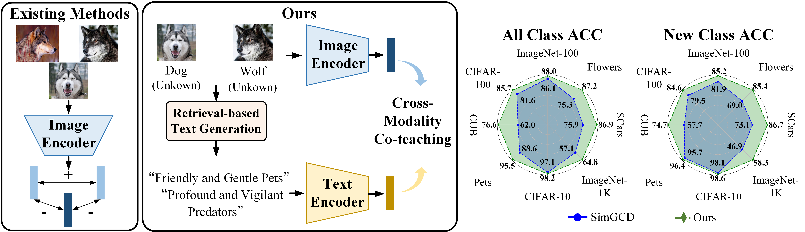

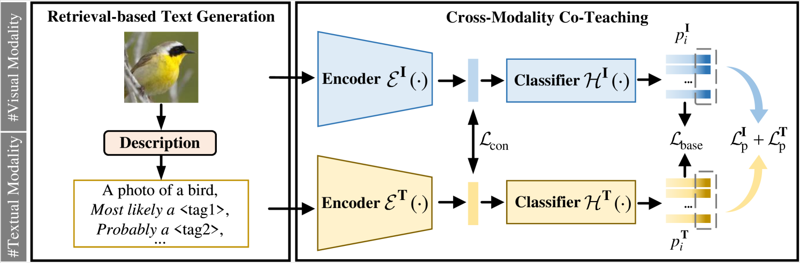

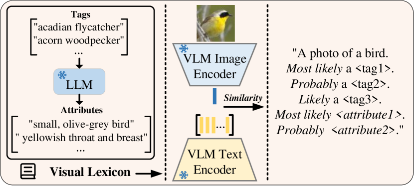

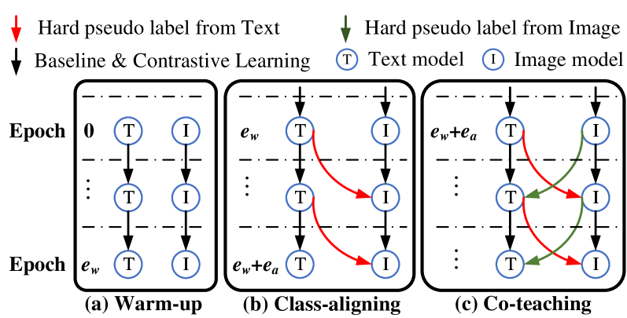

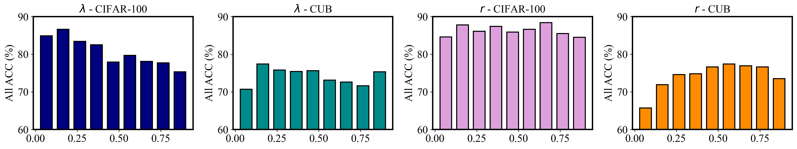

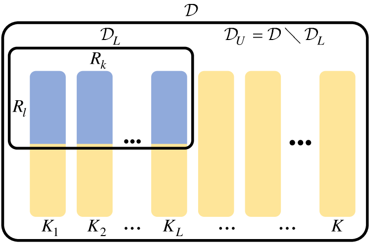

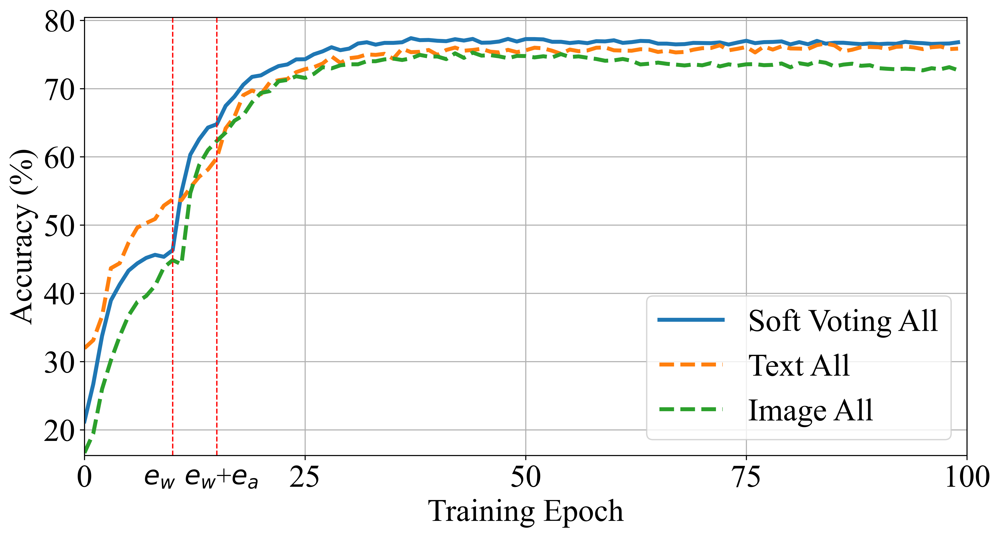

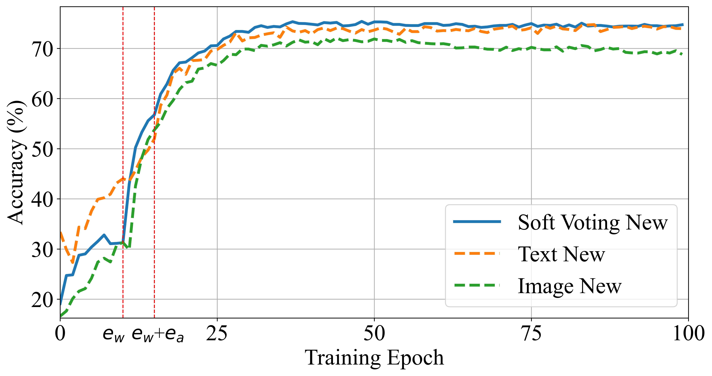

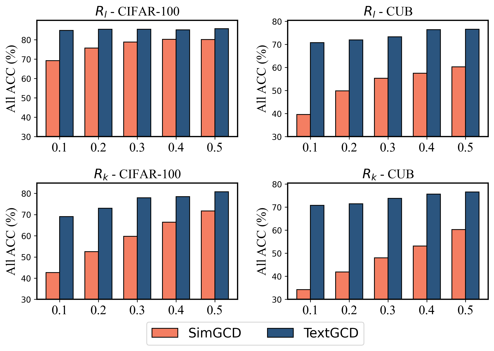

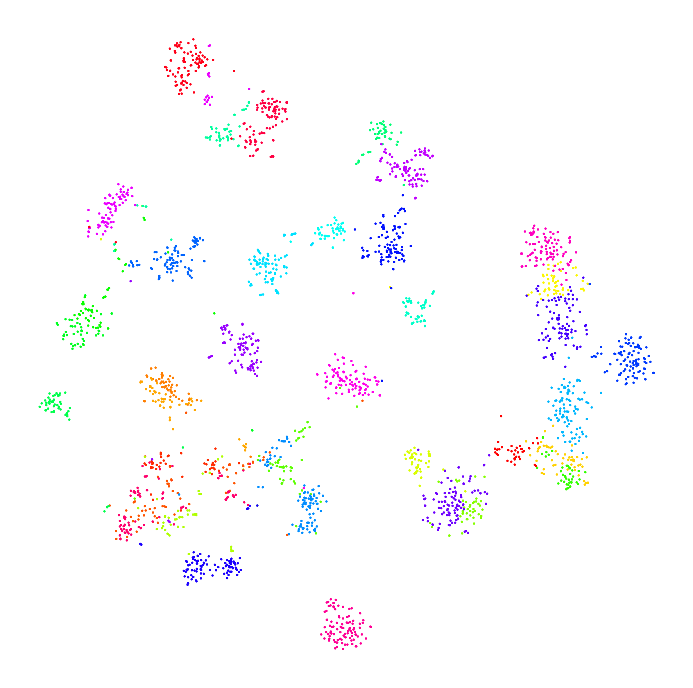

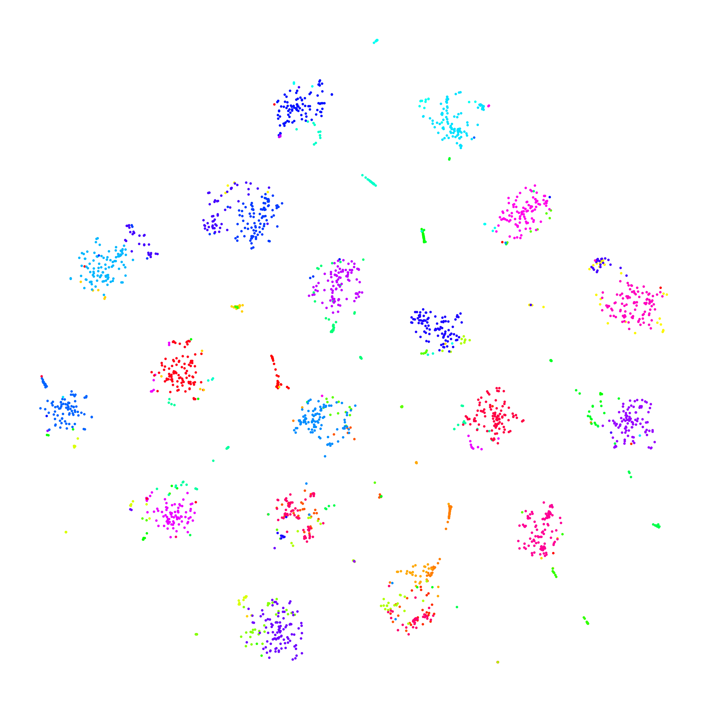

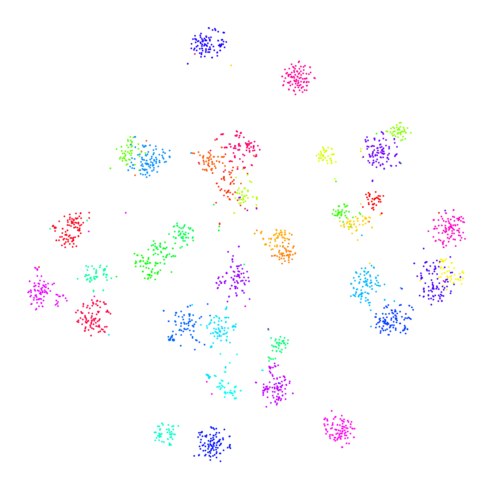

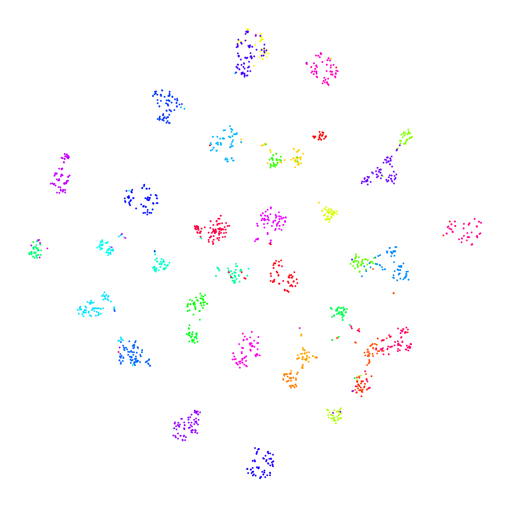

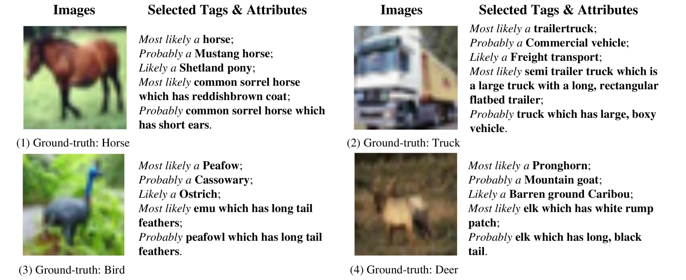

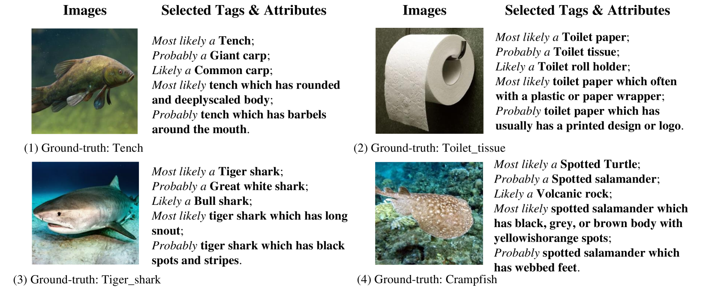

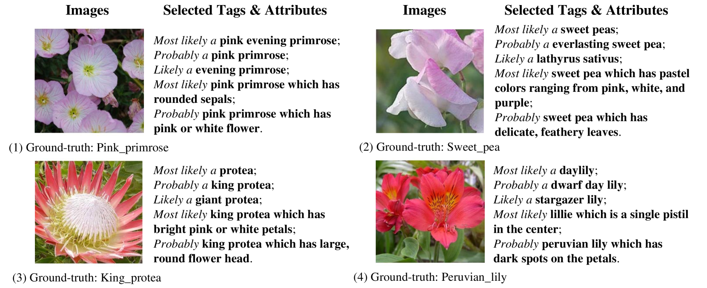

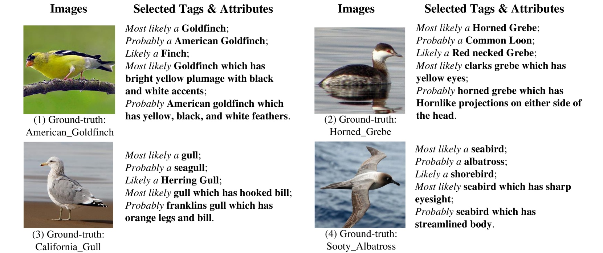

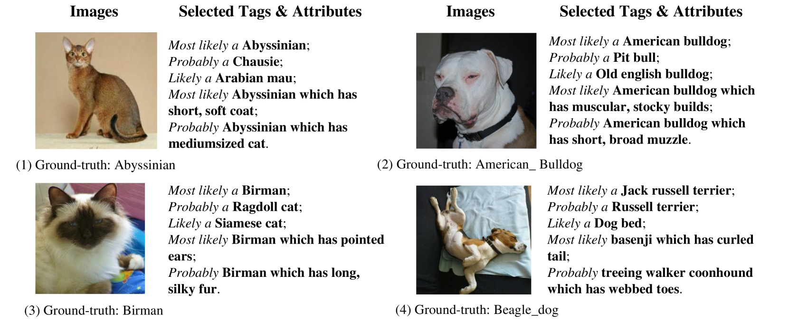

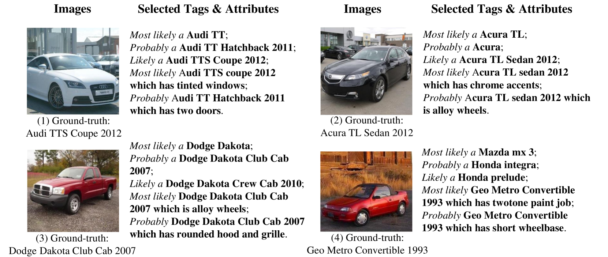

[Arxiv](https://arxiv.org/abs/2403.07369)