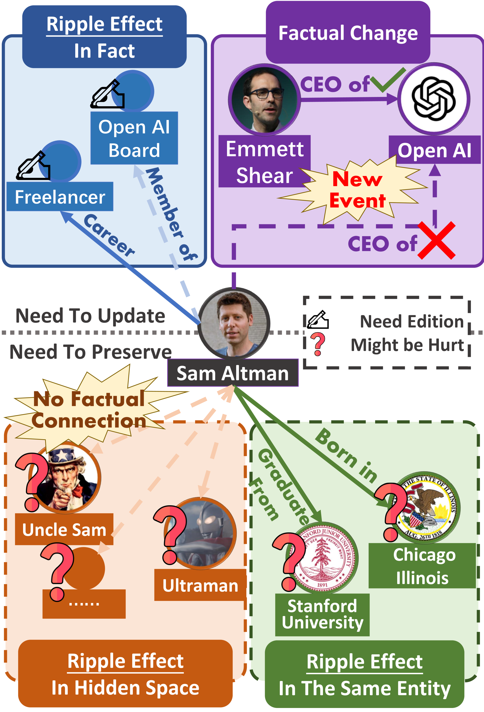
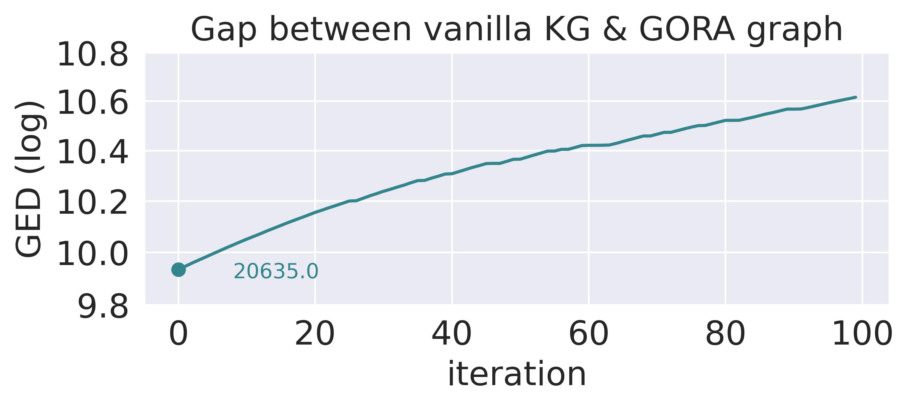
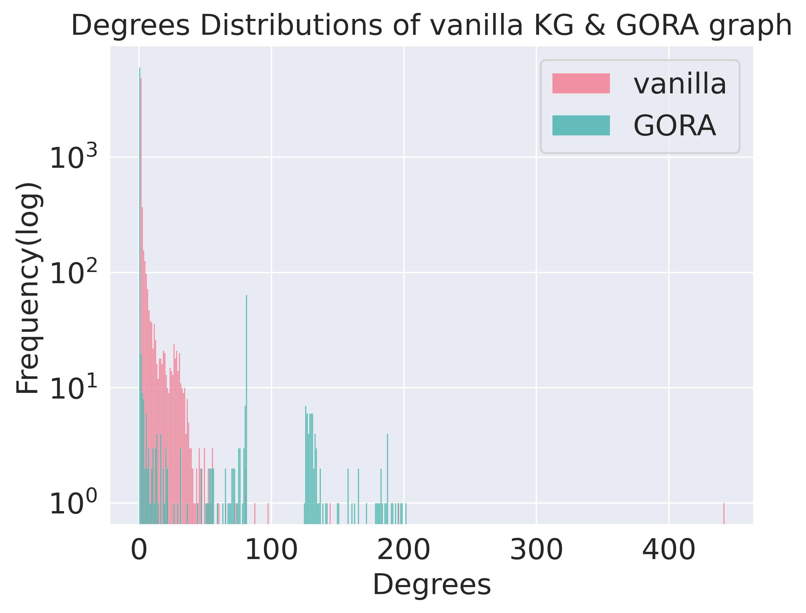
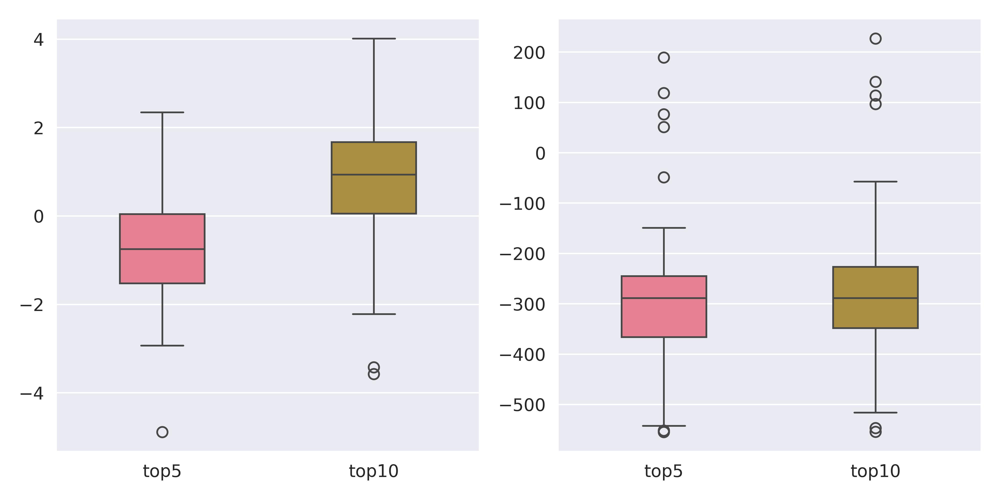
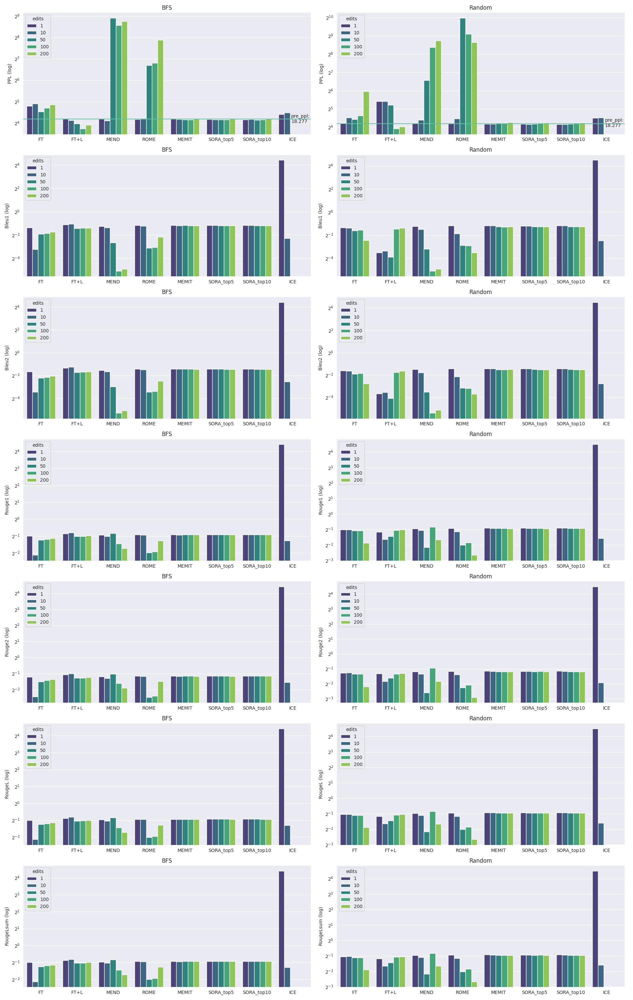

# [在模型编辑领域，尚有一片待深挖的盲区——即由编辑操作所带来的隐藏损害。本研究将对此进行深度剖析，揭示模型编辑过程中可能产生的无形伤害。](https://arxiv.org/abs/2403.07825)

发布时间：2024年03月12日

`LLM理论`

> The Missing Piece in Model Editing: A Deep Dive into the Hidden Damage Brought By Model Editing

> 大型语言模型以其卓越效能颠覆了许多任务处理方式，然而，对模型进行修正更新以去除过时或错误信息的操作，常常会在隐藏空间引发棘手的“涟漪效应”。这一不易觉察的问题会对模型编辑效果造成显著阻碍，甚至损害模型整体性能。本文直面这一挑战，创新提出了基于图形异常关系评估（GORA）的方法，量化分析模型调整后的影响及其后续效应。同时，我们还推出了选择性离群值重编辑策略（SORA），专为减轻涟漪效应而设计。综合评估显示，当前各类模型编辑方法均无法回避隐藏空间的涟漪效应问题。庆幸的是，我们提出的GORA和SORA两种方法能有效识别并逐步解决这个问题，有力地推动了大型语言模型编辑技术的发展进程。

> Large Language Models have revolutionized numerous tasks with their remarkable efficacy.However, the editing of these models, crucial for rectifying outdated or erroneous information, often leads to a complex issue known as the ripple effect in the hidden space. This effect, while difficult to detect, can significantly impede the efficacy of model editing tasks and deteriorate model performance.This paper addresses this scientific challenge by proposing a novel evaluation methodology, Graphical Outlier Relation based Assessment(GORA), which quantitatively evaluates the adaptations of the model and the subsequent impact of editing. Furthermore, we introduce the Selective Outlier Re-Editing Approach(SORA), a model editing method designed to mitigate this ripple effect. Our comprehensive evaluations reveal that the ripple effect in the hidden space is a significant issue in all current model editing methods. However, our proposed methods, GORA and SORA, effectively identify and alleviate this issue, respectively, contributing to the advancement of LLM editing techniques.

[Arxiv](https://arxiv.org/abs/2403.07825)