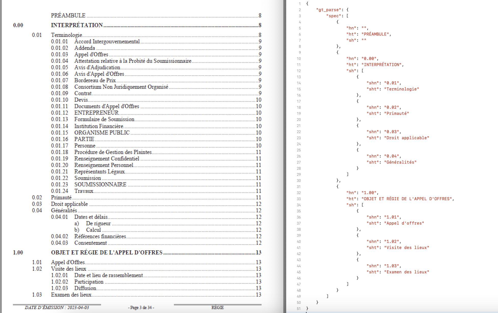
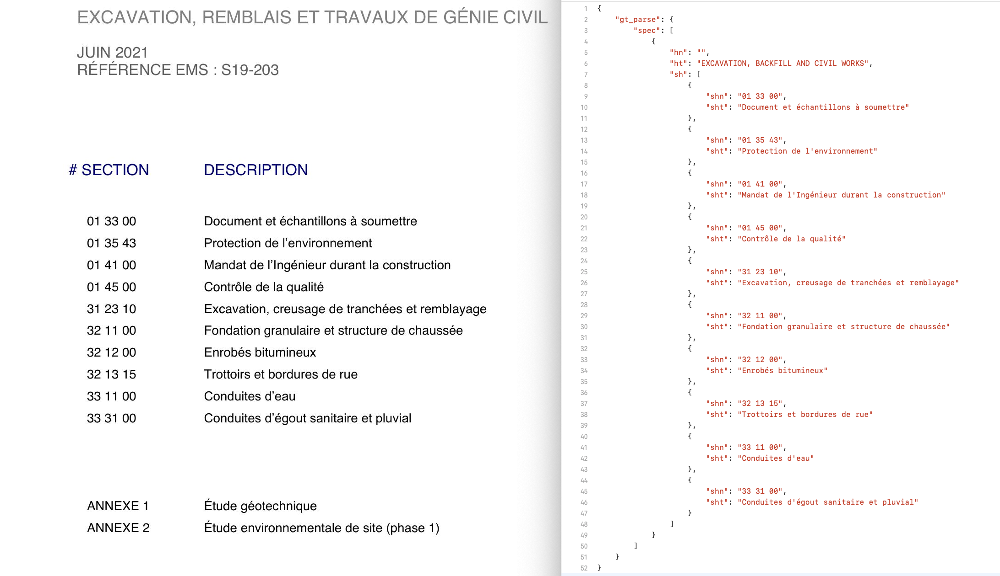
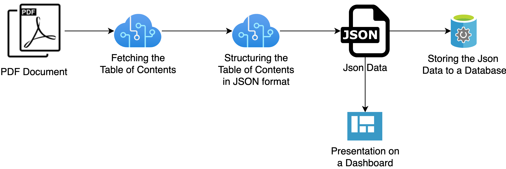
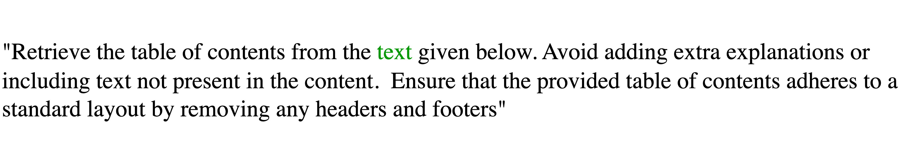
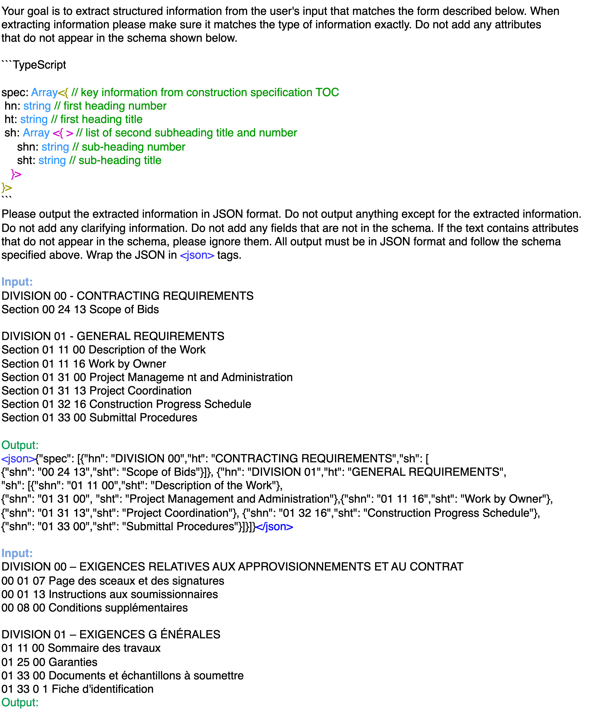

# GPT 和 Donut 引领未来，革新了文档索引领域，以崭新的方式重塑目录处理技术。

发布时间：2024年03月12日

`Agent`

> The future of document indexing: GPT and Donut revolutionize table of content processing

# 摘要

> 面对工业项目中繁复冗长的规格文档，人工提取结构化信息成为了工作效率的一大障碍。本文提出了一项突破性方案，巧妙结合了两款前沿AI模型——无需OCR就能从扫描文档直接抽取信息的Donut模型和强大稳健的大型语言模型OpenAI GPT-3.5 Turbo。该方法以获取建筑规格文档的目录（ToC）为起点，进一步将其转化为JSON格式的数据结构。令人瞩目的是，Donut在整理ToC时达到了85%的高准确率，而GPT-3.5 Turbo更是达到了89%。这项重大成果有力推进了文档索引技术的发展，生动展现了AI在跨多种文档类型自动执行信息抽取任务上的巨大潜能，极大地提升了各行各业的工作效率并释放了宝贵资源。

> Industrial projects rely heavily on lengthy, complex specification documents, making tedious manual extraction of structured information a major bottleneck. This paper introduces an innovative approach to automate this process, leveraging the capabilities of two cutting-edge AI models: Donut, a model that extracts information directly from scanned documents without OCR, and OpenAI GPT-3.5 Turbo, a robust large language model. The proposed methodology is initiated by acquiring the table of contents (ToCs) from construction specification documents and subsequently structuring the ToCs text into JSON data. Remarkable accuracy is achieved, with Donut reaching 85% and GPT-3.5 Turbo reaching 89% in effectively organizing the ToCs. This landmark achievement represents a significant leap forward in document indexing, demonstrating the immense potential of AI to automate information extraction tasks across diverse document types, boosting efficiency and liberating critical resources in various industries.

[Arxiv](https://arxiv.org/abs/2403.07553)