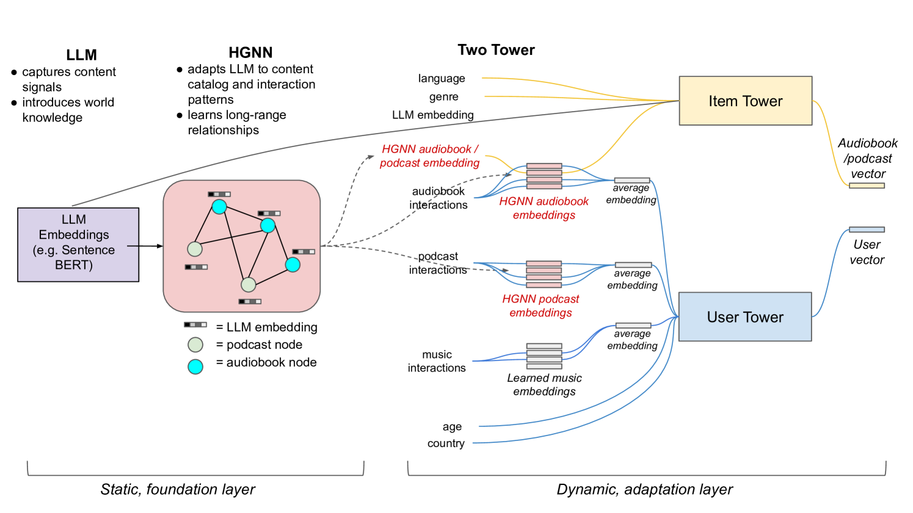

# [本研究致力于探索用于个性化的图基础模型，旨在构建能够适应个性化需求的图神经网络模型，以挖掘和利用大规模图数据中的深层次关系与模式。](https://arxiv.org/abs/2403.07478)

发布时间：2024年03月12日

`LLM应用`

> Towards Graph Foundation Models for Personalization

> 面对个性化需求的增长，整合消费信号、内容表示等多元信息源成为构建尖端解决方案的关键所在。当前的研究热点集中在图神经网络（GNNs）和基础模型（FMs）上。GNNs已成功应用于工业界的规模化个性化服务，而FMs凭借其在个性化任务如排名和检索上的潜力逐渐崭露头角。本文介绍一种面向个性化的基于图的基础模型方法，其中心组件是一款能够捕捉跨多种推荐项目类型的多跳内容及消费关联的异构图神经网络（HGNN）。为了满足基础模型的普适性要求，我们运用大型语言模型（LLM）对节点进行文本特征化处理，涵盖了所有项目类型，并利用超越内容特定性的共交互信号构建图结构。为了增强模型的实际泛化能力，我们创新性地将HGNN与基于双塔（2T）架构的适应机制相结合，后者同样不依赖于内容类型。这一多层次方法不仅保证了强大的可扩展性——HGNN生成通用嵌入，而2T组件则连续地对海量用户-项目交互数据进行建模。我们在真实世界的工业级音频流媒体平台上对该综合方法进行了深入严谨的测试验证，实证其在为多样化产品提供推荐服务方面的高效性和有效性。

> In the realm of personalization, integrating diverse information sources such as consumption signals and content-based representations is becoming increasingly critical to build state-of-the-art solutions. In this regard, two of the biggest trends in research around this subject are Graph Neural Networks (GNNs) and Foundation Models (FMs). While GNNs emerged as a popular solution in industry for powering personalization at scale, FMs have only recently caught attention for their promising performance in personalization tasks like ranking and retrieval. In this paper, we present a graph-based foundation modeling approach tailored to personalization. Central to this approach is a Heterogeneous GNN (HGNN) designed to capture multi-hop content and consumption relationships across a range of recommendable item types. To ensure the generality required from a Foundation Model, we employ a Large Language Model (LLM) text-based featurization of nodes that accommodates all item types, and construct the graph using co-interaction signals, which inherently transcend content specificity. To facilitate practical generalization, we further couple the HGNN with an adaptation mechanism based on a two-tower (2T) architecture, which also operates agnostically to content type. This multi-stage approach ensures high scalability; while the HGNN produces general purpose embeddings, the 2T component models in a continuous space the sheer size of user-item interaction data. Our comprehensive approach has been rigorously tested and proven effective in delivering recommendations across a diverse array of products within a real-world, industrial audio streaming platform.

[Arxiv](https://arxiv.org/abs/2403.07478)