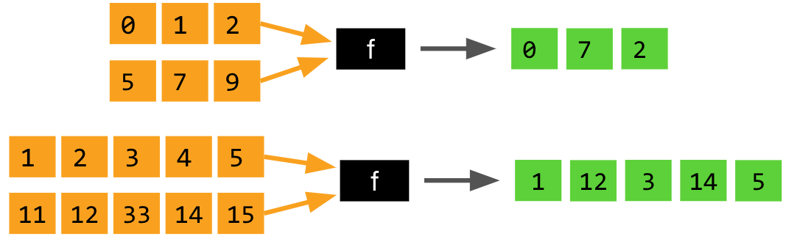
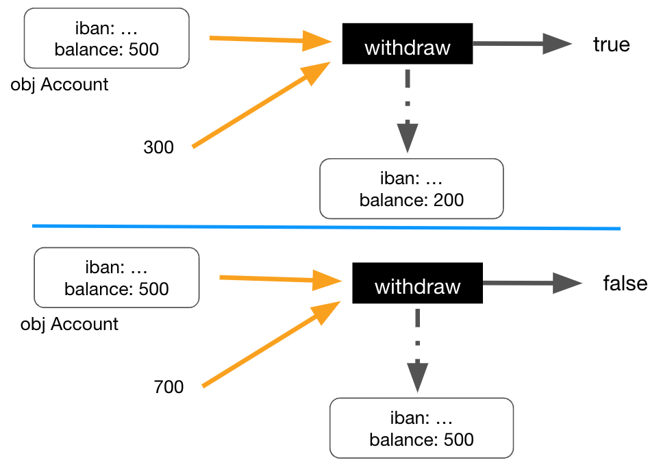
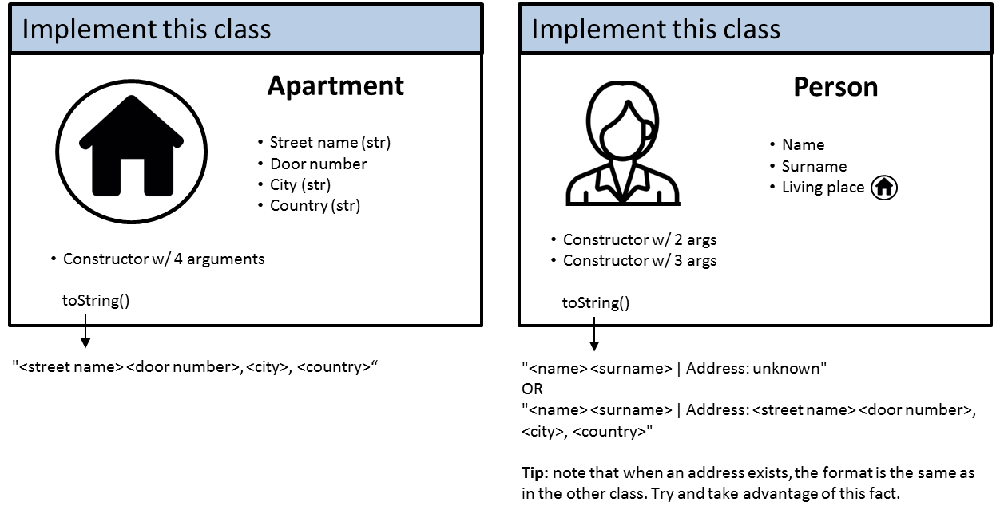
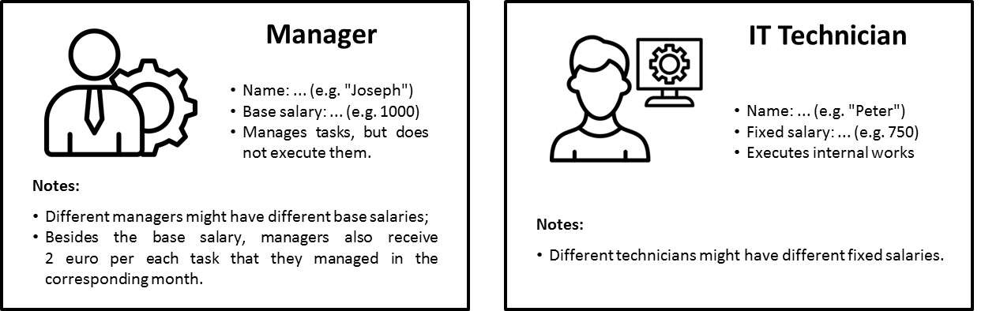
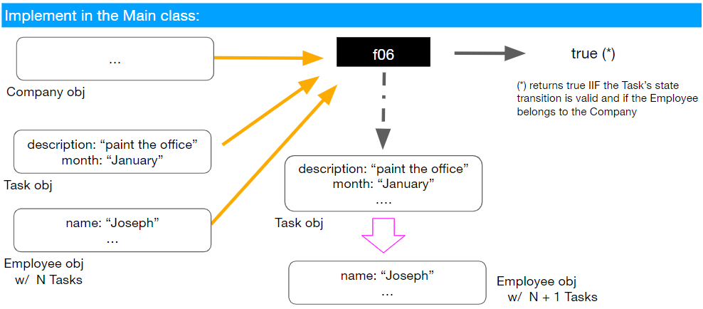
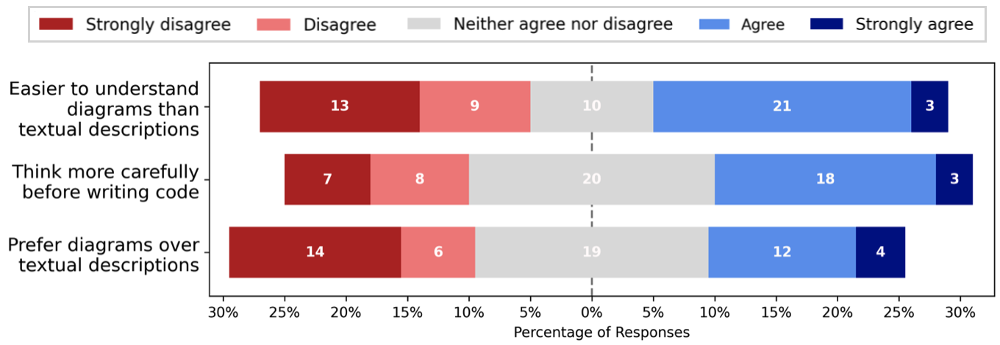
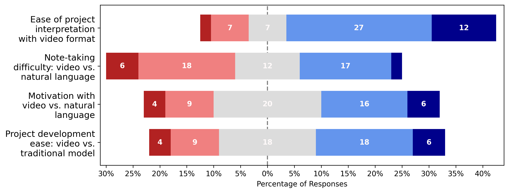
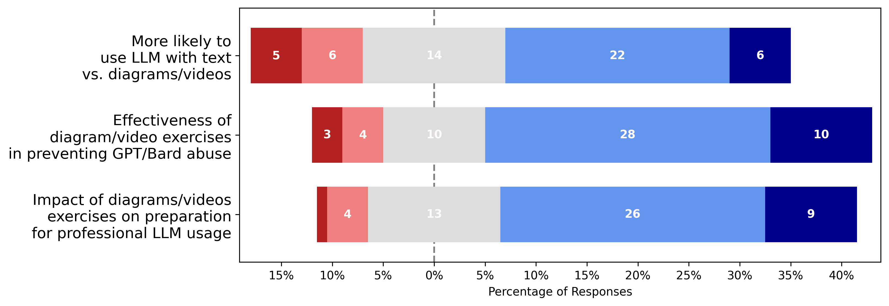

# 在对抗大型语言模型过度依赖的过程中，我们发现“一图胜千言”。为此，我们探索了利用图表和视频进行面向对象编程练习的新途径，以减轻LLM过度依赖现象。

发布时间：2024年03月13日

`LLM应用` `编程教育`

> A Picture Is Worth a Thousand Words: Exploring Diagram and Video-Based OOP Exercises to Counter LLM Over-Reliance

> 当前研究表明，LLMs 如 GPT 和 Bard 在解决基础编程题上有显著成效，甚至能应对一些复杂的 OOP 任务。然而，这也引发了对学生可能滥用此类模型完成作业而忽视关键技能培养的担忧。因此，我们创新性地提出了运用图表和视频形式设计 OOP 任务的方法，旨在激发学生的解题能力和抵制他们在 OOP 课程中的抄袭行为。我们开发了一套新的符号体系，用于详细描述 OOP 作业的结构与行为需求，并在一整个学期的课堂教学中进行实践检验。通过一份涵盖56名学生的调查发现，大部分学生对图表和视频表示欢迎，尤其偏好基于视频的项目。这种新型符号系统促使学生更深入地理解图表，并激发其参与视频项目制作的热情。同时，学生们反映在面对这类图表和视频任务时，减少了对 LLM 代码生成工具的依赖。实验结果显示，尽管 GPT-4 和 Bard 已具备一定的视觉解析能力，但目前尚无法精准解读此类图表以生成准确的代码解决方案。

> Much research has highlighted the impressive capabilities of large language models (LLMs), like GPT and Bard, for solving introductory programming exercises. Recent work has shown that LLMs can effectively solve a range of more complex object-oriented programming (OOP) exercises with text-based specifications. This raises concerns about academic integrity, as students might use these models to complete assignments unethically, neglecting the development of important skills such as program design, problem-solving, and computational thinking. To address this, we propose an innovative approach to formulating OOP tasks using diagrams and videos, as a way to foster problem-solving and deter students from a copy-and-prompt approach in OOP courses. We introduce a novel notation system for specifying OOP assignments, encompassing structural and behavioral requirements, and assess its use in a classroom setting over a semester. Student perceptions of this approach are explored through a survey (n=56). Generally, students responded positively to diagrams and videos, with video-based projects being better received than diagram-based exercises. This notation appears to have several benefits, with students investing more effort in understanding the diagrams and feeling more motivated to engage with the video-based projects. Furthermore, students reported being less inclined to rely on LLM-based code generation tools for these diagram and video-based exercises. Experiments with GPT-4 and Bard's vision abilities revealed that they currently fall short in interpreting these diagrams to generate accurate code solutions.

[Arxiv](https://arxiv.org/abs/2403.08396)