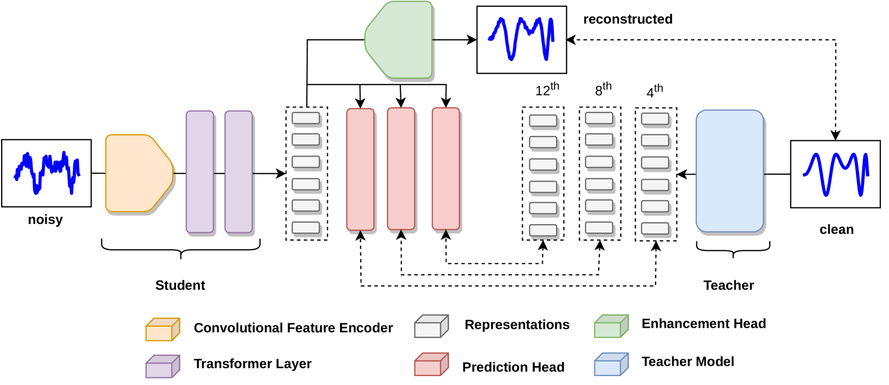
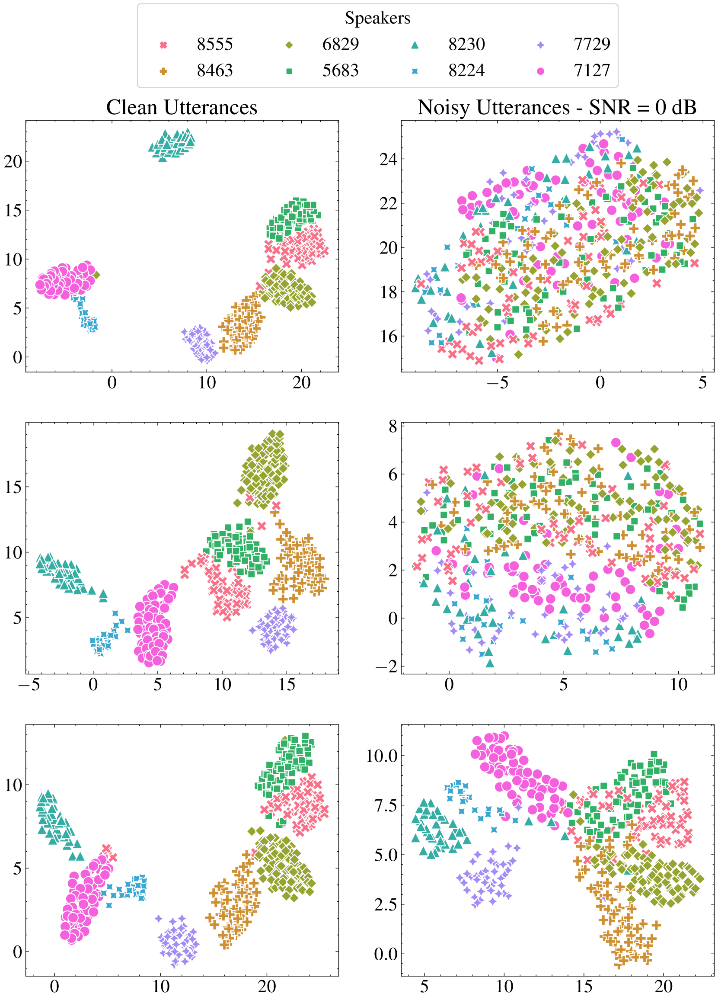
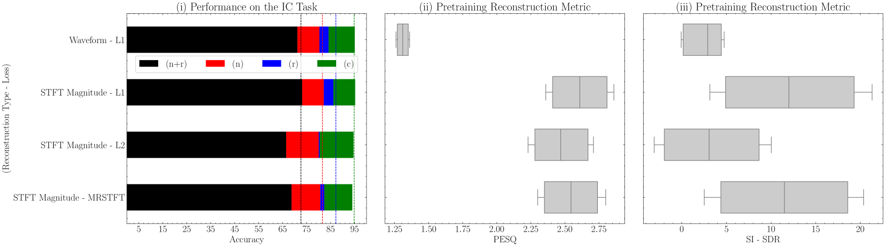
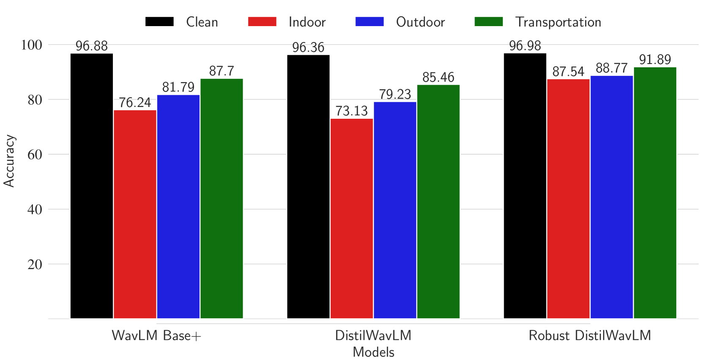
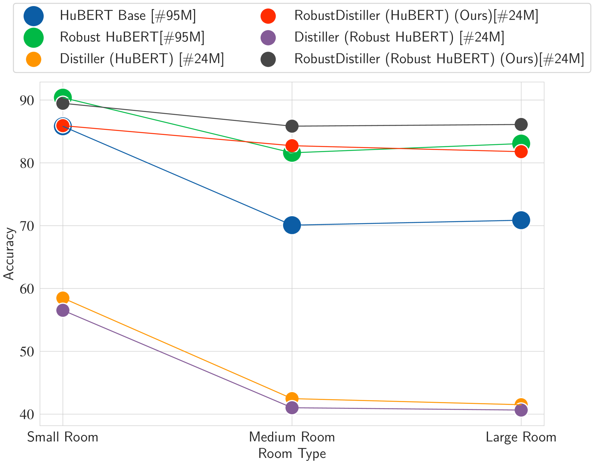

# [本研究提出了一种新颖高效的端到端解决方案，利用多任务学习技术来提取对噪声具有鲁棒性的语音特征。]

发布时间：2024年03月13日

`Agent` `语音识别` `知识蒸馏`

> An Efficient End-to-End Approach to Noise Invariant Speech Features via Multi-Task Learning

> 自我监督的语音表征学习能有效提取原始音频中的有价值特征，并广泛用于各种下游任务。然而，这类技术在实际场景下部署时面临两大挑战：一是模型规模庞大，不利于边缘设备使用；二是它们对噪声、混响等恶劣条件的抗干扰能力不足，可能导致系统性能大幅下滑。为此，我们在本工作中提出了名为RobustDistiller的新型知识蒸馏机制，一并解决了上述问题。该机制在进行知识蒸馏的同时，利用多任务学习策略对输入进行去噪处理，引导网络学习噪声不敏感的特征表示。我们在十二项不同的下游任务上验证了此机制，即使面对不同类型的噪声和不同程度的混响干扰，RobustDistiller也能显著超越多种基准方法。实验表明，仅含2300万参数的新颖学生模型，其性能已堪比含有9500万参数的教师模型。此外，我们还展示了这一新蒸馏配方同样适用于DPWavLM等其他知识蒸馏方法。为了确保研究的可复现性，我们将公开相关代码及模型checkpoint，访问地址为：\mbox{\url{https://github.com/Hguimaraes/robustdistiller}}。

> Self-supervised speech representation learning enables the extraction of meaningful features from raw waveforms. These features can then be efficiently used across multiple downstream tasks. However, two significant issues arise when considering the deployment of such methods ``in-the-wild": (i) Their large size, which can be prohibitive for edge applications; and (ii) their robustness to detrimental factors, such as noise and/or reverberation, that can heavily degrade the performance of such systems. In this work, we propose RobustDistiller, a novel knowledge distillation mechanism that tackles both problems jointly. Simultaneously to the distillation recipe, we apply a multi-task learning objective to encourage the network to learn noise-invariant representations by denoising the input. The proposed mechanism is evaluated on twelve different downstream tasks. It outperforms several benchmarks regardless of noise type, or noise and reverberation levels. Experimental results show that the new Student model with 23M parameters can achieve results comparable to the Teacher model with 95M parameters. Lastly, we show that the proposed recipe can be applied to other distillation methodologies, such as the recent DPWavLM. For reproducibility, code and model checkpoints will be made available at \mbox{\url{https://github.com/Hguimaraes/robustdistiller}}.

[Arxiv](https://arxiv.org/abs/2403.08654)