# AutoGuide 是一项技术，它能自动为大型语言模型智能体生成并优选具备状态感知能力的操作指南。

发布时间：2024年03月13日

`Agent` `智能体`

> AutoGuide: Automated Generation and Selection of State-Aware Guidelines for Large Language Model Agents

> LLMs的核心问题是其对现实世界的理解力有限，这使得基于LLM的智能体在预训练知识不足的领域面临较大挑战。本文创新性地引入了一个名为AutoGuide的框架，它能借助离线经验中的潜在知识填补预训练LLMs的知识空白。具体而言，AutoGuide精巧地提炼出一套反映状态感知的指导原则，这些原则以简练的自然语言表述并遵循条件逻辑结构，明确指出了各自适用的状态情境。这样一来，生成的指导原则就能系统地向智能体提供与其当前决策过程紧密相关的有益知识。实验结果显示，在序列决策任务基准测试中，AutoGuide框架的表现远超其他同类基于LLM的基线方法。

> The primary limitation of large language models (LLMs) is their restricted understanding of the world. This poses significant difficulties for LLM-based agents, particularly in domains where pre-trained LLMs lack sufficient knowledge. In this paper, we introduce a novel framework, called AutoGuide, that bridges the knowledge gap in pre-trained LLMs by leveraging implicit knowledge in offline experiences. Specifically, AutoGuide effectively extracts knowledge embedded in offline data by extracting a set of state-aware guidelines. Importantly, each state-aware guideline is expressed in concise natural language and follows a conditional structure, clearly describing the state where it is applicable. As such, the resulting guidelines enable a principled way to provide helpful knowledge pertinent to an agent's current decision-making process. We show that our approach outperforms competitive LLM-based baselines by a large margin in sequential decision-making benchmarks.

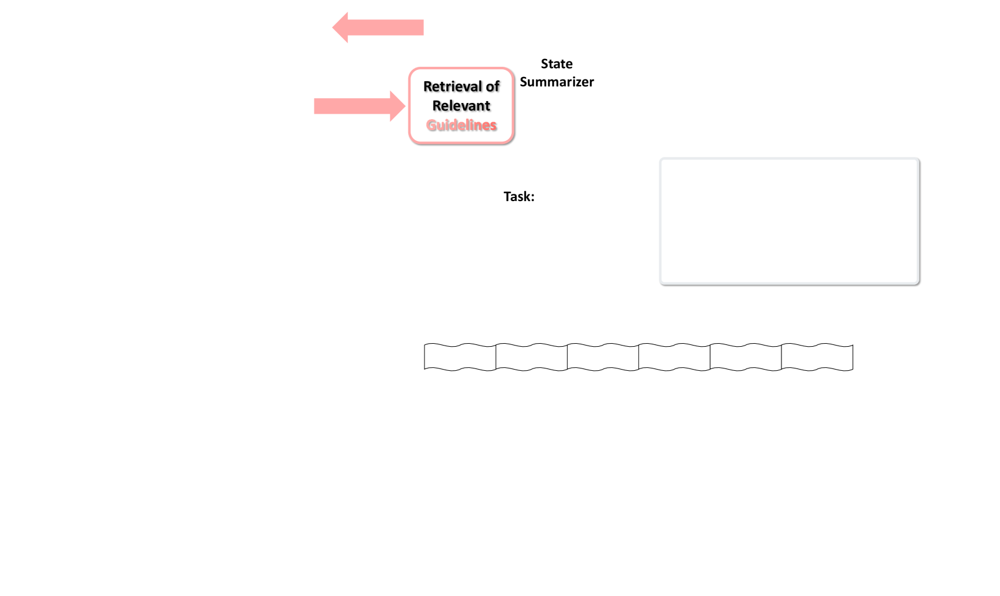

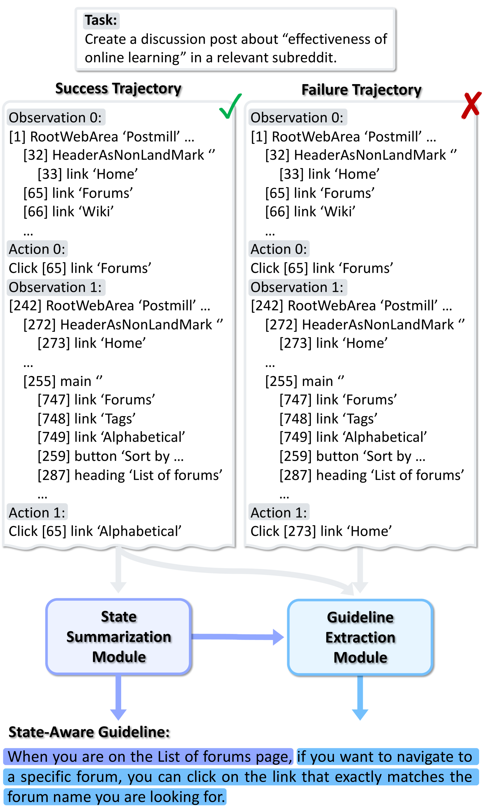

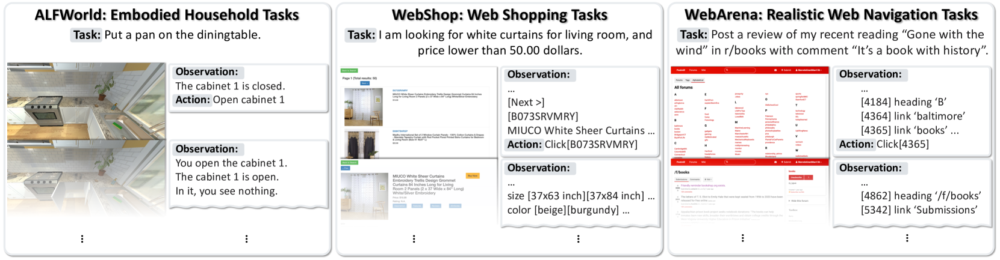

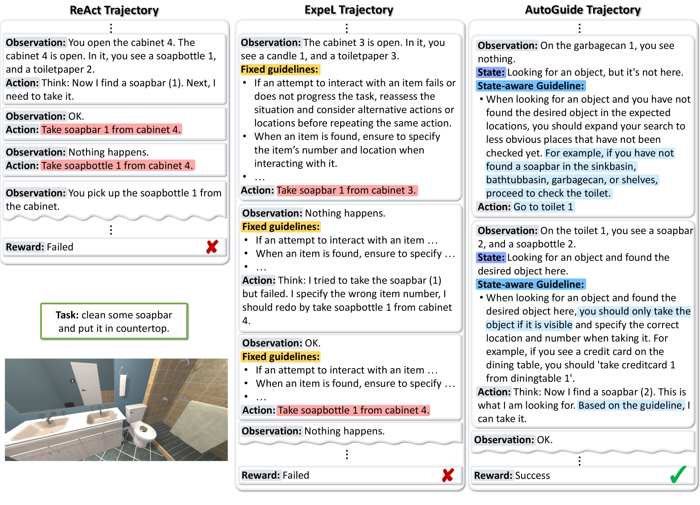

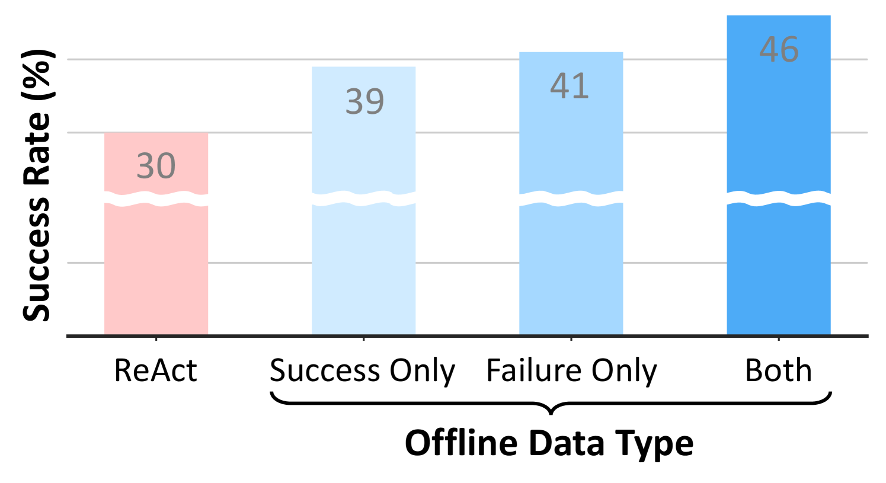

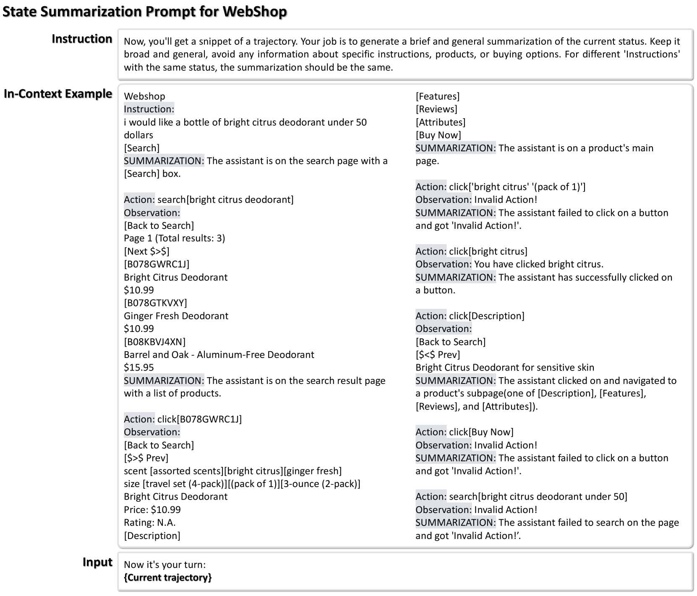

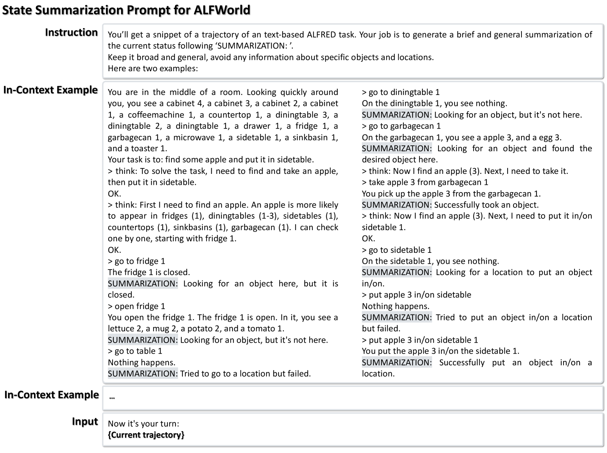

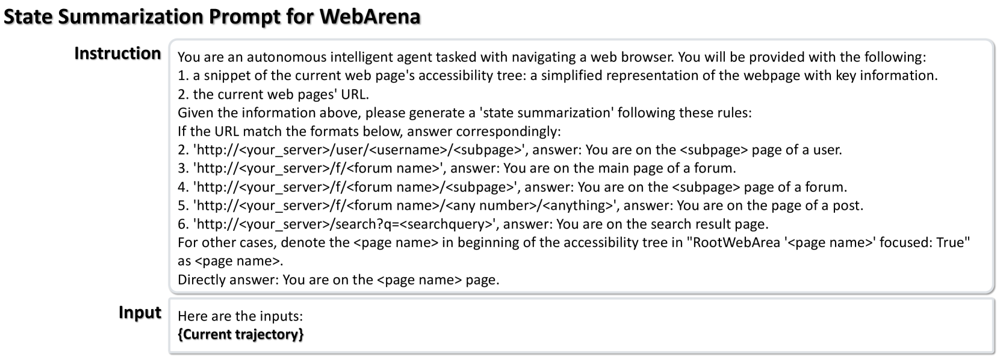

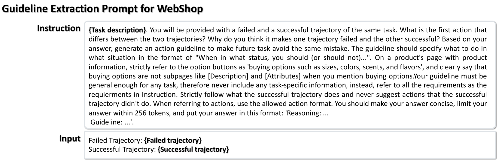

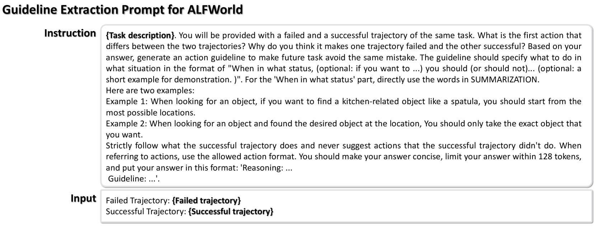

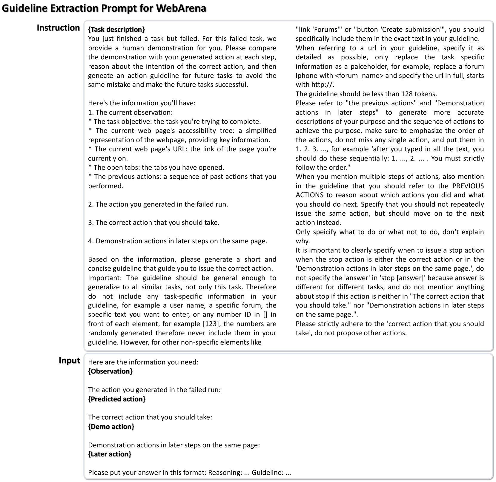

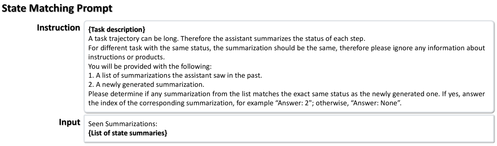

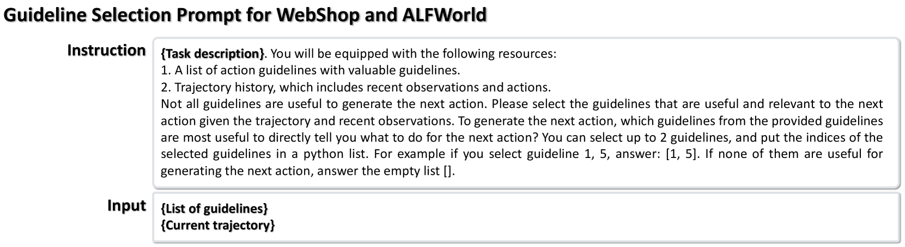

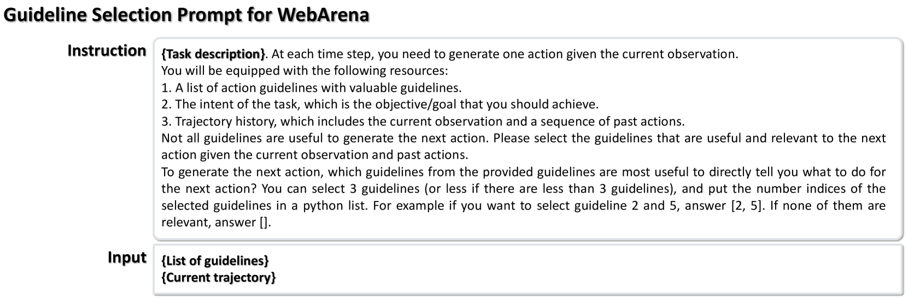

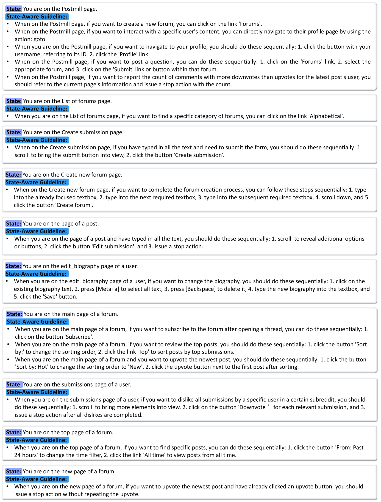

[Arxiv](https://arxiv.org/abs/2403.08978)