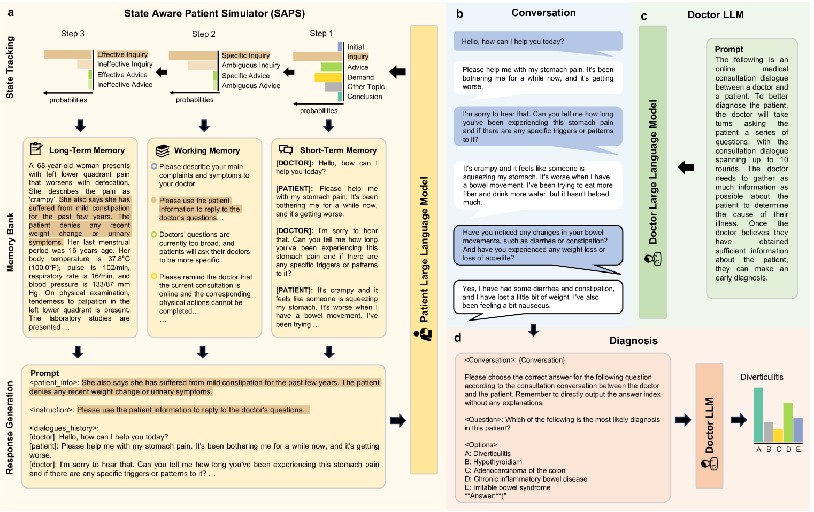
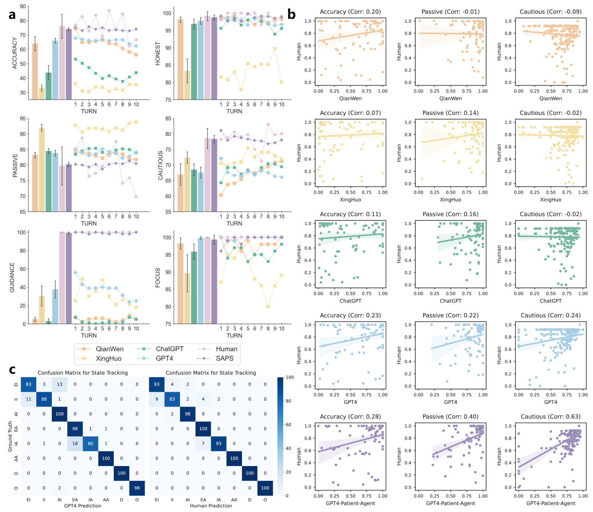
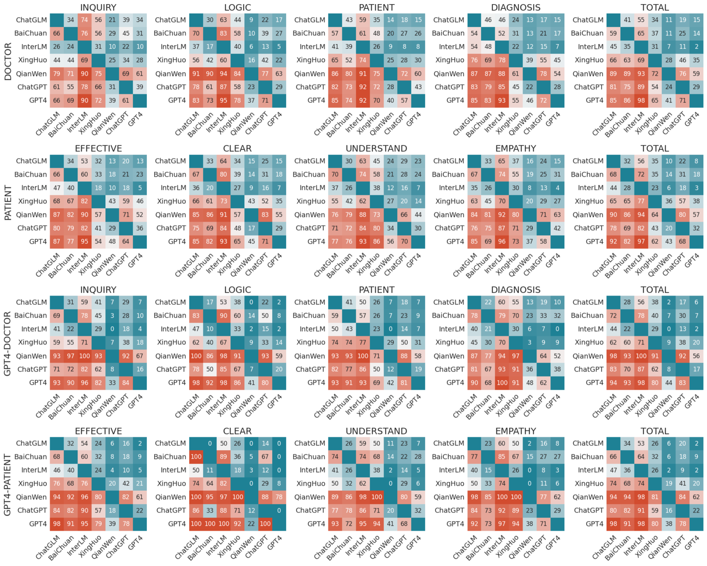
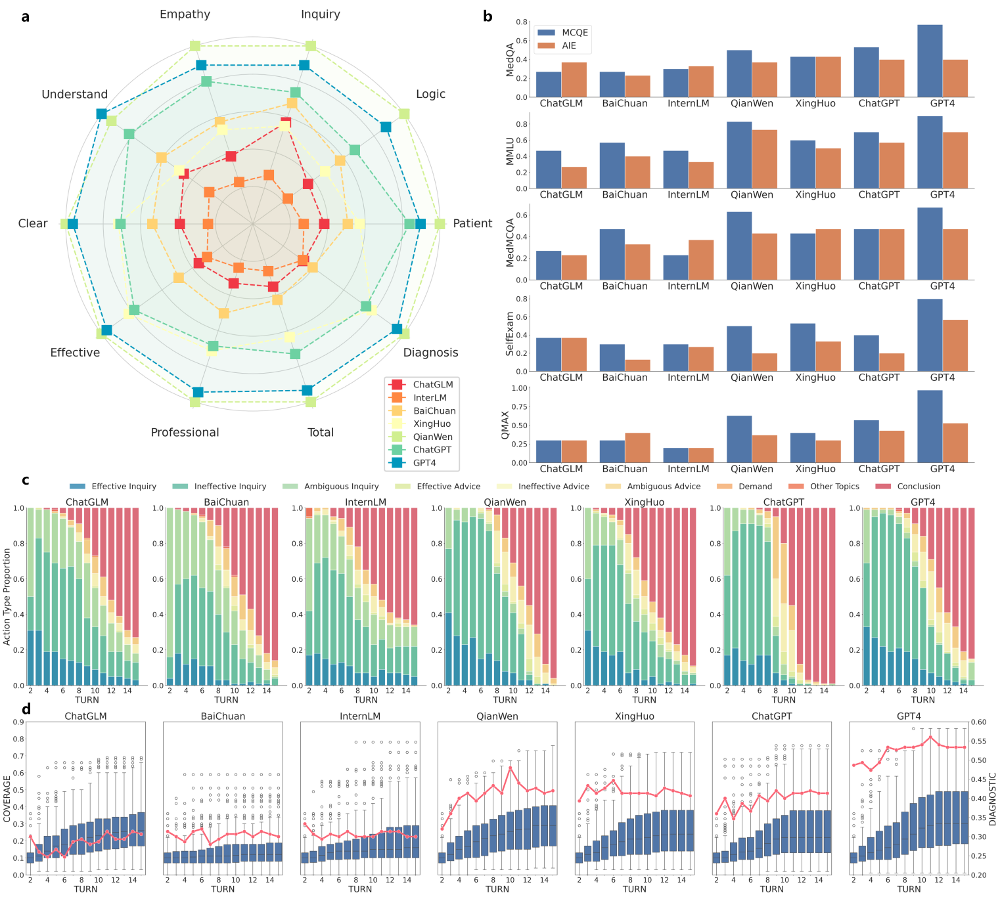

# [针对大型语言模型，我们提出了一种结合了状态感知病人模拟器的自动交互评估方法。这种方法能够模拟真实世界中病人的复杂状态变化，从而对大型语言模型进行深入细致的互动性评估。]

发布时间：2024年03月13日

`LLM应用`

> Automatic Interactive Evaluation for Large Language Models with State Aware Patient Simulator

> 尽管LLMs在人际交流上表现出色，但在医学领域的实际运用尚待深度挖掘。过往研究大多聚焦于LLMs在医疗知识点考核上的表现，难以体现其在实际临床任务中的能力。为推动LLMs在医疗健康领域的大规模应用，本论文提出了“自动化互动评估”（AIE）框架及“状态感知患者模拟器”（SAPS），瞄准传统LLM评估与临床实践复杂需求之间的差距。有别于依赖静态医学知识测试的传统手段，AIE和SAPS借助多回合医患互动模拟构建了一个生动逼真且动态变化的评估环境，从而更加贴近真实临床情境，并能够细致剖析LLMs面对复杂病患沟通时的反应行为。大量的实验证据有力地证实了AIE框架的有效性，其评估结果与人工评价高度吻合，预示着它将引领一场医疗LLM测试的革命，助力提升医疗服务效率与质量。

> Large Language Models (LLMs) have demonstrated remarkable proficiency in human interactions, yet their application within the medical field remains insufficiently explored. Previous works mainly focus on the performance of medical knowledge with examinations, which is far from the realistic scenarios, falling short in assessing the abilities of LLMs on clinical tasks. In the quest to enhance the application of Large Language Models (LLMs) in healthcare, this paper introduces the Automated Interactive Evaluation (AIE) framework and the State-Aware Patient Simulator (SAPS), targeting the gap between traditional LLM evaluations and the nuanced demands of clinical practice. Unlike prior methods that rely on static medical knowledge assessments, AIE and SAPS provide a dynamic, realistic platform for assessing LLMs through multi-turn doctor-patient simulations. This approach offers a closer approximation to real clinical scenarios and allows for a detailed analysis of LLM behaviors in response to complex patient interactions. Our extensive experimental validation demonstrates the effectiveness of the AIE framework, with outcomes that align well with human evaluations, underscoring its potential to revolutionize medical LLM testing for improved healthcare delivery.

[Arxiv](https://arxiv.org/abs/2403.08495)