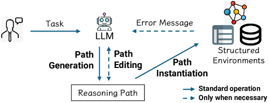
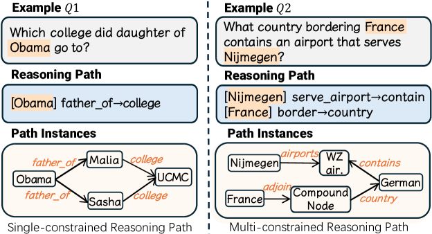
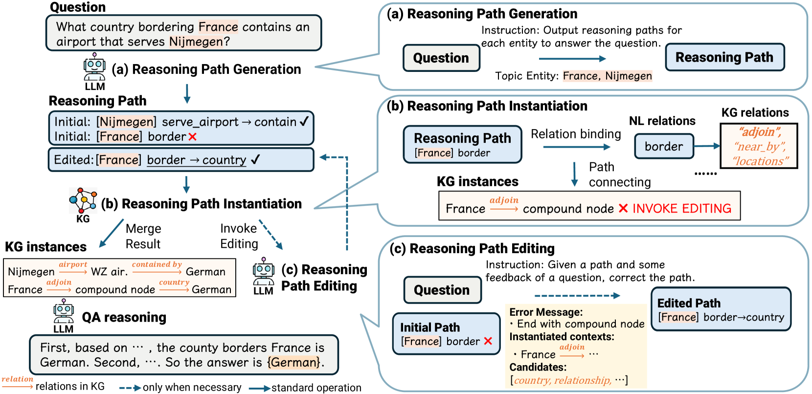
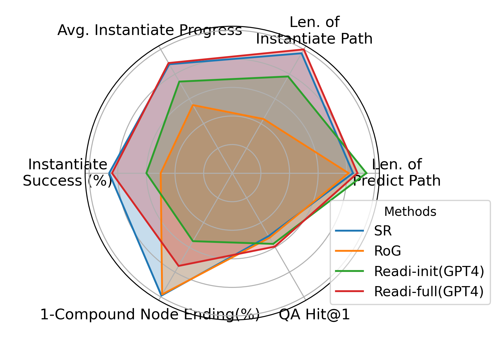
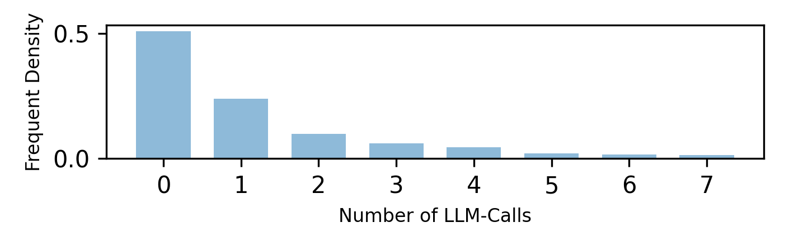
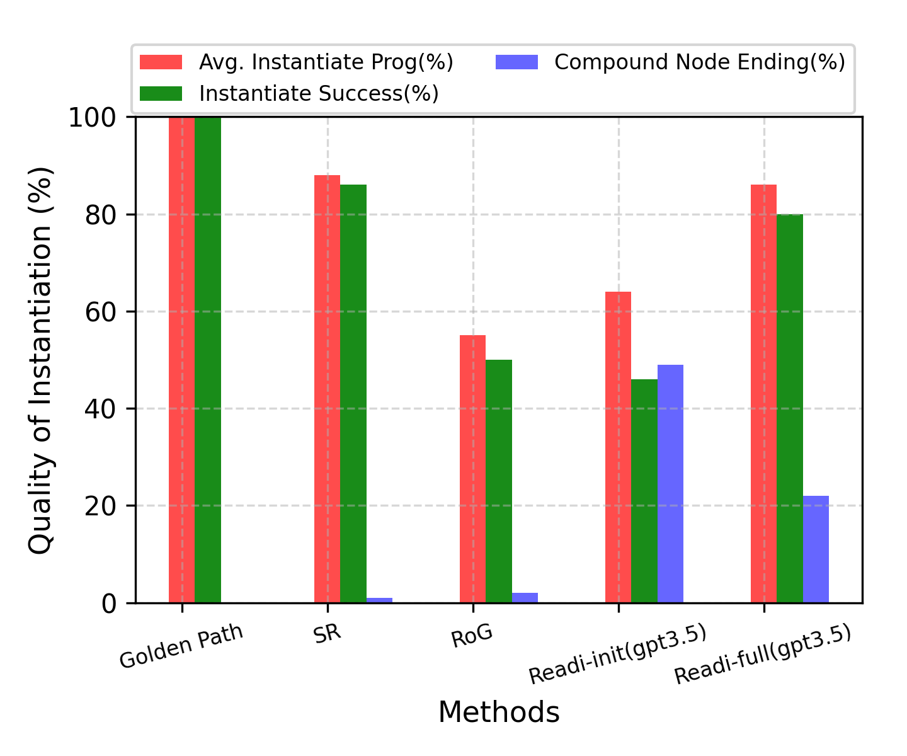
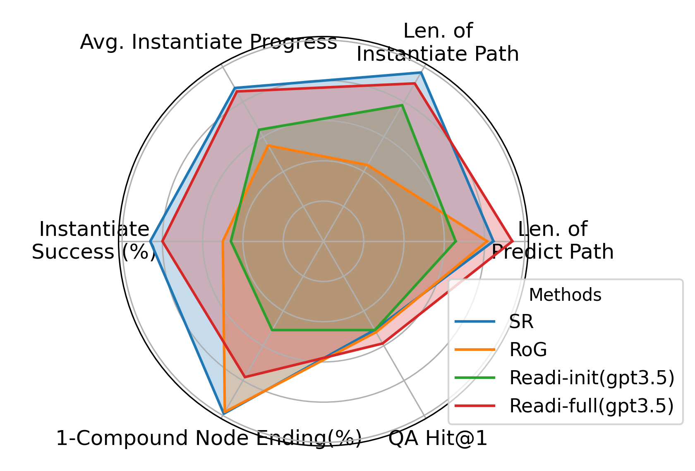
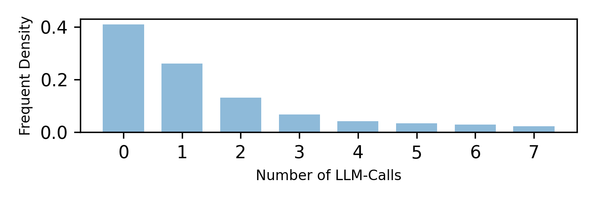

# [无论是处理结构化环境还是应对复杂需求，LLMs 都能以高效而精准的方式进行推理。不妨视其为“必要时随时呼叫”的可靠智能工具。]

发布时间：2024年03月13日

`LLM应用` `知识图谱` `问答系统`

> Call Me When Necessary: LLMs can Efficiently and Faithfully Reason over Structured Environments

> LLMs展现出了在处理诸如知识图谱和表格等结构化环境中的推理能力，这类任务往往需要通过多跳推理来将自然语言表达与环境实例对应起来。过去的研究通过让LLMs逐步与环境互动，逐渐构造推理路径，或者调用工具、获取模式等方式加以实现。现在，我们提出一种创新框架——Reasoning-Path-Editing（简称Readi），它能让LLMs更高效且精准地在结构化环境中执行推理。在Readi中，LLMs会先针对查询生成初步推理路径，并只在必要时对路径进行调整。我们将该路径落实到实际的结构化环境中，并在发现问题时给予反馈指导路径修正。实验证明，Readi在三个KGQA数据集和两个TableQA数据集上效果显著，相比其他基于LLM的方法均有大幅提升（分别在WebQSP上提升9.1%，MQA-3H上提升12.4%，WTQ上提升10.9%），其性能可媲美当前最顶尖的微调方法（CWQ上达到67%，WebQSP上达74.7%），并且极大地增强了原始LLMs的能力（在CWQ上提高14.9%）。我们的代码将在发表后公开发布。

> Large Language Models (LLMs) have shown potential in reasoning over structured environments, e.g., knowledge graph and table. Such tasks typically require multi-hop reasoning, i.e., match natural language utterance with instances in the environment. Previous methods leverage LLMs to incrementally build a reasoning path, where the LLMs either invoke tools or pick up schemas by step-by-step interacting with the environment. We propose Reasoning-Path-Editing (Readi), a novel framework where LLMs can efficiently and faithfully reason over structured environments. In Readi, LLMs initially generate a reasoning path given a query, and edit the path only when necessary. We instantiate the path on structured environments and provide feedback to edit the path if anything goes wrong. Experimental results on three KGQA datasets and two TableQA datasets show the effectiveness of Readi, significantly surpassing all LLM-based methods (by 9.1% on WebQSP, 12.4% on MQA-3H and 10.9% on WTQ), comparable with state-of-the-art fine-tuned methods (67% on CWQ and 74.7% on WebQSP) and substantially boosting the vanilla LLMs (by 14.9% on CWQ). Our code will be available upon publication.

[Arxiv](https://arxiv.org/abs/2403.08593)