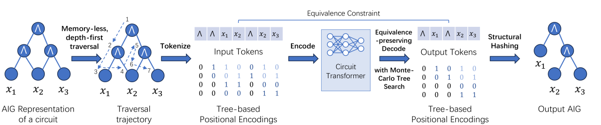
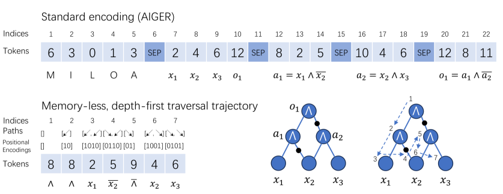
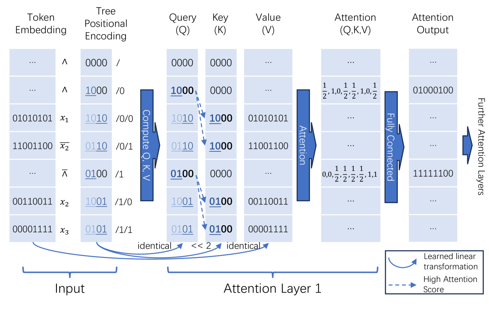
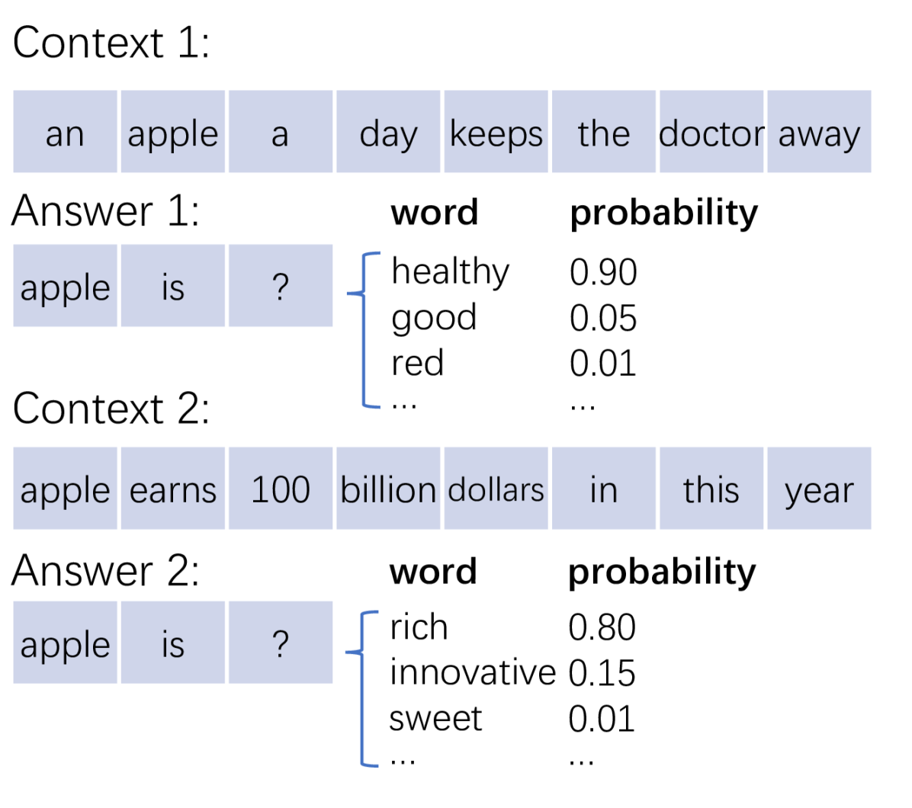
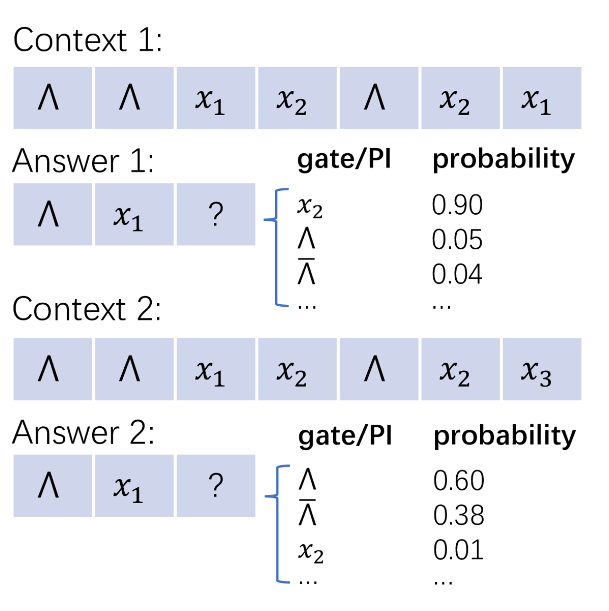
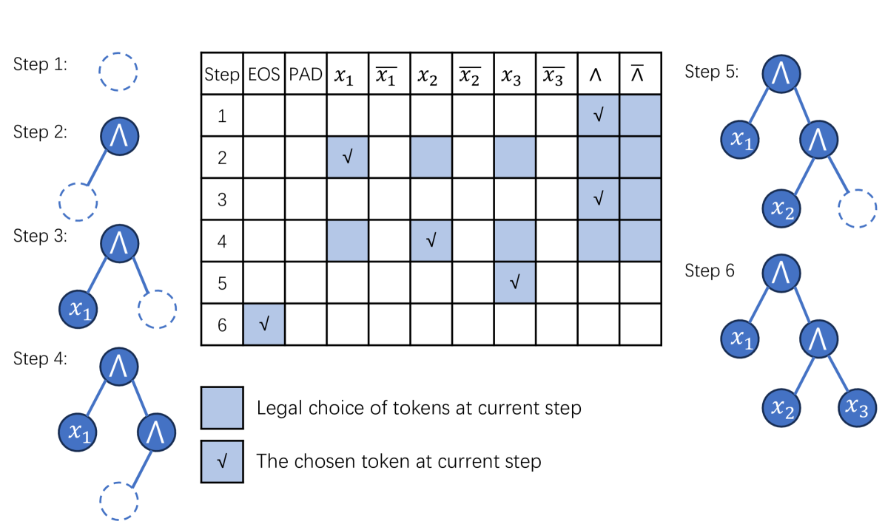

# 电路Transformer，通过精准预测下一个组件门，实现全程自动化的电路设计。

发布时间：2024年03月13日

`Agent` `电子设计` `电路设计`

> Circuit Transformer: End-to-end Circuit Design by Predicting the Next Gate

# 摘要

> 随着LLMs的突破，计算机如今已能巧妙掌握人类通过序列符号进行表达的语言能力，通过巨型神经网络循环预测单词，展现出空前的理解与推理才能。而在电子设计领域，“电路”如同其自身的“语言”，通过逻辑门的串联来定义电子器件功能。我们不禁设想，是否存在一种类似于LLMs的庞大“电路模型”，只需预判下一个逻辑门，就能应对电子设计的各种挑战？在本次研究中，我们率先踏出探寻这一可能的道路。然而，将LLMs直接应用于电路设计面临两大难题：一是电路复杂且非线性的结构特性，二是因严格的等价性要求而不容许丝毫臆测。针对第一道难关，我们创新性地将电路转化为一种无需记忆、采用深度优先遍历的轨迹表示，从而使基于Transformer的神经网络得以充分利用电路的结构信息，像一位电路专家那样预测轨迹上的下一个逻辑门。至于第二道难关，我们提出了一种保证生成轨迹中每个元素均满足预设等价约束的解码方法。不仅如此，该电路模型还可视为处理优化型电路设计任务的一种随机策略。实验证明，我们所训练的拥有8800万参数的“电路Transformer”，在端到端逻辑综合任务上表现卓越。当结合蒙特卡洛树搜索技术后，电路Transformer在严守等价性原则的前提下，相较于resyn2有显著提升，充分展现了生成式AI在攻克电子设计难题方面的巨大潜力。

> Language, a prominent human ability to express through sequential symbols, has been computationally mastered by recent advances of large language models (LLMs). By predicting the next word recurrently with huge neural models, LLMs have shown unprecedented capabilities in understanding and reasoning. Circuit, as the "language" of electronic design, specifies the functionality of an electronic device by cascade connections of logic gates. Then, can circuits also be mastered by a a sufficiently large "circuit model", which can conquer electronic design tasks by simply predicting the next logic gate? In this work, we take the first step to explore such possibilities. Two primary barriers impede the straightforward application of LLMs to circuits: their complex, non-sequential structure, and the intolerance of hallucination due to strict constraints (e.g., equivalence). For the first barrier, we encode a circuit as a memory-less, depth-first traversal trajectory, which allows Transformer-based neural models to better leverage its structural information, and predict the next gate on the trajectory as a circuit model. For the second barrier, we introduce an equivalence-preserving decoding process, which ensures that every token in the generated trajectory adheres to the specified equivalence constraints. Moreover, the circuit model can also be regarded as a stochastic policy to tackle optimization-oriented circuit design tasks. Experimentally, we trained a Transformer-based model of 88M parameters, named "Circuit Transformer", which demonstrates impressive performance in end-to-end logic synthesis. With Monte-Carlo tree search, Circuit Transformer significantly improves over resyn2 while retaining strict equivalence, showcasing the potential of generative AI in conquering electronic design challenges.

[Arxiv](https://arxiv.org/abs/2403.13838)