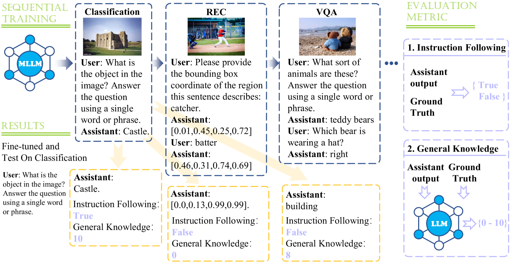
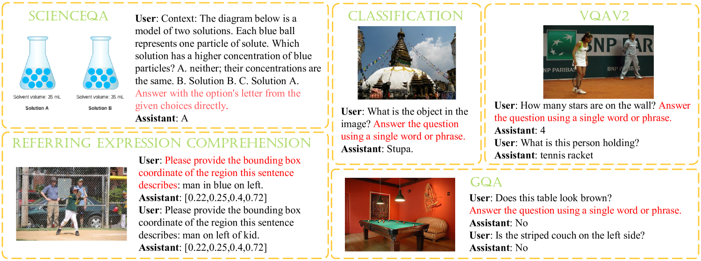

# [CoIN 是一个针对多模态大型语言模型的连续指令优化基准，旨在衡量和推进此类模型在不断学习和适应新指令任务中的性能。](https://arxiv.org/abs/2403.08350)

发布时间：2024年03月13日

`Agent` `持续学习`

> CoIN: A Benchmark of Continual Instruction tuNing for Multimodel Large Language Model

> 为了让 MLLMs 更好地跟随人类指令并适应各类新任务，指令微调已成为主流策略。然而，随着用户知识和需求的发展变化，MLLMs 面临着如何在学习新知识的同时不忘旧技能的挑战。为此，本文提出了一个名为“连续指令微调”（CoIN）的综合基准测试，用以评估 MLLMs 在顺序指令微调环境中的性能。CoIN 涵盖了来自8个任务类别、共计10个常用数据集，确保了丰富的指令及任务多样性。同时，我们从“指令遵循度”和“通用知识”两个维度评价模型的表现，前者检验其对人类意图的理解程度，后者则衡量其保存推理所需知识的能力。通过在 CoIN 上的实验，我们发现即使是最先进的 MLLMs 也存在严重的灾难性遗忘问题，而主要原因并非知识遗忘，而是未能有效保持对先前指令的一致性。于是，我们引入了一种名为 MoELoRA 的方法应用于 MLLMs，实验证明该方法有助于维持模型对以往指令的精准匹配。结果显示，在 CoIN 上应用此方法后，遗忘现象明显减少。

> Instruction tuning represents a prevalent strategy employed by Multimodal Large Language Models (MLLMs) to align with human instructions and adapt to new tasks. Nevertheless, MLLMs encounter the challenge of adapting to users' evolving knowledge and demands. Therefore, how to retain existing skills while acquiring new knowledge needs to be investigated. In this paper, we present a comprehensive benchmark, namely Continual Instruction tuNing (CoIN), to assess existing MLLMs in the sequential instruction tuning paradigm. CoIN comprises 10 commonly used datasets spanning 8 task categories, ensuring a diverse range of instructions and tasks. Besides, the trained model is evaluated from two aspects: Instruction Following and General Knowledge, which assess the alignment with human intention and knowledge preserved for reasoning, respectively. Experiments on CoIN demonstrate that current powerful MLLMs still suffer catastrophic forgetting, and the failure in intention alignment assumes the main responsibility, instead of the knowledge forgetting. To this end, we introduce MoELoRA to MLLMs which is effective to retain the previous instruction alignment. Experimental results consistently illustrate the forgetting decreased from this method on CoIN.

[Arxiv](https://arxiv.org/abs/2403.08350)