# 探究大型语言模型群体中文化演进的现象

发布时间：2024年03月13日

`Agent` `文化进化` `人工智能`

> Cultural evolution in populations of Large Language Models

> 文化进化研究的核心目标是对文化随时间变迁的原因进行解析。过去数十年，学者们运用实验、历史分析及计算手段积累了丰富的研究成果。虽然计算模型在推测诸如人口结构、传播偏好等因素的作用上成果显著，但某些复杂现象，尤其是进化认知机制导致的社会信息变化效应，目前尚难通过基于代理和形式模型准确捕获。为此，我们提议借助大型语言模型（LLMs）模拟人类行为的能力，以解决这一难题。不仅因为这种模拟为理解人类文化动态提供了有力参照，而且生成型多智能体模型自身也极具探索价值，毕竟，在文化进化过程中，人工智能代理的角色愈发重要，深入了解其驱动下的文化进化动力机制至关重要。本文提出了一个在LLMs群体中模拟文化进化的框架，允许操作文化进化中关键的变量，例如网络架构、个体性格以及社会信息如何整合与转换。我们研发的用于此类模拟实验的软件采用了开源模式，并配备了易于使用的用户界面，期待能以此促进文化进化研究与生成式人工智能领域的交融与发展。

> Research in cultural evolution aims at providing causal explanations for the change of culture over time. Over the past decades, this field has generated an important body of knowledge, using experimental, historical, and computational methods. While computational models have been very successful at generating testable hypotheses about the effects of several factors, such as population structure or transmission biases, some phenomena have so far been more complex to capture using agent-based and formal models. This is in particular the case for the effect of the transformations of social information induced by evolved cognitive mechanisms. We here propose that leveraging the capacity of Large Language Models (LLMs) to mimic human behavior may be fruitful to address this gap. On top of being an useful approximation of human cultural dynamics, multi-agents models featuring generative agents are also important to study for their own sake. Indeed, as artificial agents are bound to participate more and more to the evolution of culture, it is crucial to better understand the dynamics of machine-generated cultural evolution. We here present a framework for simulating cultural evolution in populations of LLMs, allowing the manipulation of variables known to be important in cultural evolution, such as network structure, personality, and the way social information is aggregated and transformed. The software we developed for conducting these simulations is open-source and features an intuitive user-interface, which we hope will help to build bridges between the fields of cultural evolution and generative artificial intelligence.

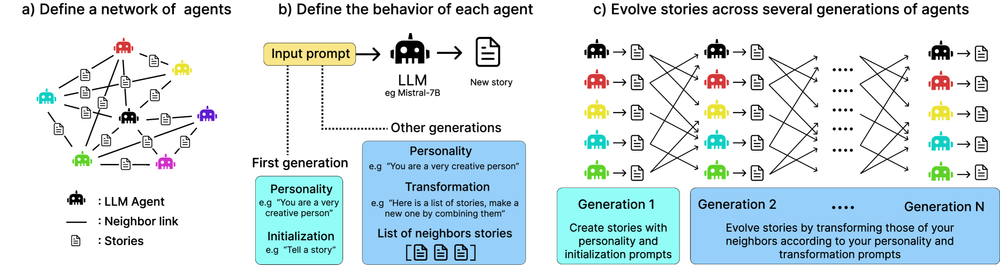

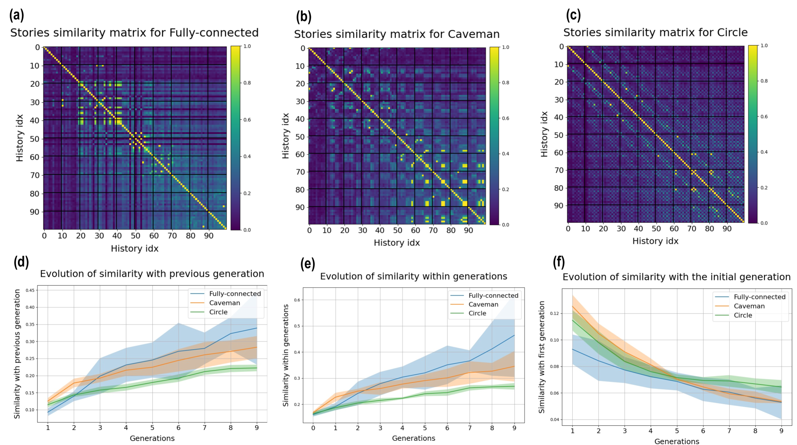

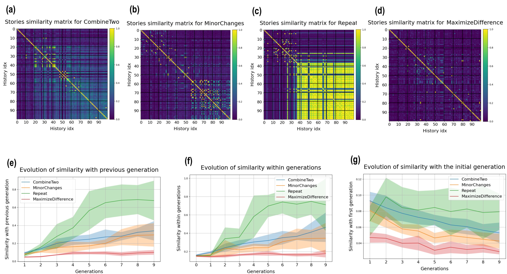

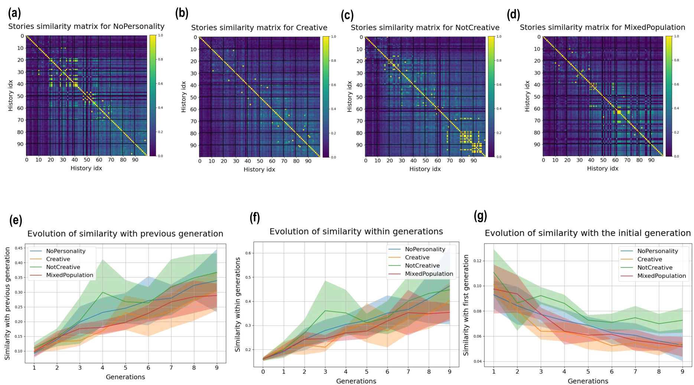

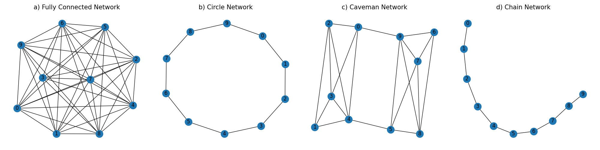

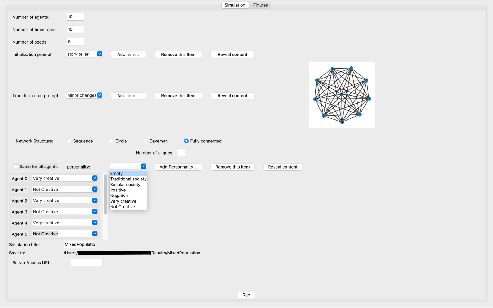

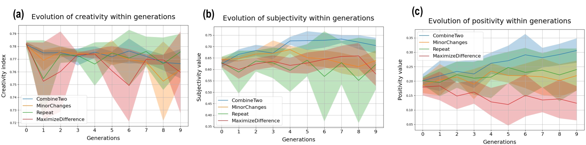

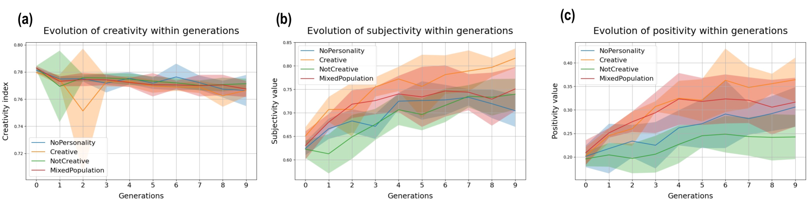

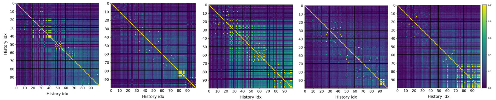

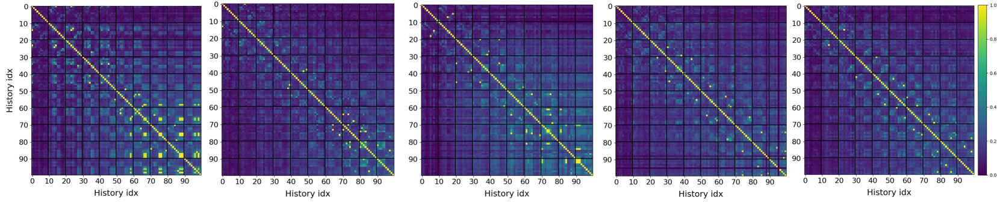

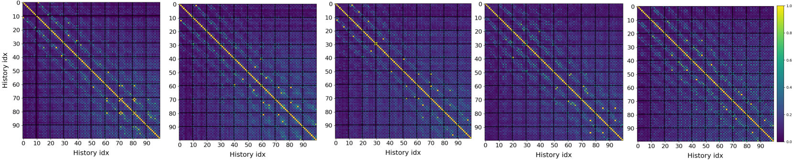

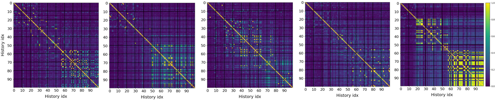

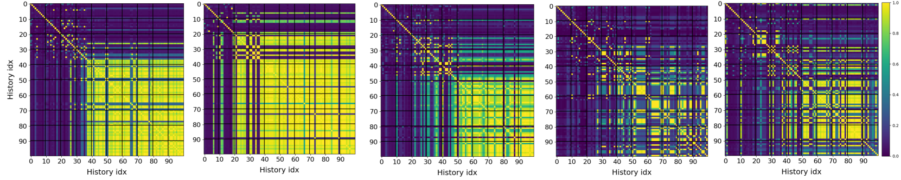

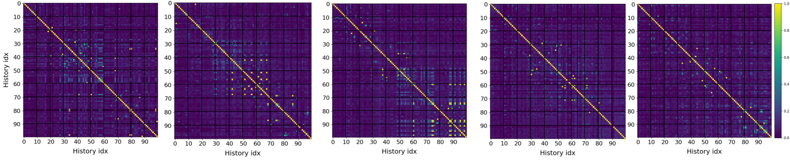

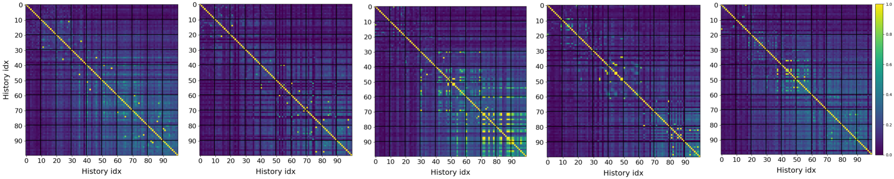

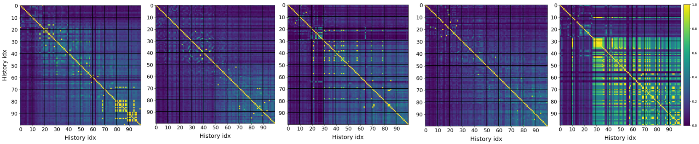

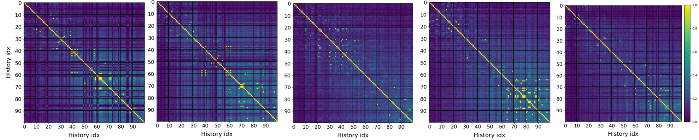

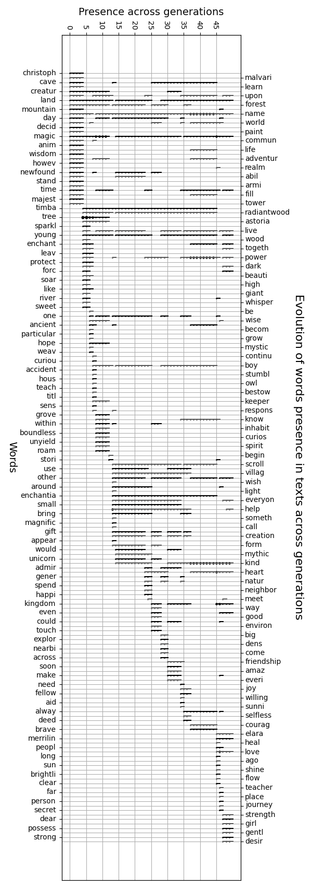

[Arxiv](https://arxiv.org/abs/2403.08882)